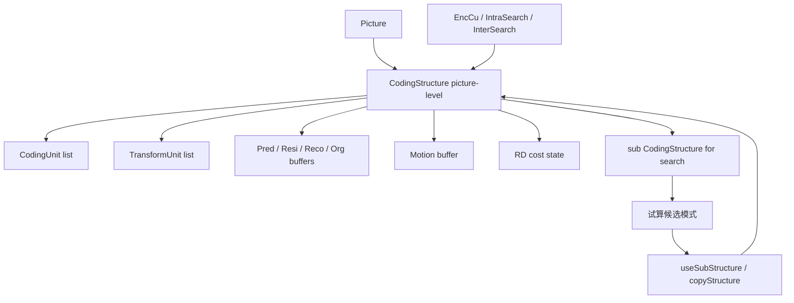
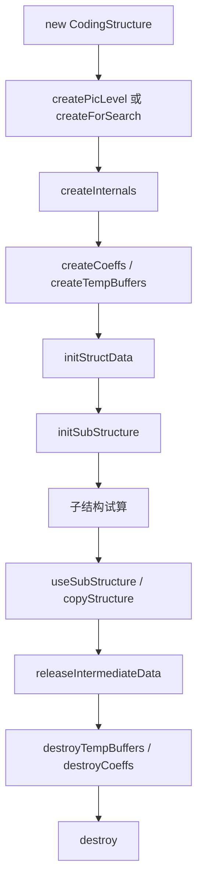
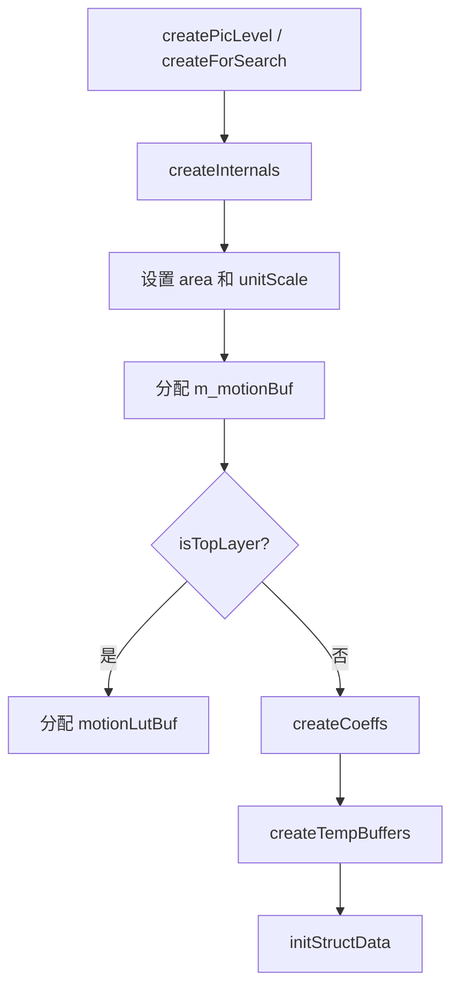
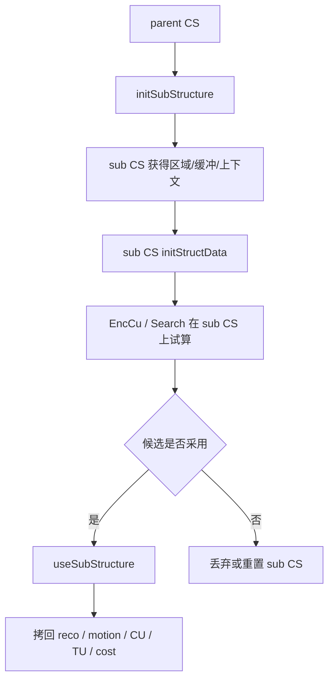

# vvenc `CodingStructure` 类分析

本文聚焦 `vvenc/source/Lib/CommonLib/CodingStructure.h/.cpp` 中的 `CodingStructure`，重点说明：

1. `CodingStructure` 在 vvenc 中的角色是什么
2. 它和 `Picture`、`Slice`、`CodingUnit`、`TransformUnit` 的关系是什么
3. 它如何支持 CU/TU 搜索中的“子结构试算 -> 回写父结构”工作流

本文重点讲“数据组织与搜索流程”，不展开具体模式决策算法。

## 1. 类定位

`CodingStructure` 是 vvenc 中负责管理某一块图像区域编码信息的核心工作对象。

它的职责不是直接做模式搜索，而是为模式搜索提供“承载结果的工作平面”：

- 管理当前区域的 `CU` / `TU` 结构
- 管理当前区域的预测、残差、重建缓冲
- 管理 motion buffer 和 loop filter 参数图
- 保存当前区域的 RD 统计量
- 支持父结构和子结构之间的数据初始化、试算和回写

一句话说：

`CodingStructure` 负责回答“这一块区域当前的编码结果长什么样”。

## 2. 在编码链路中的位置

它位于帧级对象 `Picture` 和块级对象 `CodingUnit/TransformUnit` 之间。

关系可以概括为：



这个图反映出：

- `Picture` 提供整帧容器
- `CodingStructure` 提供某个区域的编码工作区
- `EncCu` 等模块在这个工作区里做搜索和回写

## 3. 它和 `Picture` 的区别

这是最核心的理解点之一。

### 3.1 `Picture`

`Picture` 代表“一整帧”，负责：

- 帧级像素缓冲
- `Slice`
- 帧状态
- APS / SEI / SAO / ALF 等附属数据

### 3.2 `CodingStructure`

`CodingStructure` 代表“某个区域当前的编码结构和中间结果”，负责：

- 当前区域的 `CU/TU`
- 当前区域的 prediction / residual / reconstruction
- 当前区域的 motion info
- 当前区域的 RD 代价统计

可以简单理解为：

- `Picture` = 帧对象
- `CodingStructure` = 区域编码工作对象

## 4. 类结构概览

`CodingStructure` 本身不继承 `UnitArea`，但持有：

```cpp
UnitArea area;
UnitArea _maxArea;
```

这说明它本质上是“绑定到一个区域”的工作对象。

其中：

- `area`
  - 当前正在表示的实际区域
- `_maxArea`
  - 当前对象最大可支持的区域

这对搜索期很关键，因为同一个 `CodingStructure` 常被反复裁切到不同子区域复用。

## 5. 关键成员分组

### 5.1 上下文与归属关系

```cpp
Picture*         picture;
CodingStructure* parent;
CodingStructure* lumaCS;
Slice*           slice;

const SPS*       sps;
const PPS*       pps;
const VPS*       vps;
PicHeader*       picHeader;
const PreCalcValues* pcv;
```

这些成员定义了 `CodingStructure` 所依赖的全局上下文：

- 它属于哪张 `Picture`
- 它是不是某个父结构的子结构
- 当前 `Slice` 是谁
- 参数集和预计算值是什么

这说明 `CodingStructure` 不是独立存在的算法对象，而是强依赖 picture/slice 上下文的。

### 5.2 编码单元容器

```cpp
std::vector<CodingUnit*>    cus;
std::vector<TransformUnit*> tus;

CodingUnit** m_cuPtr[MAX_NUM_CH];
unsigned     m_numCUs;
unsigned     m_numTUs;
```

这组成员负责两种访问模式：

1. 线性拥有与遍历
   - `cus`
   - `tus`

2. 按位置快速查找
   - `m_cuPtr`

也就是说，它既支持：

- “把所有 CU/TU 收集起来”
- 也支持：
- “给一个坐标，快速找这个位置属于哪个 CU”

### 5.3 像素缓冲

```cpp
PelStorage  m_pred;
PelStorage  m_resi;
PelStorage  m_reco;
PelStorage  m_rspreco;
PelStorage* m_org;
PelStorage* m_rsporg;
```

它们分别表示：

- 预测缓冲
- 残差缓冲
- 重建缓冲
- reshape 后重建缓冲
- 原图缓冲
- reshape 后原图缓冲

这说明 `CodingStructure` 本质上就是“当前区域一套完整的像素工作平面”。

### 5.4 系数和运动信息

```cpp
TCoeffSig*   m_coeffs[MAX_NUM_COMP];
MotionInfo*  m_motionBuf;
LoopFilterParam* m_lfParam[NUM_EDGE_DIR];
```

这些成员负责：

- 残差系数存储
- motion info 图
- deblock 所需的边界参数图

因此 `CodingStructure` 不只存像素，还存编码附属图层。

### 5.5 RD 统计量

```cpp
double      cost;
double      costDbOffset;
double      lumaCost;
uint64_t    fracBits;
Distortion  dist;
Distortion  interHad;
```

这组成员是搜索阶段的核心结果：

- 当前候选总代价
- 码率项
- 失真项
- 一些附加代价

它们让 `CodingStructure` 成为一个天然的“候选模式结果对象”。

## 6. 生命周期总览

`CodingStructure` 在 vvenc 中通常有两种使用方式：

1. picture-level 常驻结构
2. 搜索阶段可复用的 sub-structure

整体生命周期可以概括为：



## 7. 创建流程

### 7.1 `createPicLevel()`

这个函数用于 picture-level `CodingStructure` 创建。

它做的事情比较简单：

- 保存 `pcv`
- 调用 `createInternals(..., true)`

它对应的是：

- “给整帧建一个顶层 CS”

### 7.2 `createForSearch()`

这个函数用于搜索期的小区域 `CodingStructure` 创建。

它会：

- 调用 `createInternals(..., false)`
- 直接创建 `m_reco / m_pred / m_resi / m_rspreco`

这意味着：

- picture-level CS 和 search CS 的构造方式不同
- 顶层更依赖 `Picture` 缓冲
- 搜索期更依赖自有紧凑缓冲

### 7.3 `createInternals()`

这是内部统一初始化核心。

其主要工作是：

1. 设定 `area/_maxArea`
2. 初始化 `unitScale`
3. 分配 `m_motionBuf`
4. 若是顶层：
   - 分配 `motionLutBuf`
5. 若不是顶层：
   - 直接 `createCoeffs()`
   - `createTempBuffers(false)`
   - `initStructData()`

### 7.4 创建流程图



## 8. 顶层 CS 和搜索期子 CS 的差别

这是理解 `CodingStructure` 的关键。

### 8.1 顶层 CS

特点：

- 绑定整帧 `Picture`
- 缓冲通常和 `Picture` 共享或重绑定
- 负责全帧最终结果

### 8.2 搜索期子 CS

特点：

- 通常来自 `EncCu` 的临时候选结构
- 区域更小
- 自己有独立工作缓冲
- 结果最终要 merge/copy 回父结构

这说明 `CodingStructure` 的真正价值，不在“存一堆字段”，而在：

- 让搜索过程能以结构化区域对象的方式进行

## 9. `initStructData()`：一次候选搜索的起点

`initStructData()` 是搜索前最重要的重置函数。

它会：

- `clearTUs()`
- `clearCUs()`
- 必要时 `compactResize()`
- 初始化 `currQP`
- 清 motion buffer
- 清 DMVR cache offset
- 重置 `fracBits/dist/cost/interHad`

这一步可以理解为：

- “把这个 CS 清空成一个新的候选工作区”

### 9.1 为什么重要

因为在 RDO 中，一个 `CodingStructure` 会被反复用于不同候选模式。

如果没有 `initStructData()`，上一轮候选的：

- CU/TU
- motion info
- cost

都会污染下一轮试算。

## 10. `CU/TU` 管理

### 10.1 `addCU()` / `addTU()`

这两个函数用于向当前结构添加新单元：

- `addCU()`
- `addTU()`

它们会：

- 从 cache 里取对象
- 挂接 area / cs / 邻接关系
- 加入 `cus/tus`
- 更新位置查找表

这说明：

- `CodingStructure` 是 `CU/TU` 的实际所有者和索引维护者

### 10.2 `getCU()` / `getTU()`

这些函数支持按位置快速查找当前区域对应的单元。

特点包括：

- 若当前位置不在当前区域，且有 `parent`，会向父结构查找
- 对 chroma tree / luma tree 做特殊处理

这使 `CodingStructure` 形成了一个层级查找系统，而不是孤立平面。

### 10.3 `clearCUs()` / `clearTUs()`

这两个函数负责：

- 清空索引表
- 把对象归还给 cache
- 重置计数

这对高频 RDO 搜索很重要，因为：

- vvenc 不会反复 `new/delete` 大量 CU/TU
- 而是用 cache 回收复用

## 11. 子结构搜索工作流

这是 `CodingStructure` 最重要的设计亮点。

### 11.1 `initSubStructure()`

当上层想在某个子区域上做搜索时，会先调用 `initSubStructure()`。

它做的事情包括：

- 设置 `parent`
- 选择 org / rsporg 缓冲来源
- `compactResize(subArea)`
- 继承 `picture/slice/sps/pps/pcv`
- 继承 `baseQP/prevQP`
- 继承或切换 `motionLut`
- 最后 `initStructData()`

这可以理解为：

- “从父结构派生出一个面向子区域的候选工作区”

### 11.2 `useSubStructure()`

搜索完成后，用 `useSubStructure()` 把子结构结果并回父结构。

它会完成：

- 把 `reco` 拷回父结构和 picture
- 把 motion buffer 拷回父结构
- 累加 `fracBits/dist/cost`
- 转移或复制 `CU/TU`
- 更新 `motionLut`

这一步本质上是：

- “提交候选结果”

### 11.3 流程图



这正是 vvenc 块级 RDO 的核心数据流。

## 12. `copyStructure()`：整块复制

除了“提交子结构”，`CodingStructure` 还支持 `copyStructure()`。

这个函数更适合：

- 把另一个 CS 的结果完整复制到当前 CS

它会根据参数决定是否复制：

- TU
- 重建缓冲

和 `useSubStructure()` 相比：

- `useSubStructure()` 更像父子提交
- `copyStructure()` 更像结构克隆

## 13. 缓冲访问接口

`CodingStructure` 提供了统一的缓冲接口：

- `getPredBuf()`
- `getResiBuf()`
- `getRecoBuf()`
- `getOrgBuf()`
- `getRspOrgBuf()`

底层统一落到：

- `getBuf(CompArea, PictureType)`
- `getBuf(UnitArea, PictureType)`

它的特点是：

- 按区域取视图
- 顶层和子结构访问方式统一
- 顶层 residual/prediction 缓冲会按 CTU 对齐裁切

这使搜索代码不需要关心缓冲具体怎么分配，只需要取区域视图。

## 14. Motion 与滤波参数图

### 14.1 motion buffer

`m_motionBuf` 是按 MI 网格组织的整块运动信息图。

相关接口：

- `getMotionBuf()`
- `getMotionInfo()`

这让 inter 工具能够：

- 按区域批量访问 motion info
- 按点快速读取 motion info

### 14.2 loop filter param

`m_lfParam[NUM_EDGE_DIR]` 负责去块滤波参数图。

接口：

- `getLoopFilterParamBuf()`

这说明 `CodingStructure` 也承担了后处理前的辅助图层管理。

## 15. 与 `Picture` 的缓冲重绑定：`rebindPicBufs()`

这个函数用于把顶层 `CodingStructure` 的：

- `m_reco`
- `m_pred`
- `m_resi`

重新绑定到 `Picture` 的对应缓冲上。

它的重要性在于：

- picture 临时缓冲创建/销毁后，CS 里的视图要同步更新

这进一步说明：

- `Picture` 是实际帧缓冲拥有者之一
- `CodingStructure` 是这些缓冲的区域级工作视图

## 16. 销毁与资源回收

### 16.1 `releaseIntermediateData()`

这个函数只清理：

- `CU`
- `TU`

常用于一帧编码收尾时释放中间结构，但不销毁整个 CS 对象。

### 16.2 `destroy()`

这个函数是真正彻底销毁 `CodingStructure`：

- 释放像素缓冲
- 释放系数
- 释放 motion buffer
- 销毁临时缓冲
- 把 CU/TU 归还 cache

这说明 vvenc 对 `CodingStructure` 做了明显的“结构对象复用”和“资源分层释放”设计。

## 17. 设计特点总结

从设计上看，`CodingStructure` 有几个很鲜明的特点。

### 17.1 它是区域级搜索工作平面

`CodingStructure` 的核心价值不是“记录结果”，而是：

- 让某一块区域拥有独立的像素、单元、运动和 RD 工作区

### 17.2 它天然支持父子层级

通过：

- `parent`
- `initSubStructure()`
- `useSubStructure()`

`CodingStructure` 成为一种天然适合 RDO 搜索树的对象模型。

### 17.3 它把“对象树”和“像素平面”绑定到一起

很多实现会把：

- CU/TU 树
- 像素缓冲
- motion 图

分散在多个对象中，而 vvenc 把它们统一放在 `CodingStructure` 中，这让候选模式切换和区域提交更直接。

### 17.4 它重度依赖 cache 和复用

无论是：

- `CU/TU cache`
- `compactResize`
- 子结构复用

都说明这个类是按“高频搜索热点”来设计的，目标是减少动态分配和大块拷贝。

## 18. 一句话总结

`CodingStructure` 可以概括为：

> vvenc 中承载某一图像区域编码单元、像素工作缓冲、运动信息和 RD 统计，并支持父子结构试算与回写的核心区域级工作对象。

如果说：

- `Picture` 表示“整帧容器”
- `Slice` 表示“切片语义”
- `CodingUnit` / `TransformUnit` 表示“最小编码单元”

那么 `CodingStructure` 负责的就是：

- “把这些单元和缓冲组织成一个可搜索、可复制、可提交的区域编码结果对象”
