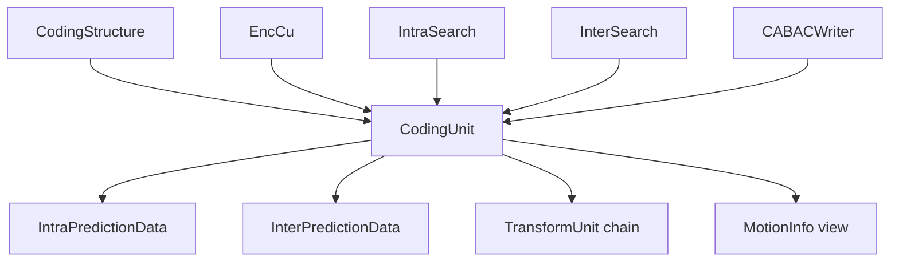
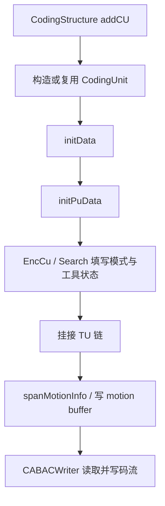
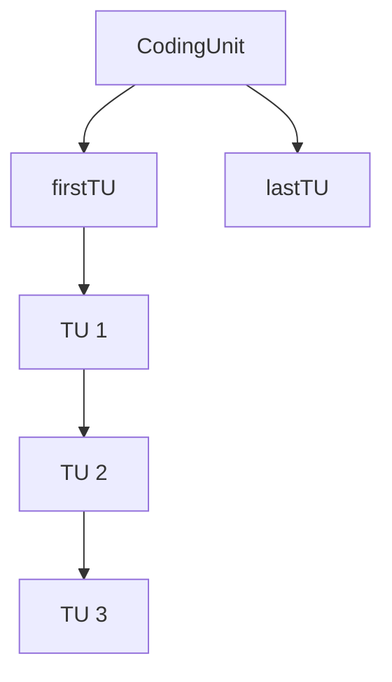
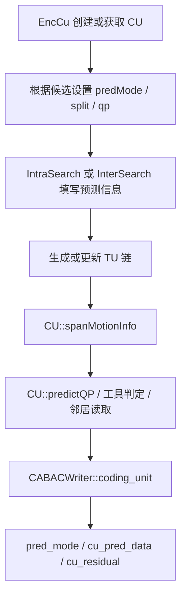

# vvenc `CodingUnit` 类分析

本文聚焦 `vvenc/source/Lib/CommonLib/Unit.h/.cpp` 中的 `CodingUnit`，重点说明：

1. `CodingUnit` 在 vvenc 中是什么
2. 它和 `CodingStructure`、`TransformUnit`、`MotionInfo` 的关系是什么
3. 为什么 `CodingUnit` 本体不算特别复杂，但围绕它的 `CU::` 工具函数非常关键

本文重点讲对象设计与数据流，不展开具体的模式搜索算法。

## 1. 类定位

`CodingUnit` 是 vvenc 中“一个编码块”的核心对象。

它描述的是：

- 当前块属于哪种预测模式
- 当前块经历了怎样的分裂历史
- 当前块的 QP、MTS、LFNST、SBT、ISP、MIP、Affine、IMV 等工具状态
- 当前块的运动信息和帧内信息
- 当前块对应的 TU 链

一句话说：

`CodingUnit` 负责回答“这个块最终是怎么编码的”。

## 2. 在编码链路中的位置

`CodingUnit` 位于 `CodingStructure` 内部，是块级编码信息的核心节点。

关系可以概括为：



这个图反映出：

- `CodingUnit` 是块级决策的汇总对象
- 上游搜索模块负责填它
- 下游 CABACWriter 负责读取它

## 3. 继承结构与含义

`CodingUnit` 的定义是：

```cpp
struct CodingUnit : public UnitArea, public IntraPredictionData, public InterPredictionData
```

这非常关键。

它说明 `CodingUnit` 自身直接继承了三类信息：

1. `UnitArea`
   - 当前块的空间范围

2. `IntraPredictionData`
   - 帧内预测相关字段

3. `InterPredictionData`
   - 帧间预测相关字段

也就是说，`CodingUnit` 不是靠“持有多个成员对象”来表达预测状态，而是直接把：

- 几何区域
- intra 数据
- inter 数据

压成了一个统一块对象。

## 4. `CodingUnit` 为什么重要

在 vvenc 里，很多判断最终都落在 `CodingUnit` 上：

- 这是 intra 还是 inter
- 是 skip / merge / MMVD / GEO / CIIP 还是普通 inter
- 是否启用了 affine / IMV / SMVD
- 是否启用了 MIP / ISP / BDPCM
- 是否有 residual，是否用 SBT / LFNST / MTS

因此 `CodingUnit` 是：

- 块级语义的最终承载体

## 5. 成员分组

### 5.1 基础归属关系

```cpp
CodingStructure* cs;
Slice*           slice;
ChannelType      chType;
```

这组成员定义了：

- 它属于哪个 `CodingStructure`
- 它处在哪个 `Slice`
- 当前对象对应 luma 还是 chroma 语义

这说明 `CodingUnit` 不是孤立块，而是强依赖 `CS/Slice` 上下文。

### 5.2 模式与分裂信息

```cpp
PredMode       predMode;
uint8_t        depth;
uint8_t        qtDepth;
uint8_t        btDepth;
uint8_t        mtDepth;
SplitSeries    splitSeries;
TreeType       treeType;
ModeType       modeType;
ModeTypeSeries modeTypeSeries;
```

这组成员负责描述：

- 当前块最终是什么预测模式
- 它在分裂树中的深度
- 走过了哪些 QT/BT/MTT 分裂
- 当前块处于 dual-tree 还是单树
- 当前块是否受 mode constraint 限制

其中最关键的理解点是：

- `depth` 是总分裂深度
- `qtDepth` 是进入 MTT 前的 QT 深度
- `btDepth/mtDepth` 是后续多类型树相关深度

因此 `CodingUnit` 不是只知道“块有多大”，还知道“块是怎么被切出来的”。

### 5.3 量化和根残差信息

```cpp
int8_t   chromaQpAdj;
int8_t   qp;
bool     rootCbf;
```

这些字段描述：

- 当前块 QP
- 色度 QP 调整
- 是否存在根残差

这是连接块级决策和残差编码的重要桥梁。

### 5.4 工具开关状态

```cpp
bool     skip;
bool     mmvdSkip;
bool     colorTransform;
bool     geo;
bool     mipFlag;
bool     affine;
uint8_t  affineType;
uint8_t  imv;
uint8_t  sbtInfo;
uint8_t  mtsFlag;
uint8_t  lfnstIdx;
uint8_t  BcwIdx;
uint8_t  smvdMode;
uint8_t  ispMode;
uint8_t  bdpcmM[MAX_NUM_CH];
```

这里几乎囊括了块级大部分重要工具。

可以分成几类理解：

- inter 类
  - `skip`
  - `mmvdSkip`
  - `geo`
  - `affine`
  - `imv`
  - `BcwIdx`
  - `smvdMode`

- intra 类
  - `mipFlag`
  - `ispMode`
  - `bdpcmM`
  - `colorTransform`

- residual/transform 类
  - `sbtInfo`
  - `mtsFlag`
  - `lfnstIdx`

这说明 `CodingUnit` 是真正的“块级总状态对象”。

### 5.5 链式组织信息

```cpp
unsigned       idx;
CodingUnit*    next;

TransformUnit* firstTU;
TransformUnit* lastTU;
```

这组成员体现出两个关键设计：

1. `CodingUnit` 在 `CodingStructure` 内通过链表顺序串联
2. 每个 `CodingUnit` 再挂一条自己的 `TU` 链

因此数据关系是：

```text
CodingStructure
  -> CU1 -> CU2 -> CU3 ...

每个 CU
  -> TU1 -> TU2 -> TU3 ...
```

这比只用 vector 下标更适合区域遍历和递归树构造。

## 6. `IntraPredictionData` 与 `InterPredictionData`

这是理解 `CodingUnit` 的核心。

### 6.1 `IntraPredictionData`

核心字段：

```cpp
uint8_t intraDir[MAX_NUM_CH];
uint8_t multiRefIdx;
bool    mipTransposedFlag;
```

表示：

- luma/chroma 的帧内方向
- MRL 的参考线索引
- MIP 是否转置

### 6.2 `InterPredictionData`

核心字段非常多，典型包括：

```cpp
bool        mergeFlag;
bool        ciip;
bool        mmvdMergeFlag;
uint8_t     mergeIdx;
uint8_t     interDir;
uint8_t     mvpIdx[2];
uint8_t     mvpNum[2];
Mv          mvd[2][3];
Mv          mv [2][3];
int16_t     refIdx[2];
```

它们表示：

- 当前块是否 merge
- 是否启用 CIIP/MMVD
- 当前 inter 方向
- MVP 相关索引
- MVD/MV
- 参考索引

这说明：

- 一个 `CodingUnit` 就足以完整表达一个块的 inter 决策

## 7. 生命周期与初始化

`CodingUnit` 的生命周期通常由 `CodingStructure::addCU()` 驱动，但本体也有自己的初始化逻辑。

### 7.1 构造函数

构造函数会：

- 初始化 `UnitArea`
- 置空 `cs/slice/next/TU`
- 调用 `initData()`
- 调用 `initPuData()`

### 7.2 `initData()`

这个函数重置块级通用字段：

- `predMode`
- 深度信息
- `skip/affine/geo/...`
- `qp/chromaQpAdj`
- `treeType/modeType`

### 7.3 `initPuData()`

这个函数专门重置预测相关字段：

- 帧内方向默认值
- inter merge/mv/refIdx 清零
- `mvdL0SubPu` 缓冲归零

这说明 vvenc 明确把：

- 块通用状态
- 预测状态

分两步初始化。

## 8. 生命周期流程图



## 9. `CodingUnit` 与 `TransformUnit` 的关系

一个 `CodingUnit` 不一定只对应一个 `TransformUnit`。

在很多情况下，一个 CU 会挂多段 TU：

- 普通 TU split
- ISP
- SBT

关系可以概括为：



因此：

- `CodingUnit` 负责块级预测与模式语义
- `TransformUnit` 负责变换树和系数语义

`firstTU/lastTU` 是两者的连接点。

## 10. `CodingUnit` 与 `MotionInfo`

`CodingUnit` 本身保存的是：

- `mv`
- `mvd`
- `refIdx`
- `interDir`

但帧内真正按更细粒度访问的运动信息，通常落在 `CodingStructure` 的 motion buffer 中。

`CodingUnit` 提供了几个桥接接口：

```cpp
const MotionInfo& getMotionInfo() const;
const MotionInfo& getMotionInfo(const Position& pos) const;
MotionBuf         getMotionBuf();
```

这说明：

- `CodingUnit` 是块级运动语义对象
- `MotionInfo` 是更细粒度的运动图表达

两者通过 `cs->getMotionBuf()` 连接起来。

## 11. 赋值操作为什么重要

`CodingUnit` 定义了多组赋值运算：

- `operator=(const CodingUnit&)`
- `operator=(const IntraPredictionData&)`
- `operator=(const InterPredictionData&)`
- `operator=(const MotionInfo&)`

这非常实用，因为在搜索过程中经常会发生：

- 只复制 intra 部分
- 只复制 inter 部分
- 从 `MotionInfo` 生成初始 inter 状态
- 完整复制另一个候选 CU

这说明 `CodingUnit` 被设计成一个非常便于候选拷贝和状态拼装的对象。

## 12. `CU::` 工具函数：为什么和本体一样重要

虽然 `CodingUnit` 本体字段很多，但 vvenc 真正常用的大量逻辑都不写在成员函数里，而是写在 `namespace CU` 中。

这是理解源码时非常重要的一点：

- `CodingUnit` 本体更偏“状态对象”
- `CU::` 更偏“规则与操作集合”

## 13. `CU::` 工具函数的几类职责

### 13.1 类型判断

最常见的是这些 inline 函数：

```cpp
CU::isIntra()
CU::isInter()
CU::isIBC()
CU::isSepTree()
CU::isConsInter()
CU::isConsIntra()
```

它们是阅读 vvenc 块级逻辑时出现频率最高的一批判断。

### 13.2 树结构与分裂历史解析

例如：

```cpp
CU::getSplitAtDepth()
CU::getModeTypeAtDepth()
```

这些函数会从 `splitSeries/modeTypeSeries` 中还原某个深度的分裂信息。

这意味着：

- `CodingUnit` 虽然只存压缩后的 split history
- 但 `CU::` 可以把它解释回树上的语义

### 13.3 QP、块位置和邻居访问

例如：

```cpp
CU::getCtuAddr()
CU::predictQP()
CU::getLeft()
CU::getAbove()
```

这些函数帮助编码器在块级做：

- QP 预测
- 邻居获取
- CTU 定位

### 13.4 帧内工具辅助

例如：

```cpp
CU::getIntraMPMs()
CU::getIntraDirLuma()
CU::getIntraChromaCandModes()
CU::isMIP()
CU::canUseISP()
CU::canUseLfnstWithISP()
```

它们本质上负责根据当前 `CodingUnit` 状态推导：

- 某工具是否可用
- 候选模式如何构造

### 13.5 帧间工具辅助

例如：

```cpp
CU::getInterMergeCandidates()
CU::getInterMMVDMergeCandidates()
CU::getAffineMergeCand()
CU::fillMvpCand()
CU::getColocatedMVP()
CU::isBipredRestriction()
```

这些函数让 `CodingUnit` 从“静态状态”变成“可参与搜索的对象”。

### 13.6 motion buffer 回写

例如：

```cpp
CU::spanMotionInfo()
CU::spanGeoMotionInfo()
```

它们会把 CU 中的运动语义铺写到 `CodingStructure` 的 motion buffer 上。

这一步非常关键，因为后续邻域访问和 DMVR/merge/HMVP 等都依赖这个图。

## 14. 从搜索到写码流的典型流程

可以用下面的流程概括一个 `CodingUnit` 在编码过程中的角色：



这反映出 `CodingUnit` 的双重角色：

- 搜索期是“候选结果对象”
- 输出期是“语法写出输入对象”

## 15. 设计特点总结

从设计上看，`CodingUnit` 有几个很鲜明的特点。

### 15.1 它是块级语义汇总对象

一个块最终怎么编码，绝大多数关键信息都落在 `CodingUnit` 上。

### 15.2 本体偏轻，规则偏外置

`CodingUnit` 本身主要负责存状态；

真正复杂的规则更多放在：

- `CU::`
- `EncCu`
- `IntraSearch`
- `InterSearch`

这是一种很典型的“数据对象 + 工具命名空间”设计。

### 15.3 它天然连接预测和变换两层

上游：

- intra/inter 信息

下游：

- `TransformUnit` 链

这使它成为块级语义的中心枢纽。

### 15.4 它和 `MotionInfo` 是两个粒度

- `CodingUnit` 负责块级语义表达
- `MotionInfo` 负责更细粒度采样图表达

这两个层次并存，是 vvenc inter 系统的重要设计基础。

## 16. 一句话总结

`CodingUnit` 可以概括为：

> vvenc 中承载单个编码块空间范围、预测模式、工具状态、量化信息和 TU 关联关系的核心块级语义对象。

如果说：

- `CodingStructure` 是区域级工作区
- `TransformUnit` 是残差/变换单元
- `MotionInfo` 是更细粒度运动图

那么 `CodingUnit` 负责的就是：

- “把一个块最终是怎么编码的，用一个对象完整表达出来”
