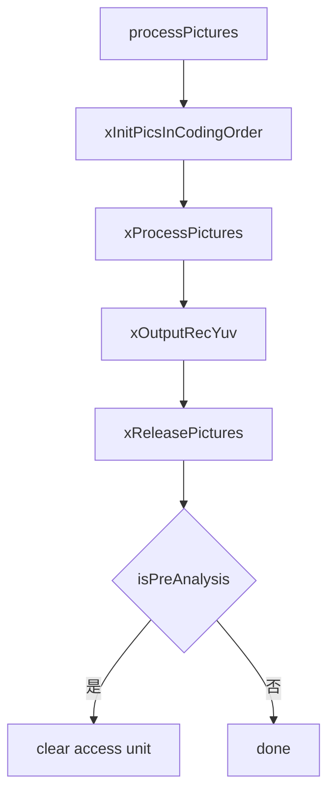
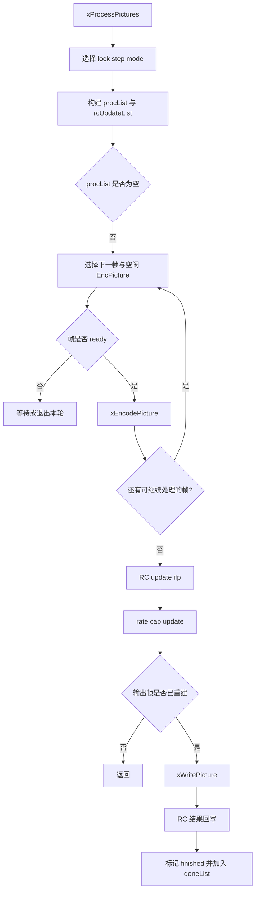
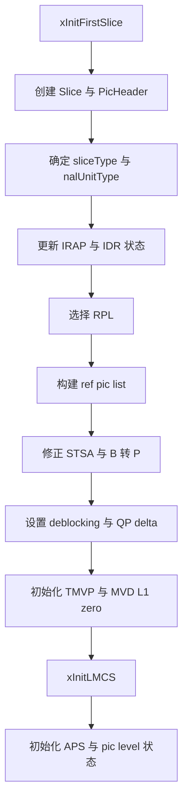

# vvenc `EncGOP` 类分析

`EncGOP` 是 `vvenc` 中真正把“待编码帧队列”转成“访问单元和码流输出”的核心调度器。  
它位于 `PreProcess` 之后、`EncPicture` 之前，负责：

- 按编码顺序组织待编码帧
- 初始化 `Slice` / `PicHeader` / 参考列表 / 参数集
- 调度 `EncPicture` 完成单帧编码
- 处理并行帧编码与 RC 协同
- 生成 `AccessUnit`
- 写出 VPS / SPS / PPS / APS / slice / SEI

如果说：

- `PreProcess` 负责“给帧打标签、做前分析”
- `EncPicture` 负责“把一帧压完”

那么 `EncGOP` 负责的就是“决定什么时候压哪一帧，以及如何把压完的帧写成可输出码流”。

## 1. 位置与调用关系

相关文件：

- [vvenc/source/Lib/EncoderLib/EncGOP.h](/Users/skl/reading/hlpvvc/vvenc/source/Lib/EncoderLib/EncGOP.h)
- [vvenc/source/Lib/EncoderLib/EncGOP.cpp](/Users/skl/reading/hlpvvc/vvenc/source/Lib/EncoderLib/EncGOP.cpp)
- [vvenc/source/Lib/EncoderLib/EncLib.cpp](/Users/skl/reading/hlpvvc/vvenc/source/Lib/EncoderLib/EncLib.cpp)
- [vvenc/source/Lib/EncoderLib/EncPicture.h](/Users/skl/reading/hlpvvc/vvenc/source/Lib/EncoderLib/EncPicture.h)

在 `EncLib` 中，`EncGOP` 同时承担两种角色：

- 首遍预分析编码器 `m_preEncoder`
- 最终编码器 `m_gopEncoder`

初始化形式如下：

```cpp
m_gopEncoder = new EncGOP( msg );
m_gopEncoder->initStage( m_encCfg, minQueueSize, 0, false, false, m_encCfg.m_stageParallelProc );
m_gopEncoder->init( m_encCfg, m_preProcess->getGOPCfg(), *m_rateCtrl, m_threadPool, false );
```

这说明：

- `EncGOP` 继承自 `EncStage`
- 它直接复用 `PreProcess` 准备好的 `GOPCfg`
- 它是 pipeline 中第一个真正产生码流输出的 stage

## 2. 类职责与核心成员

`EncGOP` 的定义见 [EncGOP.h](/Users/skl/reading/hlpvvc/vvenc/source/Lib/EncoderLib/EncGOP.h)。

从职责上看，它大致由五部分构成。

### 2.1 编码统计与输出

- `Analyze m_AnalyzeAll`
- `Analyze m_AnalyzeI`
- `Analyze m_AnalyzeP`
- `Analyze m_AnalyzeB`
- `HLSWriter m_HLSWriter`
- `SEIWriter m_seiWriter`
- `SEIEncoder m_seiEncoder`

### 2.2 参数集与高层语法

- `ParameterSetMap<SPS> m_spsMap`
- `ParameterSetMap<PPS> m_ppsMap`
- `VPS m_VPS`
- `DCI m_DCI`
- `EncHRD m_EncHRD`

### 2.3 单帧编码资源池

- `std::list<EncPicture*> m_freePicEncoderList`
- `NoMallocThreadPool* m_threadPool`

这里的 `EncPicture` 不是每帧 new 一个，而是预先分配多个实例作为“帧编码器池”。

### 2.4 图片调度队列

- `std::list<Picture*> m_gopEncListInput`
- `std::list<Picture*> m_gopEncListOutput`
- `std::list<Picture*> m_procList`
- `std::list<Picture*> m_rcUpdateList`
- `std::list<Picture*> m_rcInputReorderList`

### 2.5 编码配置与状态

- `const VVEncCfg* m_pcEncCfg`
- `const GOPCfg* m_gopCfg`
- `RateCtrl* m_pcRateCtrl`
- `EncReshape m_Reshaper`
- `std::vector<int> m_globalCtuQpVector`
- `bool m_isPreAnalysis`
- `bool m_bFirstWrite`
- `int m_numPicsCoded`
- `int m_lastIDR`
- `int m_pocCRA`

## 3. 初始化逻辑

关键函数：`EncGOP::init()`

简化伪代码：

```cpp
init( encCfg, gopCfg, rateCtrl, threadPool, isPreAnalysis )
{
  保存配置和依赖;

  初始化 SPS PPS VPS DCI HRD;
  初始化 SEIEncoder;
  初始化 Reshaper;

  按 maxParallelFrames 创建 EncPicture 池;

  如果启用 perceptual QPA
    初始化全局 CTU QP 向量;

  计算 ticksPerFrame;
  清空 rate cap 状态;
}
```

这一阶段完成三件事：

1. 建立后续编码所需的参数集模板
2. 建立单帧编码器池
3. 建立 GOP 级公共资源，例如 reshaper、全局 CTU QP 数据和时钟参数

## 4. `EncGOP` 的总体流程

关键函数：

- `processPictures()`
- `xProcessPictures()`
- `xEncodePicture()`
- `xWritePicture()`

### 4.1 总流程图



### 4.2 `xProcessPictures` 主循环



## 5. 关键函数拆解

## 5.1 `initPicture`

职责：

- 把进入 `EncGOP` 的 `Picture` 补齐成可编码状态

主要动作：

- 记录编码计时
- 设置 `TLayer`
- 根据 `cts` 计算缺帧信息
- 调用 `pic->setSccFlags()`
- 基于 `SPS/PPS/VPS/DCI` 执行 `finalInit()`
- 分配 SAO / ALF / QPA 所需的帧级缓存

简化逻辑：

```cpp
pic->TLayer = pic->gopEntry->m_temporalId;
pic->finalInit( vps, sps, pps, ... );

if( usePerceptQPA )
  分配 ctuQpaLambda 和 ctuAdaptedQP;

if( saoEnabled )
  分配 SAO 缓冲;

if( alfEnabled )
  分配 ALF 缓冲;
```

可以理解为：

- `PreProcess` 负责“元数据准备”
- `EncGOP::initPicture()` 负责“把帧装配成可进入 `EncPicture` 的完整对象”

## 5.2 `processPictures`

职责：

- 这是 `EncStage` 对外调用的主入口
- 它负责把当前 `picList` 中的图片推进到“编码、输出、释放”三个阶段

简化逻辑：

```cpp
processPictures( picList, auList, doneList, freeList )
{
  xInitPicsInCodingOrder( picList );
  xProcessPictures( auList, doneList );
  xOutputRecYuv( picList );
  xReleasePictures( picList, freeList );

  if( m_isPreAnalysis )
    auList.clearAu();
}
```

注意：

- 在预分析模式下，虽然内部也会跑编码逻辑，但最终不会保留输出 AU

## 5.3 `xInitPicsInCodingOrder`

职责：

- 从 `picList` 中选出当前可以进入 GOP 编码的帧
- 按编码顺序而不是显示顺序组织输入列表

这个函数是 `EncGOP` 从“队列视角”切换到“编码顺序视角”的关键点。  
`PreProcess` 已经给每帧填好了 `GOPEntry`，而 `EncGOP` 在这里依据 `m_codingNum`、GOP 起点、flush 状态等信息，决定哪些帧可以进入当前编码批次。

## 5.4 `xProcessPictures`

职责：

- 真正驱动 `EncPicture` 编码
- 管理帧并行编码
- 管理 lock-step RC 更新
- 在合适时机把重建完成的帧交给 `xWritePicture`

这里有一个非常关键的概念：`lockStepMode`。

```cpp
const bool lockStepMode =
  (targetBitrate > 0 || (lookAhead > 0 && !m_isPreAnalysis))
  && (maxParallelFrames > 0);
```

含义：

- 当启用 RC / lookahead 且存在帧并行时，输出和 RC 更新不能再完全自由推进
- 需要把若干帧作为一个“同步 chunk”处理

该函数的核心工作可以概括为：

1. 准备 `procList` 和 `rcUpdateList`
2. 挑选一帧可编码图片和一个空闲 `EncPicture`
3. 交给 `xEncodePicture`
4. 等待重建条件满足
5. 输出一帧并做 RC 更新

## 5.5 `xEncodePicture`

职责：

- 把一帧真正交给 `EncPicture`
- 处理首遍跳帧、ALF APS 同步、RC 初始化、scene-cut GOP 的 QP 修正

简化伪代码：

```cpp
xEncodePicture( pic, picEncoder )
{
  if( 首遍并且当前帧允许 skipFirstPass )
  {
    pic->isReconstructed = true;
    回收 picEncoder;
    return;
  }

  if( alfTempPred )
    xSyncAlfAps( pic );

  pic->isPreAnalysis = m_isPreAnalysis;

  if( 不是最高两个时域层 )
    initPicAuxQPOffsets( ... );

  if( 开启 RC )
    initRateControlPic( ... );

  if( 当前是 scene-cut GOP 的后续帧 )
    应用 gopAdaptedQPAdj;

  picEncoder->compressPicture( *pic, *this );

  finalizePicture 同步或异步执行;
  标记 isReconstructed;
  回收 picEncoder;
}
```

这个函数是 `EncGOP` 和 `EncPicture` 的核心连接点。

### 一个很重要的细节

`compressPicture()` 和 `finalizePicture()` 在多线程下不是一次同步完成的：

- `compressPicture()` 先发起帧内部的编码
- `finalizePicture()` 可能通过线程池 barrier task 异步执行
- 完成后才会把 `pic->isReconstructed` 置为 `true`

这也是 `xProcessPictures()` 为什么必须检查“输出帧是否已经完成重建”的原因。

## 5.6 `xInitFirstSlice`

职责：

- 初始化当前帧第一条 slice
- 这是 `EncGOP` 中信息最密集的函数之一

它完成的事情很多，核心包括：

- 分配 `Slice` 与 `PicHeader`
- 根据 `GOPEntry` 决定 `sliceType` 与 `nalUnitType`
- 更新 IRAP / IDR / CRA 相关状态
- 选择参考列表和构造 ref pic list
- 设置 TMVP / MVD L1 zero / deblocking / QP delta / chroma QP delta
- 初始化 LMCS
- 初始化 APS 和 pic-level 编码状态

可以把它理解为：  
“把 `PreProcess` 给出的 `GOPEntry`，展开成一帧真正可编码的 slice 头部与参考结构配置。”

简化流程图：



## 5.7 `xInitLMCS`

职责：

- 处理 reshaper / LMCS 的编码侧初始化

该函数会根据当前帧是否为 intra、是否启用 reshaper、信号类型是 PQ 还是 SDR / HLG，决定：

- 是否生成新的 LMCS model
- 是否构造新的 LUT
- 是否把原始 luma 重塑到 `filtered orig buffer`
- 是否为当前帧写入 LMCS APS

这部分不属于 `EncGOP` 的调度核心，但属于“单帧开始编码前必须完成的高层准备”。

## 5.8 `xWritePicture`

职责：

- 把一帧编码结果写入 `AccessUnit`
- 这是 `EncGOP` 的输出主入口

简化伪代码：

```cpp
xWritePicture( pic, au )
{
  if( 首遍跳帧 )
  {
    addRCPassStats();
    return;
  }

  设置 au 的 poc temporalLayer cts dts 等字段;

  pic.actualTotalBits += xWriteParameterSets();
  xWriteLeadingSEIs();
  pic.actualTotalBits += xWritePictureSlices();
  xWriteTrailingSEIs();
  xPrintPictureInfo();
}
```

这个函数串起了三种输出：

1. 参数集输出
2. slice 数据输出
3. SEI 与统计输出

## 5.9 `xWriteParameterSets`

职责：

- 在需要时写出 VPS / DCI / SPS / PPS / APS / AUD

核心逻辑：

- 首次输出，或者 IRAP 且允许 rewrite param sets 时，写 VPS DCI SPS PPS
- 如启用 AU delimiter，则写 AUD
- 如 LMCS APS 有变化，则写 LMCS APS
- 如 ALF APS 有变化，则写 ALF APS

注意：

- 参数集不是每帧都写
- APS 写出和 “changed flag” 强相关

## 5.10 `xWritePictureSlices`

职责：

- 把当前帧的 slice header 和 CABAC slice data 拼成最终 NAL

简化逻辑：

```cpp
for each slice:
  创建 OutputNALUnit
  codeSliceHeader
  codeTilesWPPEntryPoint
  attach slice data stream
  push 到 accessUnit

xCabacZeroWordPadding()
```

这里的 slice data 已经在 `EncPicture` / `EncSlice` 阶段准备好，`EncGOP` 在这里只负责高层封装与 NAL 拼装。

## 5.11 `xOutputRecYuv`

职责：

- 若注册了回调且处于 final pass，则按显示顺序输出重建 YUV

这个输出和码流输出不同：

- 码流输出按 AU 组织
- 重建 YUV 输出则按 `pocRecOut` 追踪显示顺序

## 5.12 `xReleasePictures`

职责：

- 释放已经不再需要的 `Picture`

释放条件大致为：

- 已完成编码
- 不再需要输出
- 不再被引用
- `refCounter <= 0`

或者：

- flush 且所有图片已处理完成

## 6. `EncGOP` 对其他模块的连接

### 6.1 与 `PreProcess`

- 消费 `GOPCfg`
- 使用每帧已经准备好的 `GOPEntry`
- 接收 scene cut / SCC / visual activity 等前处理结果

### 6.2 与 `EncPicture`

- `EncGOP` 负责选帧和调度
- `EncPicture` 负责单帧压缩和后处理

### 6.3 与 `RateCtrl`

- 初始化每帧的初始 QP 与 lambda
- 在 lock-step 模式下控制 RC 更新时机
- 在首遍跳帧时写入 pass stats

### 6.4 与 `HLSWriter` / `SEIWriter`

- `EncGOP` 组织高层语法与 AU 输出
- `HLSWriter` 负责编码参数集和 slice header
- `SEIWriter` 负责编码 SEI NAL

## 7. 阅读建议

如果目标是尽快掌握 `EncGOP`，建议按下面顺序读：

1. `init()`
2. `initPicture()`
3. `processPictures()`
4. `xProcessPictures()`
5. `xEncodePicture()`
6. `xInitFirstSlice()`
7. `xInitLMCS()`
8. `xWritePicture()`
9. `xWriteParameterSets()`
10. `xWritePictureSlices()`

## 8. 一句话总结

`EncGOP` 的本质是 GOP 级调度与输出中枢。它把 `PreProcess` 产出的帧级元数据，变成可以送入 `EncPicture` 的编码任务；再把 `EncPicture` 产出的压缩结果，变成最终的访问单元和码流输出。  
