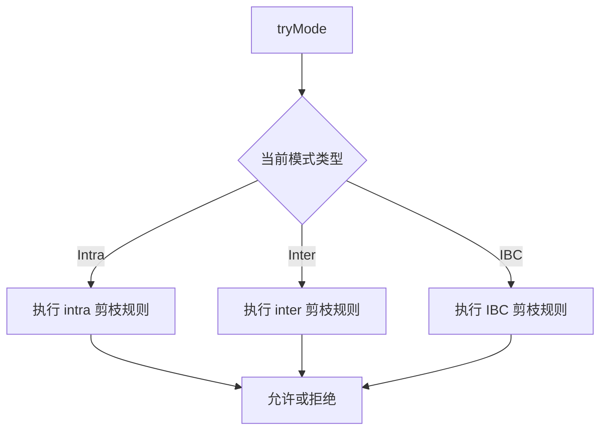
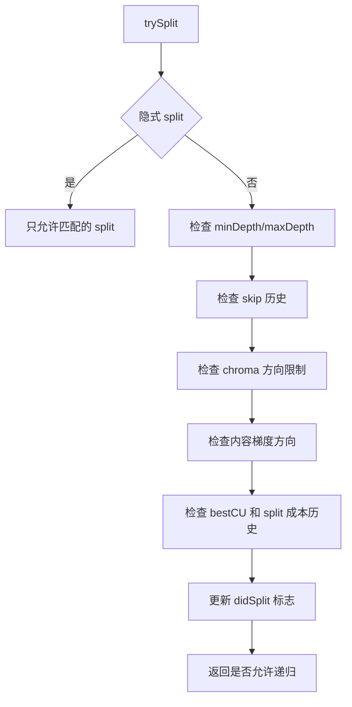
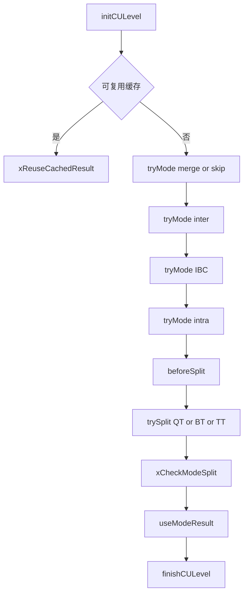

# vvenc `EncModeCtrl` 类分析

## 1. 类定位

`EncModeCtrl` 是 `EncCu` 的模式控制器。

它本身不执行 intra / inter / merge / split 的 RDO 搜索，也不直接写码流，而是负责回答三个问题：

- 当前这个 CU 节点，哪些编码模式值得试
- 哪些 split 值得继续向下递归
- 已经试过的结果里，哪些状态可以缓存、复用或提前剪枝

因此，`EncModeCtrl` 的本质是“CU 级搜索控制层”，而 `EncCu` 才是真正的执行层。

## 2. 在编码流程中的位置

它和 `EncCu` 的关系可以概括为：

```text
EncSlice
  -> EncCu::encodeCtu()
    -> EncCu::xCompressCU()
      -> EncModeCtrl::initCULevel()
      -> EncModeCtrl::tryMode()
      -> EncModeCtrl::useModeResult()
      -> EncModeCtrl::beforeSplit()
      -> EncModeCtrl::trySplit()
      -> EncModeCtrl::finishCULevel()
```

更直白地说：

- `EncCu` 负责“怎么试”
- `EncModeCtrl` 负责“试不试”

## 3. 核心数据结构

### 3.1 `EncTestMode`

`EncTestMode` 表示一个待测试模式：

```cpp
struct EncTestMode
{
  EncTestModeType type;
  EncTestModeOpts opts;
  int             qp;
  bool            lossless;
  double          maxCostAllowed;
};
```

它把一次“模式尝试”抽象成统一对象，交给 `EncCu` 和 `EncModeCtrl` 共同使用。

### 3.2 `EncTestModeType`

vvenc 把 CU 级候选模式抽成一套枚举：

```cpp
ETM_MERGE_SKIP
ETM_INTER_ME
ETM_INTER_IMV
ETM_INTRA
ETM_SPLIT_QT
ETM_SPLIT_BT_H
ETM_SPLIT_BT_V
ETM_SPLIT_TT_H
ETM_SPLIT_TT_V
ETM_RECO_CACHED
ETM_IBC
ETM_IBC_MERGE
```

可以分成三类：

- 非 split 模式
  - merge/skip
  - inter ME
  - inter IMV
  - intra
  - IBC
- split 模式
  - QT / BT / TT
- 缓存相关模式
  - `ETM_RECO_CACHED`

`EncModeCtrl` 的很多判断逻辑，都是围绕这个枚举展开的。

### 3.3 `ComprCUCtx`

这是 `EncModeCtrl` 最重要的上下文结构。  
每进入一层 `xCompressCU()` 递归，都会新建一个 `ComprCUCtx`。

关键成员包括：

```cpp
struct ComprCUCtx
{
  unsigned         minDepth;
  unsigned         maxDepth;
  CodingStructure* bestCS;
  CodingUnit*      bestCU;
  TransformUnit*   bestTU;
  EncTestMode      bestMode;
  double           bestCostBeforeSplit;
  double           bestCostVertSplit;
  double           bestCostHorzSplit;
  double           bestCostNoImv;
  int              maxQtSubDepth;
  bool             isReusingCu;
  bool             qtBeforeBt;
  bool             doTriHorzSplit;
  bool             doTriVertSplit;
  int              doMoreSplits;
  bool             didQuadSplit;
  bool             didHorzSplit;
  bool             didVertSplit;
  bool             isBestNoSplitSkip;
  bool             intraWasTested;
  bool             nonSkipWasTested;
  EncTestMode      bestNsPredMode;
};
```

`ComprCUCtx` 记录的是“当前 CU 节点到目前为止已经知道的最优信息和剪枝线索”。

它主要承担四类信息：

- 深度边界
  - `minDepth`
  - `maxDepth`
- 当前最好结果
  - `bestCS`
  - `bestCU`
  - `bestTU`
  - `bestMode`
- split 相关搜索状态
  - `qtBeforeBt`
  - `didHorzSplit`
  - `doTriVertSplit`
  - `bestCostVertSplit`
- 快速算法线索
  - `isBestNoSplitSkip`
  - `bestCostNoImv`
  - `nonSkipWasTested`
  - 梯度统计值

### 3.4 `CacheBlkInfoCtrl`

这是一个块级历史信息缓存。

缓存对象是 `CodedCUInfo`，里面保存：

- 相关块是否已经是 inter / intra / skip / IBC
- 保存的 MV
- SBT 相关缓存
- 某些快速模式判断需要的 bestCost

它的定位不是“精确复现旧结果”，而是作为快速剪枝的启发式信息来源。

### 3.5 `BestEncInfoCache`

这是一套更强的结果复用缓存。

它会在满足条件时，把当前 CU 的：

- `CodingUnit`
- `TransformUnit`
- `EncTestMode`
- `dist`
- `costDbOffset`

保存下来，后续遇到相同位置、相同邻域、相同 QP、相同树约束时，可直接复用。

它的核心接口是：

- `setFromCs()`
- `setCsFrom()`
- `isReusingCuValid()`

这套机制服务于 `m_reuseCuResults`。

## 4. 生命周期

`EncModeCtrl` 的生命周期分三层：

### 4.1 编码器初始化

`init()` 中会：

- 保存配置和 `RdCost`
- 创建 `CacheBlkInfoCtrl`
- 创建 `BestEncInfoCache`

### 4.2 每个 CTU 开始

`initCTUEncoding()` 中会：

- 初始化 slice 级缓存依赖
- 清空 `m_ComprCUCtxList`
- 计算快速编码相关阈值
- 记录当前 `tileIdx`

### 4.3 每个 CU 递归节点

`initCULevel()` / `finishCULevel()` 负责 push / pop `ComprCUCtx`。

也就是说，`m_ComprCUCtxList` 实际上是一条和 partitioner 递归深度同步的上下文栈。

## 5. `initCULevel()`：进入一个 CU 节点时做什么

`initCULevel()` 是理解 `EncModeCtrl` 的第一关键点。

它做的核心工作有三类：

1. 计算当前 CU 的最小 / 最大深度约束
2. 创建新的 `ComprCUCtx`
3. 初始化快速剪枝特征

简化伪代码：

```cpp
initCULevel(partitioner, cs)
{
  compute minDepth and maxDepth;
  push ComprCUCtx(minDepth, maxDepth);

  infer qtBeforeBt from neighbors and config;
  set split-related flags;
  set isReusingCu from cache validation;

  if contentBasedFastQtbt enabled:
    compute horizontal / vertical / diagonal gradients;
}
```

### 5.1 `qtBeforeBt`

这是一个很关键的开关。

它决定当前节点的 split 搜索顺序是否倾向：

- 先试 QT
- 再试 BT/TT

它并不是固定规则，而是根据：

- 左邻和上邻的 `qtDepth`
- 当前块尺寸
- 当前层级
- `qtbttSpeedUp` 配置

综合得出。

### 5.2 内容梯度特征

如果开启 `m_contentBasedFastQtbt`，函数会统计当前 luma 区域的：

- 水平梯度
- 垂直梯度
- 两条对角线梯度

这些梯度不会直接决定编码模式，而是后续用于 `trySplit()` 中的方向性剪枝。

## 6. `tryMode()`：非 split 模式是否值得试

`tryMode()` 用来判断非 split 模式能不能进入真正的 RDO 检查。

支持的类型主要包括：

- `ETM_MERGE_SKIP`
- `ETM_INTER_ME`
- `ETM_INTER_IMV`
- `ETM_INTRA`
- `ETM_IBC`
- `ETM_IBC_MERGE`

流程图如下：



### 6.1 intra 模式剪枝

对 `ETM_INTRA`，`tryMode()` 会检查很多条件，例如：

- 当前块是否超过最大 TB 大小
- inter 最优结果是否已经很强，且 `usePbIntraFast` 允许跳过
- 邻块历史是否表明这是明显的 inter 区域
- IBC 最优结果是否已经足够好
- `FastIntraTools` 下相关块是否已经有可靠线索

本质上是避免在明显 inter-friendly 的区域浪费大量 intra 搜索时间。

### 6.2 inter 模式剪枝

对 `ETM_INTER_ME` / `ETM_INTER_IMV` / `ETM_MERGE_SKIP`，会用到：

- `FastInferMerge`
- `relatedCU.isSkip`
- `relatedCU.isIntra`

例如，如果历史缓存已经表明这个位置更像 skip 或 intra，就可以跳过一部分 inter 搜索。

### 6.3 IBC 模式剪枝

对 `ETM_IBC` / `ETM_IBC_MERGE`，限制更强：

- 只有启用 IBC 才能试
- CU 尺寸必须小于 `128x128`
- 某些快速模式下，4x4 或较大块直接跳过
- 如果已有 intra 或其它模式明显更优，也会直接剪掉

## 7. `beforeSplit()`：从非 split 最优结果提取分裂线索

`beforeSplit()` 在所有非 split 模式试完之后调用。

它做两类事情：

### 7.1 记录当前 non-split 最优结果

```cpp
cuECtx.bestNsPredMode      = cuECtx.bestMode;
cuECtx.bestCostBeforeSplit = cuECtx.bestCS->cost;
```

这会成为后续 split 模式的重要参考基线。

### 7.2 回写历史块信息

它会把当前最好 CU 的属性写回 `CodedCUInfo`，例如：

- 是否 inter
- 是否 skip
- 是否 MMVD skip
- 是否 IBC
- 是否 intra

如果是 intra，还可能更新相关块的 `bestCost`。

### 7.3 缓存当前最好结果

它还会调用：

```cpp
setFromCs(*cuECtx.bestCS, cuECtx.bestMode, partitioner);
```

把当前最优解存进 `BestEncInfoCache`，为后续复用做准备。

## 8. `trySplit()`：split 是否值得继续递归

`trySplit()` 是 `EncModeCtrl` 最核心的函数之一。

它不是简单检查 `partitioner.canSplit()`，而是在“语法允许”的前提下，再叠加大量启发式剪枝。

流程图如下：



### 8.1 深度约束

它会首先应用：

- `minDepth`
- `maxDepth`

例如：

- 如果当前还没达到最小 QT 深度，就强制 QT
- 如果已经达到最大 QT 深度，就不再试 QT

### 8.2 skip 历史剪枝

这是比较典型的一条启发式：

- 如果在连续几层祖先节点里，最佳 non-split 一直都是 skip
- 则当前节点继续 split 的收益大概率不高

代码里通过 `skipScore` 来统计这种现象，并在达到阈值后直接剪掉 split。

### 8.3 chroma split 限制

对色度树，`doHorChromaSplit` / `doVerChromaSplit` / `doQtChromaSplit` 可以限制某些方向 split。

### 8.4 基于内容梯度的方向性剪枝

如果启用了 `contentBasedFastQtbt`，当前块近似正方形时会比较：

- 水平梯度
- 垂直梯度
- 对角梯度

例如：

- 如果水平纹理明显更强，则跳过水平 split
- 如果垂直纹理明显更强，则跳过垂直 split

这类判断不是标准规定，而是纯编码器侧加速策略。

### 8.5 基于已有最佳结果的 split 剪枝

很多剪枝都依赖 `bestCU` 和 split 历史代价：

- 如果当前最好就是 skip，而且 `mtDepth` 已经较深，则不再继续分
- 如果 horz/vert split 已经试过，TT split 的代价远差于 no-split 或另一方向，则跳过 TT
- 如果 QT 先行且子树 QT 深度已经很大，某些 BT/TT 可跳过

这些规则说明 `EncModeCtrl` 并不是“先列全模式再挨个试”，而是边试边缩小搜索空间。

## 9. `useModeResult()`：消费 RDO 结果并更新上下文

当 `EncCu` 真的执行完某个模式的 RDO 后，会把结果交回：

```cpp
useModeResult(encTestmode, tempCS, partitioner, useEDO)
```

这一步负责：

- 记录 split 方向代价
- 记录 IMV / non-skip 等辅助线索
- 更新当前 CU 层的最优结果

简化逻辑如下：

```cpp
if mode is split BT_H:
  save bestCostHorzSplit;
if mode is split BT_V:
  save bestCostVertSplit;
if mode is inter without split:
  mark nonSkipWasTested;
if mode is inter ME with no-IMV:
  save bestCostNoImv;
if mode is QT split:
  update maxQtSubDepth;

if split result shows all children are skip:
  reduce doMoreSplits;

if tempCS cost better than bestCS:
  update bestCS / bestCU / bestTU / bestMode;
```

### 9.1 `doMoreSplits`

这是当前节点还能继续尝试多少 split 的一个软预算。

如果已经多次观察到“split 以后所有子块都是 skip”，就会减少 `doMoreSplits`，从而收紧后续 split 尝试。

### 9.2 `bestCostNoImv`

当开启 `AMVRspeed` 时，这个值用于衡量普通整像素或标准精度 inter 的表现，后续可用于 IMV 分支的快速判断。

## 10. 与 `EncCu::xCompressCU()` 的配合方式

结合 `EncCu.cpp` 可以把完整配合理解成下面这条链：



也就是说，`EncModeCtrl` 决定了 `xCompressCU()` 的搜索节奏：

- 先 non-split
- 再提取最佳 non-split 线索
- 再按规则决定 split 方向和顺序

## 11. 两套缓存机制的区别

很多人第一次读 `EncModeCtrl` 时，会混淆 `CacheBlkInfoCtrl` 和 `BestEncInfoCache`。

可以这样区分：

### 11.1 `CacheBlkInfoCtrl`

保存的是轻量启发式信息：

- 这里上次更像 inter 还是 intra
- 是否 skip
- 有哪些 MV / SBT 线索

用途：

- 快速剪枝
- 快速方向判断

### 11.2 `BestEncInfoCache`

保存的是近似完整的最佳编码结果：

- CU/TU
- testMode
- dist / costDbOffset

用途：

- 在高度相似场景下直接复用已有 CU 结果

前者偏“经验线索”，后者偏“结果复用”。

## 12. 设计特点

### 12.1 搜索控制与执行分离

`EncModeCtrl` 不直接做模式搜索，但掌握搜索节奏。  
这是比较典型的“控制层 / 执行层分离”。

### 12.2 栈式上下文

`m_ComprCUCtxList` 和 partitioner 递归同步增长、回退，适合 CU 递归树结构。

### 12.3 启发式快速算法集中化

大量 fast algorithm 都集中在这里：

- skip 历史剪枝
- 梯度方向剪枝
- intra/inter 互斥剪枝
- chroma split 剪枝
- TT split 剪枝
- reuse CU result

这使得 `EncCu` 主流程保持相对清晰，而复杂的“要不要试”逻辑被集中管理。

## 13. 阅读建议

建议按下面顺序读：

1. 先看 `EncTestModeType`、`EncTestMode`
2. 看 `ComprCUCtx`，理解当前层保存哪些状态
3. 看 `CacheBlkInfoCtrl` 和 `BestEncInfoCache`
4. 看 `initCULevel()`，理解上下文如何初始化
5. 看 `tryMode()`，理解非 split 模式剪枝
6. 看 `beforeSplit()`，理解 non-split 最优结果如何反馈
7. 重点看 `trySplit()`，这是最复杂的剪枝逻辑
8. 最后看 `useModeResult()`，理解结果如何回写

## 14. 小结

`EncModeCtrl` 的核心价值不在于“实现某个编码工具”，而在于控制搜索复杂度。

它做的事情可以概括成三句：

- 用 `EncTestMode` 描述当前可以尝试的候选模式
- 用 `ComprCUCtx` 记录当前递归节点的最好结果和剪枝线索
- 用缓存和启发式规则，尽量减少无价值的模式与 split 递归

从代码结构上看：

- `EncSlice` 决定 CTU 何时编码
- `EncCu` 决定具体执行哪些 RDO 检查
- `EncModeCtrl` 决定这些检查是否值得发生

如果继续深入，下一篇最自然的是把 `EncModeCtrl -> EncCu::xCheckRDCost* / xCheckModeSplit` 之间的执行关系单独展开。  
