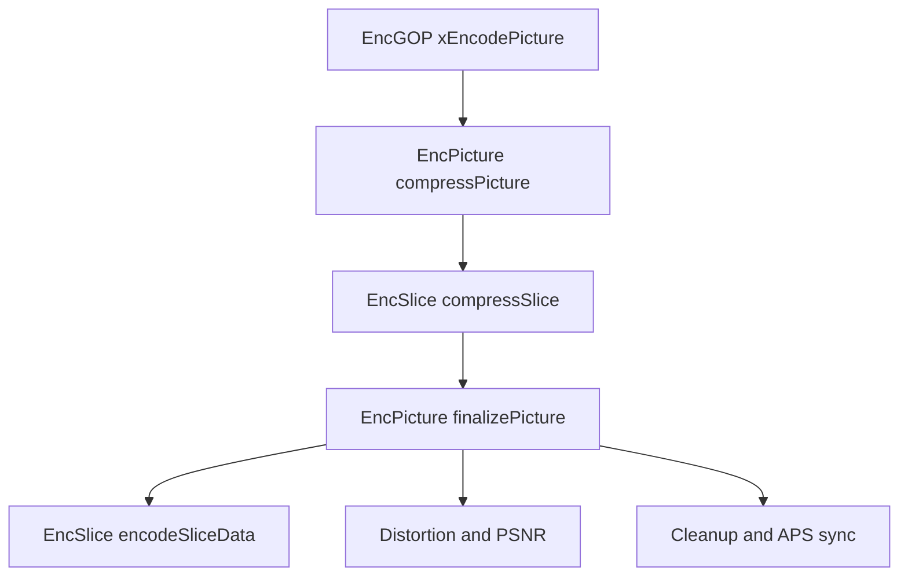
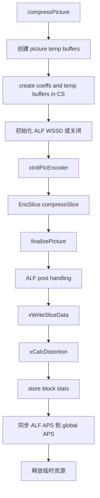

# vvenc `EncPicture` 类分析

`EncPicture` 是 `vvenc` 中的单帧编码组织器。  
它位于 `EncGOP` 与 `EncSlice` 之间，负责把一帧从“已经完成 GOP / slice 头初始化”的状态，推进到：

- CTU 级压缩完成
- 环路后处理状态就绪
- slice data 码流生成
- 失真和 PSNR 统计完成
- 临时资源清理完成

如果说：

- `EncGOP` 负责“这一帧该怎么组织、何时编码、何时输出”
- `EncSlice` 负责“这一帧内部的 CTU/slice 编码”

那么 `EncPicture` 负责的就是：

- “把一帧完整压完并收尾”

## 1. 位置与调用关系

相关文件：

- [vvenc/source/Lib/EncoderLib/EncPicture.h](/Users/skl/reading/hlpvvc/vvenc/source/Lib/EncoderLib/EncPicture.h)
- [vvenc/source/Lib/EncoderLib/EncPicture.cpp](/Users/skl/reading/hlpvvc/vvenc/source/Lib/EncoderLib/EncPicture.cpp)
- [vvenc/source/Lib/EncoderLib/EncGOP.cpp](/Users/skl/reading/hlpvvc/vvenc/source/Lib/EncoderLib/EncGOP.cpp)
- [vvenc/source/Lib/EncoderLib/EncSlice.h](/Users/skl/reading/hlpvvc/vvenc/source/Lib/EncoderLib/EncSlice.h)

在 `EncGOP::xEncodePicture()` 中，一帧真正交给 `EncPicture`：

```cpp
picEncoder->compressPicture( *pic, *this );
...
picEncoder->finalizePicture( *pic );
```

这说明 `EncPicture` 的生命周期被 `EncGOP` 控制，而 `EncPicture` 自己只聚焦“单帧内部的编码与收尾”。

整体位置关系：



## 2. 类职责与主要成员

`EncPicture` 的定义见 [EncPicture.h](/Users/skl/reading/hlpvvc/vvenc/source/Lib/EncoderLib/EncPicture.h)。

### 2.1 核心职责

- 持有单帧编码所需的 slice encoder、loop filter、ALF 编码器
- 驱动一帧的压缩过程
- 驱动一帧的码流写出准备和收尾
- 计算失真和 PSNR
- 管理该帧编码时的临时资源

### 2.2 主要成员

```cpp
const VVEncCfg*       m_pcEncCfg;
EncSlice              m_SliceEncoder;
LoopFilter            m_LoopFilter;
EncAdaptiveLoopFilter m_ALF;

BitEstimator          m_BitEstimator;
CABACWriter           m_CABACEstimator;
CtxCache              m_CtxCache;
RateCtrl*             m_pcRateCtrl;

WaitCounter           m_ctuTasksDoneCounter;
```

可以分成三组理解：

### 编码主模块

- `m_SliceEncoder`
- `m_LoopFilter`
- `m_ALF`

### CABAC / 上下文估计资源

- `m_BitEstimator`
- `m_CABACEstimator`
- `m_CtxCache`

### 编码控制

- `m_pcEncCfg`
- `m_pcRateCtrl`
- `m_ctuTasksDoneCounter`

`WaitCounter` 的作用尤其关键：

- 多线程下 `EncSlice` 内部会派发 CTU 级任务
- `EncGOP` 可以基于这个 counter 确认何时允许做 `finalizePicture`

## 3. 初始化逻辑

关键函数：`EncPicture::init()`

简化伪代码：

```cpp
init( encCfg, globalCtuQpVector, sps, pps, rateCtrl, threadPool )
{
  m_pcEncCfg = &encCfg;

  if( alf or ccalf enabled )
    m_ALF.init( ... );

  m_SliceEncoder.init(
    encCfg, sps, pps,
    globalCtuQpVector,
    m_LoopFilter,
    m_ALF,
    rateCtrl,
    threadPool,
    &m_ctuTasksDoneCounter
  );

  m_pcRateCtrl = &rateCtrl;
}
```

这一步的核心是：

- 把单帧内部所需的编码子模块接好
- 尤其把 `LoopFilter`、`ALF`、`RateCtrl` 和 `WaitCounter` 传进 `EncSlice`

因此 `EncPicture` 更像一个局部装配器，它把 frame-level 的依赖集中接到 `EncSlice`。

## 4. 主流程

`EncPicture` 的对外主流程只有两个函数：

- `compressPicture()`
- `finalizePicture()`

可以把它理解成：

- `compressPicture()`：做压缩阶段
- `finalizePicture()`：做收尾阶段

### 总流程图



## 5. `compressPicture`

关键函数：`EncPicture::compressPicture()`

### 5.1 职责

- 为当前帧创建压缩阶段所需的临时缓冲
- 初始化 `EncSlice`
- 调用 `EncSlice::compressSlice()` 做真正的 slice / CTU 级压缩

### 5.2 实现逻辑

简化伪代码：

```cpp
compressPicture( pic, gopEncoder )
{
  pic.encTime.startTimer();

  pic.createTempBuffers(...);
  pic.cs->createCoeffs();
  pic.cs->createTempBuffers(true);
  pic.cs->initStructData(...);

  if( LMCS PQ and ALF enabled )
  {
    从 gopEncoder reshaper 拿 luma weight table;
    设置给 m_ALF;
    m_ALF.setAlfWSSD(1);
  }
  else
  {
    m_ALF.setAlfWSSD(0);
  }

  xInitPicEncoder( pic );

  pic.cs->slice = pic.slices[0];
  fill ctuSlice with first slice;
  m_SliceEncoder.compressSlice( &pic );
}
```

### 5.3 关键点

#### 1. 先分配 temp buffers

包括：

- `Picture` 级临时缓冲
- `CodingStructure` 的 coeff buffer
- `CodingStructure` 的 temp buffer

这说明：

- `compressPicture()` 不是只调一个 `compressSlice()` 就完了
- 它先要把整帧工作区建好

#### 2. ALF 和 LMCS 的联动

当：

- `pic.useLMCS`
- `reshapeSignalType == PQ`
- `ALF` 开启

时，会把 reshaper 生成的 luma 权重表复制到 `m_ALF`，并开启 `AlfWSSD`。

这说明 `EncPicture` 也是 frame-level 工具协同的节点之一。

#### 3. 真正的“压缩工作”交给 `EncSlice`

`EncPicture` 本身不做 CTU 级递归搜索，它只负责调度：

- `xInitPicEncoder()`
- `m_SliceEncoder.compressSlice()`

## 6. `xInitPicEncoder`

### 6.1 职责

- 在进入 slice 压缩前，把当前帧和 slice 状态调整到可编码状态

### 6.2 关键逻辑

```cpp
m_SliceEncoder.initPic( &pic );

xInitSliceColFromL0Flag( slice );
xInitSliceCheckLDC( slice );

if( slice->sps->alfEnabled )
{
  for each slice:
    slice->alfEnabled[COMP_Y] = false;
}
```

### 6.3 几个关键动作

#### 1. 调用 `EncSlice::initPic`

这一步会把 picture 级状态进一步下沉到 slice encoder。

#### 2. 初始化 `colFromL0Flag`

对于 B slice，会根据 L0/L1 第一个参考帧的 `sliceQp` 决定：

- 该 slice 的 colocated 参考来自 L0 还是 L1

#### 3. 初始化 `checkLDC`

会检查当前双向参考是否都满足 low-delay 条件，决定：

- `slice->checkLDC`

#### 4. 初始关闭 luma ALF

这一点很重要：

- ALF 不是在 `compressPicture()` 开始时就默认开启
- 初始状态下先清掉，再由后续编码与统计决定是否真正启用

## 7. `finalizePicture`

关键函数：`EncPicture::finalizePicture()`

这是单帧编码的收尾阶段。

### 7.1 职责

- 执行 ALF 后处理信息同步
- 生成 slice data 码流
- 计算失真和 PSNR
- 更新块级统计
- 同步 ALF APS
- 释放临时缓冲

### 7.2 简化伪代码

```cpp
finalizePicture( pic )
{
  if( ALF enabled )
  {
    设置 picApsMap 起始 APS id;
    把 CCALF 参数写回 slice;
  }

  xWriteSliceData( pic );
  xCalcDistortion( pic, *slice->sps );

  if( useAMaxBT )
    pic.picBlkStat.storeBlkSize( pic );

  if( pic.picApsGlobal )
    把本帧 ALF APS 复制到 global APS map;

  pic.cs->releaseIntermediateData();
  pic.cs->destroyTempBuffers();
  pic.cs->destroyCoeffs();
  pic.destroyTempBuffers();

  pic.encTime.stopTimer();
}
```

### 7.3 为什么要拆成 finalize 阶段

因为在多线程模式下：

- `compressPicture()` 发起了帧内部编码
- `finalizePicture()` 可能在所有 CTU 任务完成后，再作为 barrier task 执行

也就是说：

- `compressPicture()` 更像“计算阶段入口”
- `finalizePicture()` 更像“提交结果并清理阶段”

## 8. `xWriteSliceData`

### 8.1 职责

- 把每个 slice 的 CABAC 数据写入 `pic.sliceDataStreams`

### 8.2 实现逻辑

```cpp
pic.sliceDataStreams.clear();
pic.sliceDataStreams.resize( numSlices );
pic.sliceDataNumBins = 0;

for each slice:
  pic.cs->slice = pic.slices[i];
  m_SliceEncoder.encodeSliceData( &pic );
```

### 8.3 作用

这一步还没有把数据封装成 NAL。  
它只是把每个 slice 的编码结果先放进：

- `pic.sliceDataStreams`

后续真正的 NAL 封装由 `EncGOP::xWritePictureSlices()` 完成。

所以：

- `EncPicture` 负责生成 slice payload
- `EncGOP` 负责把 payload 包装成 AU / NAL

## 9. `xCalcDistortion`

### 9.1 职责

- 计算当前重建帧相对原始帧的 SSD / MSE / PSNR

### 9.2 实现逻辑

它会：

1. 取重建图 `pic.getRecoBuf()`
2. 取原图 `pic.getOrigBuf()`
3. 去掉 padding 区域
4. 对每个有效分量计算 SSD
5. 再换算成 `psnr[]` 和 `mse[]`

简化公式：

```cpp
uiSSDtemp = findDistortionPlane( rec, org );
psnr = 10 * log10( maxVal^2 * size / uiSSDtemp );
mse  = uiSSDtemp / size;
```

### 9.3 结果写到哪里

最终写入：

- `pic.psnr[MAX_NUM_COMP]`
- `pic.mse[MAX_NUM_COMP]`

这些结果后续会被 `EncGOP` 的统计输出路径使用。

## 10. `xInitSliceColFromL0Flag` 和 `xInitSliceCheckLDC`

这两个函数都属于 slice 编码前的小型状态修正。

### `xInitSliceColFromL0Flag`

用途：

- 对 B slice 决定 colocated motion 信息来自 L0 还是 L1

### `xInitSliceCheckLDC`

用途：

- 检查是否满足 low-delay coding 条件
- 若所有参考 POC 都不大于当前 POC，则认为是 low-delay

这两个函数都不大，但非常典型地体现了 `EncPicture` 的定位：

- 不是做重算法
- 而是做单帧编码前后的 frame-level 状态整理

## 11. 与其他模块的关系

## 11.1 与 `EncGOP`

- `EncGOP` 提供 frame-level 入口和时序控制
- `EncPicture` 只负责当前帧内部流程

## 11.2 与 `EncSlice`

- `EncSlice` 是真正的 slice/CTU 编码器
- `EncPicture` 调它完成压缩和 slice data 生成

## 11.3 与 `ALF` / `LoopFilter`

- `EncPicture` 直接持有 `LoopFilter` 和 `EncAdaptiveLoopFilter`
- 说明这些工具是按“单帧编码器实例”组织的，而不是全局裸函数

## 11.4 与 `RateCtrl`

- `EncPicture` 不直接做 GOP 级 RC 决策
- 但持有 `RateCtrl*`，并把它传递给 `EncSlice`

## 12. 读代码建议

如果你想快速读懂 `EncPicture`，建议按下面顺序：

1. `init()`
2. `compressPicture()`
3. `xInitPicEncoder()`
4. `finalizePicture()`
5. `xWriteSliceData()`
6. `xCalcDistortion()`

然后再回头看：

- `EncGOP::xEncodePicture()`
- `EncSlice::compressSlice()`
- `EncSlice::encodeSliceData()`

这样最容易看清边界。

## 13. 一句话总结

`EncPicture` 的本质是单帧编码 orchestrator。它不决定 GOP，不直接做 CU 级搜索，也不负责最终 AU 封装；它做的是把一帧的 slice 压缩、环路工具协同、slice payload 生成、失真统计和临时资源清理，组织成一个完整而清晰的单帧编码过程。  
