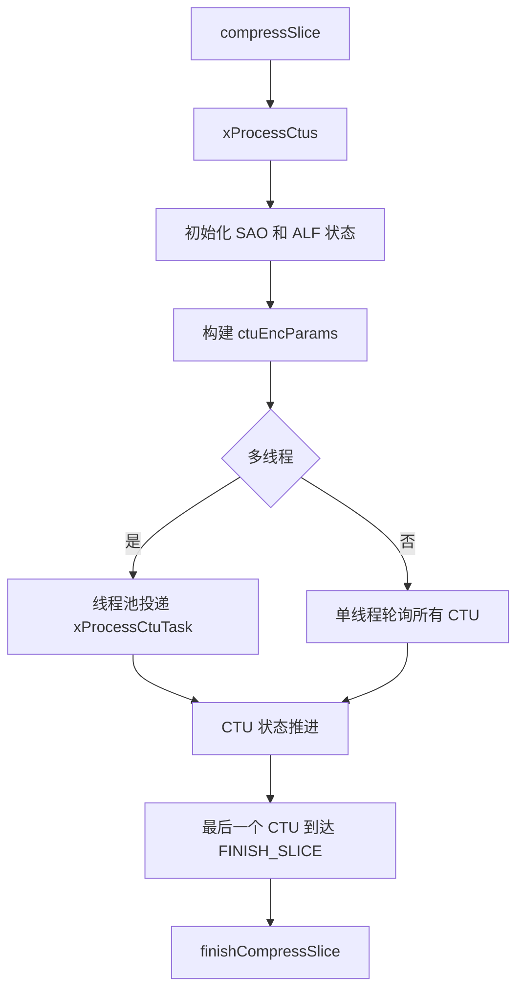
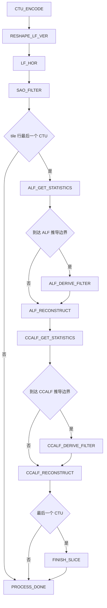
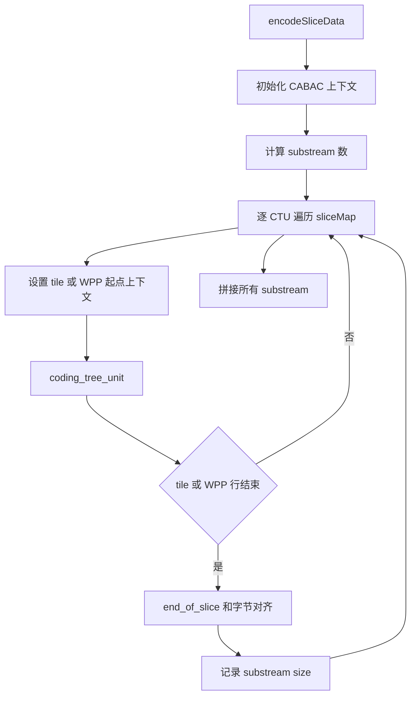

# vvenc `EncSlice` 类分析

## 1. 类定位

`EncSlice` 位于 `EncPicture` 和 `EncCu` 之间，是 vvenc 在帧级编码阶段的一个关键调度类。

它不直接负责完整的帧编排，也不深入做 CU 级模式决策，而是承担以下几类职责：

- 为当前 slice 初始化 QP、lambda、CABAC 表和线程资源
- 以 CTU 为粒度驱动 `EncCu::encodeCtu()` 完成块级 RDO 编码
- 在 CTU 编码之后推进去块滤波、SAO、ALF、CCALF 等后处理阶段
- 在所有 CTU 完成后，调用 `CABACWriter` 将 slice 内各 CTU 的语法元素写成子码流并拼接输出

从职责上看，`EncSlice` 更接近“slice 级 CTU 状态机调度器”，而不是简单的 slice 编码封装。

## 2. 在编码链路中的位置

整体调用关系可以概括为：

```text
EncLib
  -> EncGOP
    -> EncPicture::compressPicture()
      -> EncSlice::initPic()
      -> EncSlice::compressSlice()
         -> xProcessCtus()
            -> xProcessCtuTask()
               -> EncCu::encodeCtu()
               -> LoopFilter / SAO / ALF / CCALF
      -> EncPicture::finalizePicture()
         -> EncSlice::encodeSliceData()
            -> CABACWriter::coding_tree_unit()
```

这里可以把 `EncSlice` 看成两段流程：

- 压缩分析路径：`initPic()` + `compressSlice()`
- 码流输出路径：`encodeSliceData()`

前者主要产生重建结果、滤波结果和 CTU 级决策；后者负责把这些结果按 slice 语法重新编码进比特流。

## 3. 关键成员与资源组织

`EncSlice` 的核心成员可以分成四组。

### 3.1 配置与外部模块

```cpp
const VVEncCfg*        m_pcEncCfg;
LoopFilter*            m_pLoopFilter;
EncAdaptiveLoopFilter* m_pALF;
RateCtrl*              m_pcRateCtrl;
```

这些对象决定 `EncSlice` 的编码策略和后处理行为：

- `m_pcEncCfg` 提供线程数、WPP、QPA、SAO、ALF、IFP 等配置
- `m_pLoopFilter` 负责去块滤波
- `m_pALF` 负责 ALF / CCALF 的统计、滤波器推导和重建
- `m_pcRateCtrl` 参与初始 QP / lambda 的确定

### 3.2 线程与行资源

```cpp
std::vector<PerThreadRsrc*>   m_ThreadRsrc;
std::vector<TileLineEncRsrc*> m_TileLineEncRsrc;
NoMallocThreadPool*           m_threadPool;
WaitCounter*                  m_ctuTasksDoneCounter;
```

这部分是 `EncSlice` 并行执行的基础。

- `PerThreadRsrc` 是线程私有资源
  - `CtxCache`
  - `EncCu`
  - `m_alfTempCtuBuf`
- `TileLineEncRsrc` 是 tile-line 级资源
  - CABAC/BitEstimator
  - SAO 编码器
  - 复用的运动信息缓存
  - affine / IBC 等行级缓存

这种拆分说明 vvenc 并不是“每个 CTU 临时 new 一堆对象”，而是提前分配好线程级和行级资源，CTU 任务执行时只做绑定和复用。

### 3.3 CTU 调度状态

```cpp
std::vector<ProcessCtuState> m_processStates;
std::vector<CtuEncParam>     ctuEncParams;
std::vector<int>             m_ctuAddrMap;
int                          m_ctuEncDelay;
```

- `m_processStates` 记录每个 CTU 当前所在阶段
- `ctuEncParams` 保存 CTU 执行所需的参数包
- `m_ctuAddrMap` 给出 CTU 的调度顺序，用于 WPP / tile 并行场景
- `m_ctuEncDelay` 用于 IBC 场景，约束 CTU 编码阶段不能跑得过快

### 3.4 熵编码与后处理状态

```cpp
BinEncoder               m_BinEncoder;
CABACWriter              m_CABACWriter;
Ctx                      m_entropyCodingSyncContextState;
std::vector<Ctx>         m_syncPicCtx;
SliceType                m_encCABACTableIdx;
unsigned                 m_alfDeriveCtu;
unsigned                 m_ccalfDeriveCtu;
std::vector<SAOBlkParam> m_saoReconParams;
```

这一组成员负责：

- slice 输出时的 CABAC 上下文维护
- WPP 下的行同步上下文保存
- SAO / ALF / CCALF 的参数与分阶段推导位置管理

## 4. 关键辅助结构

`EncSlice.cpp` 里定义了三个很重要的辅助结构。

### 4.1 `PerThreadRsrc`

```cpp
struct PerThreadRsrc
{
  CtxCache   m_CtxCache;
  EncCu      m_encCu;
  PelStorage m_alfTempCtuBuf;
};
```

作用是把真正做块级决策的 `EncCu` 挂在线程本地，避免多线程下频繁切换状态。

### 4.2 `TileLineEncRsrc`

```cpp
struct TileLineEncRsrc
{
  CABACWriter             m_CABACEstimator;
  CABACWriter             m_SaoCABACEstimator;
  CABACWriter             m_AlfCABACEstimator;
  ReuseUniMv              m_ReuseUniMv;
  BlkUniMvInfoBuffer      m_BlkUniMvInfoBuffer;
  AffineProfList          m_AffineProfList;
  IbcBvCand               m_CachedBvs;
  EncSampleAdaptiveOffset m_encSao;
  int                     m_prevQp[MAX_NUM_CH];
};
```

它保存的是“同一 tile 行内可复用”的编码状态。典型例子包括：

- 行内 CABAC 估计器
- 行内可复用运动信息
- affine 候选缓存
- IBC BV 候选缓存
- SAO 行处理状态

### 4.3 `CtuEncParam`

```cpp
struct CtuEncParam
{
  Picture*  pic;
  EncSlice* encSlice;
  int       ctuRsAddr;
  int       ctuPosX;
  int       ctuPosY;
  UnitArea  ctuArea;
  int       tileLineResIdx;
};
```

这是投递给线程池的任务上下文。`xProcessCtuTask()` 不需要再去查一大堆全局结构，直接依赖这个参数包即可。

## 5. 初始化流程

`EncSlice` 的初始化分成两个层次：

- `init()`：编码器初始化阶段，只做长期资源分配
- `initPic()`：进入某一帧时，做当前帧相关的初始化

### 5.1 `init()`

`init()` 的职责包括：

- 挂接 `LoopFilter`、`ALF`、`RateCtrl`、线程池等外部模块
- 分配 `PerThreadRsrc`
- 分配 `TileLineEncRsrc`
- 创建 SAO 统计缓存
- 初始化 `m_processStates`
- 构造 CTU 调度顺序 `m_ctuAddrMap`
- 计算 `m_alfDeriveCtu` 和 `m_ccalfDeriveCtu`

简化逻辑如下：

```cpp
init(...)
{
  save external modules and config;
  create thread-local resources;
  create tile-line resources;
  allocate sao buffers and process state array;
  build arbitrary WPP CTU order;
  precompute ALF and CCALF derive boundary;
}
```

其中有两个实现细节值得注意：

### 5.1.1 线程资源预分配

每个线程各自拥有一个 `EncCu` 实例。这样做的意义是：

- `EncCu` 内部状态复杂，不适合多个 CTU 任务共享
- 多线程时不需要在 `EncCu` 级别加大量锁
- 同一线程连续处理多个 CTU 时能复用上下文缓存

### 5.1.2 自定义 CTU 调度图

`setArbitraryWppPattern()` 会生成一份满足 WPP 依赖的 CTU 遍历顺序。这说明 vvenc 并不直接按简单 raster scan 派发任务，而是在“满足依赖即可尽快并行”的前提下生成调度顺序。

### 5.2 `initPic()`

`initPic()` 是进入当前帧后的初始化入口，核心工作包括：

- 设置 `sliceMap`
- 决定 `encCABACTableIdx`
- 计算并写入 slice 级 QP / lambda
- 对每个线程资源中的 `EncCu` 执行 `initPic()`
- 清空行级复用运动缓存
- 计算 `m_ctuEncDelay`

简化伪代码如下：

```cpp
initPic(pic)
{
  build slice map;
  choose CABAC init table;
  xInitSliceLambdaQP(slice);

  for each thread resource:
    encCu.initPic(pic);

  for each tile-line resource:
    reset reused motion caches;

  m_ctuEncDelay = 1;
  if use IBC:
    enlarge encode delay according to CTU size;
}
```

其中 `m_ctuEncDelay` 主要服务于 IBC。IBC 依赖已编码但尚未滤波的样本，因此后续 CTU 调度不能让当前 CTU 在空间上跑得太靠前。

## 6. QP 与 lambda 初始化

`xInitSliceLambdaQP()` 是 `EncSlice` 的一个核心函数。它负责把配置层、GOP 层、QPA、RC 层的决策，落成当前 slice 的最终编码参数。

### 6.1 输入来源

QP / lambda 的来源有几条路径：

- 码率控制二次通道给出的 `picInitialQP` / `picInitialLambda`
- 普通配置下由 `xGetQPForPicture()` 计算的 picture QP
- `xCalculateLambda()` 计算得到的 lambda
- 如果开启 QPA，则通过 `BitAllocation::applyQPAdaptationSlice()` 再做 slice / CTU 级修正

### 6.2 `xGetQPForPicture()`

这个函数负责给当前 picture 选出基础 QP。它综合考虑：

- 全局 `m_QP`
- `pic->gopAdaptedQP`
- intra / inter 不同的偏移逻辑
- `GOPEntry::m_QPOffset`
- `QPOffsetModel`
- BIM 的辅助 QP 偏移

简化逻辑如下：

```cpp
qp = cfg.QP + pic.gopAdaptedQP;

if lossless:
  qp = special lossless qp;
else if use perceptual QPA:
  qp = temporal-layer aware qp;
else if intra:
  qp += intraQPOffset;
else:
  qp += GOPEntry qp offset and model offset;

if BIM enabled:
  qp += picAuxQpOffset;

qp = clip(qp);
```

### 6.3 `xCalculateLambda()`

`xCalculateLambda()` 会根据：

- slice 类型
- 时域层级
- bit depth
- `QPFactor`
- HAD ME 开关
- lambda modifier
- DepQuant 开关

生成当前 slice 的基础 lambda。

这个函数的重要性在于：后续 `EncCu` 的 RDO 代价几乎都依赖这里确定下来的 lambda。

## 7. `compressSlice()` 主流程

`compressSlice()` 是分析压缩阶段的入口。

它的职责可以概括为三步：

1. 初始化 `CodingStructure` 和各线程 `EncCu`
2. 初始化各 tile-line 的 CABAC / SAO / 运动缓存
3. 调用 `xProcessCtus()` 执行 CTU 级状态机

简化伪代码如下：

```cpp
compressSlice(pic)
{
  setup cs and slice;
  init struct data if first CTU;

  for each thread:
    encCu.initSlice(slice);

  for each tile-line:
    init CABAC contexts;
    reset line motion caches;
    init SAO slice if enabled;

  maybe disable frac-MMVD on large picture;

  xProcessCtus(pic, startCtuTsAddr, endCtuTsAddr);
}
```

这里要注意一点：`compressSlice()` 并不直接输出码流。它主要完成的是编码决策、重建更新和后处理推进。

## 8. CTU 调度总览

`xProcessCtus()` 会把 slice 内所有 CTU 包装成任务，并驱动一个 CTU 状态机。

整体流程如下：



`xProcessCtus()` 自身并不做具体编码，而是负责：

- 初始化 SAO / ALF 全局状态
- 重置所有 CTU 的初始状态为 `CTU_ENCODE`
- 为每个 CTU 生成 `CtuEncParam`
- 在线程池模式下，把 `xProcessCtuTask()` 作为 barrier task 投递
- 在单线程模式下，循环检查并推进每个 CTU 的状态

## 9. `xProcessCtuTask()`：CTU 状态机核心

`xProcessCtuTask()` 是 `EncSlice` 最关键的实现。它把单个 CTU 的生命周期拆成多个状态：

```cpp
CTU_ENCODE
RESHAPE_LF_VER
LF_HOR
SAO_FILTER
ALF_GET_STATISTICS
ALF_DERIVE_FILTER
ALF_RECONSTRUCT
CCALF_GET_STATISTICS
CCALF_DERIVE_FILTER
CCALF_RECONSTRUCT
FINISH_SLICE
PROCESS_DONE
```

这实际上是一个“带依赖检查的阶段推进器”。

### 9.1 总体状态图



### 9.2 状态推进的本质

每个状态进入前都会先做依赖检查，主要包括：

- 左邻 CTU 是否已经至少到达当前阶段
- WPP 场景下上方 / 右上方 CTU 是否满足约束
- tile 边界能否独立执行
- 滤波阶段是否会读写相邻 CTU 的像素
- IFP / IBC 场景下参考行是否就绪

如果依赖不满足：

- `checkReadyState == true` 时，只返回“尚不可执行”
- 否则任务会直接返回，等待后续再次被调度

这意味着 `xProcessCtuTask()` 不是一次性把 CTU 做完，而是每次根据当前状态尽量向前推进一格。

## 10. 各状态的作用

### 10.1 `CTU_ENCODE`

这是块级编码阶段，真正调用 `EncCu::encodeCtu()`。

执行前检查：

- 左侧 CTU 必须先完成同阶段
- WPP 下上方和右上方 CTU 要满足依赖
- IFP 场景下参考帧行同步必须满足

执行内容：

- 绑定当前线程的 `EncCu`
- 绑定当前 tile-line 的 CABAC 估计器和复用运动缓存
- 调用 `encCu.encodeCtu(pic, prevQp, ctuPosX, ctuPosY)`
- 在一行末尾清理 affine / uniMV / IBC 等缓存

简化伪代码：

```cpp
if dependencies not ready:
  return false;

encCu.setCtuEncRsrc(...);
encCu.encodeCtu(pic, prevQp, ctuPosX, ctuPosY);

if end of tile line:
  reset line caches;

state = RESHAPE_LF_VER;
```

### 10.2 `RESHAPE_LF_VER`

这一阶段把 luma reshaper 和竖直方向去块滤波合在一起处理。

执行内容：

- 若开启 LMCS，则对重建亮度做逆 reshape
- 计算当前 CTU 去块强度
- 执行竖直边界去块滤波

依赖检查比较严格，因为这一阶段既要读当前 CTU 结果，也可能受到周围 CTU 未完成编码的影响，尤其是 IBC / intra 相关邻域约束。

### 10.3 `LF_HOR`

执行横向去块滤波。

这里主要确保：

- 上方 CTU 已经不会再破坏当前边界
- 右侧 CTU 的竖直滤波不会回头修改当前残差相关区域

### 10.4 `SAO_FILTER`

这一阶段负责：

- 收集 SAO 统计
- 决策当前 CTU 的 SAO 参数
- 扩展 ALF 边界
- 为后续 ALF 拷贝 CTU 数据
- 在需要时提交 DMVR refined motion field

其中一个关键设计是：

- 普通 CTU 在做完 `SAO_FILTER` 之后就可以直接 `PROCESS_DONE`
- 只有 tile 行最后一个 CTU 才继续承担 ALF / CCALF 行级任务

这说明 vvenc 把 ALF / CCALF 的很多处理聚合到了“tile 行末 CTU”这个同步点上。

### 10.5 `ALF_GET_STATISTICS`

作用是为当前 tile 行累计 ALF 统计量。

执行时会对该 tile 行从首 CTU 到当前末 CTU 逐个调用：

```cpp
m_pALF->getStatisticsCTU(...)
```

随后根据 `m_alfDeriveCtu` 决定：

- 直接进入 `ALF_RECONSTRUCT`
- 或进入 `ALF_DERIVE_FILTER`

### 10.6 `ALF_DERIVE_FILTER`

这是 ALF 滤波器推导阶段。

典型动作包括：

- `initDerivation(slice)`
- `deriveFilter(...)`
- `reconstructCoeffAPSs(...)`

如果是 sync-lines 模式，还会对后续行调用：

- `selectFilterForCTU(...)`

也就是说，`ALF_DERIVE_FILTER` 不只是“推导一次全局滤波器”，在特定模式下还承担逐行 filter selection。

### 10.7 `ALF_RECONSTRUCT`

在滤波器已经就绪的前提下，对当前 tile 行逐 CTU 执行：

```cpp
m_pALF->reconstructCTU_MT(...)
```

执行完成后直接进入 `CCALF_GET_STATISTICS`。

### 10.8 `CCALF_GET_STATISTICS`

为色度分量的 CCALF 收集统计量，分别处理：

- `COMP_Cb`
- `COMP_Cr`

### 10.9 `CCALF_DERIVE_FILTER`

这一阶段负责：

- 在 derive 边界处推导 CCALF 滤波器
- 或在 sync-lines 模式下按行做 filter selection

### 10.10 `CCALF_RECONSTRUCT`

执行真正的 CCALF 滤波重建：

```cpp
applyCcAlfFilterCTU(cs, COMP_Cb, ...)
applyCcAlfFilterCTU(cs, COMP_Cr, ...)
```

随后：

- 统计当前 CTU 行有多少 tile 已完成
- 当整行 tile 都完成时，扩展整行重建边界
- 若是最后一个 CTU，则进入 `FINISH_SLICE`

### 10.11 `FINISH_SLICE`

只有整帧的最后一个 CTU 才会进入这一状态。

它会等待所有前序 CTU 都至少到达 `FINISH_SLICE`，然后调用：

```cpp
finishCompressSlice(cs.picture, slice);
```

这里的工作主要是：

- 根据 SAO 统计决定最终 slice header 中的 SAO enable 标志
- 完成压缩阶段的收尾提交

## 11. `encodeSliceData()`：码流输出阶段

`compressSlice()` 完成后，CTU 的编码决策和重建结果已经具备；`encodeSliceData()` 才真正把它们写入码流。

它的核心逻辑包括：

- 初始化 slice 级 CABAC 上下文
- 根据 tile 和 WPP 计算 substream 数量
- 逐 CTU 调用 `CABACWriter::coding_tree_unit()`
- 在 tile / WPP 行边界结束子码流并记录长度
- 拼接所有 substream 到 `pic->sliceDataStreams`

流程图如下：



简化伪代码如下：

```cpp
encodeSliceData(pic)
{
  init CABAC context for slice;
  create output substreams;

  for each CTU in slice order:
    choose current substream;
    reset or sync CABAC context at tile/WPP boundary;
    coding_tree_unit(cs, ctuArea, prevQP, ctuRsAddr);

    if tile end or WPP row end or slice end:
      end_of_slice();
      byte align;
      record substream size;
  }

  update CABAC init table index;
  concatenate substreams to picture output;
}
```

要点在于：`compressSlice()` 的 CTU 执行顺序可能为了并行调度而重排，但 `encodeSliceData()` 仍然按照 slice map 的语法顺序写出码流。

## 12. 和其它类的关系

### 12.1 与 `EncPicture`

- `EncPicture` 负责帧级控制
- `EncSlice` 负责 slice / CTU 级压缩与写出

可以理解为：

- `EncPicture` 管“这帧什么时候开始、什么时候结束”
- `EncSlice` 管“这一帧内部的 CTU 如何编码和滤波”

### 12.2 与 `EncCu`

- `EncSlice` 不做 CU 级模式搜索
- 真正的 intra / inter / merge / split RDO 由 `EncCu` 完成

`EncSlice` 只是为 `EncCu` 提供：

- 当前 CTU 坐标
- 当前行的 CABAC estimator
- 上下文缓存
- 行级复用运动缓存
- QP / lambda 环境

### 12.3 与 `LoopFilter` / `SAO` / `ALF`

`EncSlice` 是这几个模块的统一调度点。

- `LoopFilter`：在 `RESHAPE_LF_VER` 和 `LF_HOR` 中执行
- `EncSampleAdaptiveOffset`：在 `SAO_FILTER` 中执行
- `EncAdaptiveLoopFilter`：在 `ALF_*` 和 `CCALF_*` 阶段执行

### 12.4 与 `CABACWriter`

`EncSlice` 在两个地方依赖 CABAC：

- 压缩阶段，tile-line 资源中的 CABAC estimator 用于模式决策估计
- 输出阶段，成员 `m_CABACWriter` 用于真正写出 `coding_tree_unit()`

也就是说，`EncSlice` 同时管理“估计用 CABAC”和“输出用 CABAC”。

## 13. 阅读 `EncSlice` 的建议顺序

如果按源码阅读，建议顺序如下：

1. 先看 `EncSlice.h`，理解成员分组和外部依赖
2. 再看 `init()` 与 `initPic()`，理解资源生命周期
3. 看 `xInitSliceLambdaQP()`、`xGetQPForPicture()`、`xCalculateLambda()`，理解参数初始化
4. 看 `compressSlice()` 和 `xProcessCtus()`，建立整体调度框架
5. 重点看 `xProcessCtuTask()`，这是理解 `EncSlice` 的核心
6. 最后看 `encodeSliceData()`，把压缩阶段和码流输出阶段连接起来

## 14. 小结

`EncSlice` 的本质不是“slice 数据容器”，而是 vvenc 在帧内编码阶段的一个核心执行器。

它完成了三件关键事情：

- 把 picture 级 QP / lambda / CABAC 环境具体化到当前 slice
- 把 CTU 编码、滤波、统计和重建组织成一个可并行推进的状态机
- 在压缩完成后，按 tile / WPP / substream 规则把 CTU 语法写出为最终 slice 码流

从源码结构上说：

- `EncPicture` 决定“处理哪一帧”
- `EncSlice` 决定“这一帧里的 CTU 如何推进”
- `EncCu` 决定“每个 CTU 里的 CU 怎样分裂和选择模式”

因此，如果要继续深入 vvenc 的主编码内核，`EncSlice -> EncCu` 是最自然的一条阅读路径。
