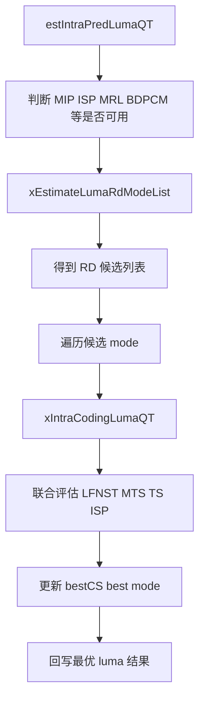
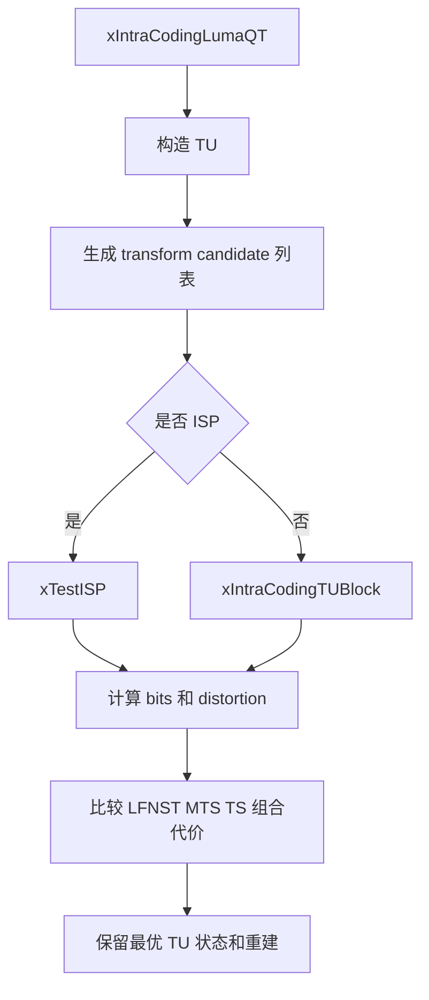
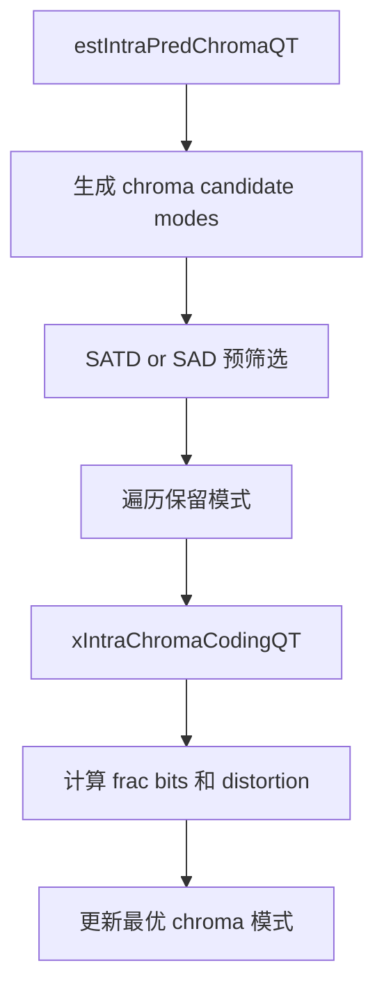

# vvenc `IntraSearch` 类分析

## 1. 类定位

`IntraSearch` 是 vvenc 中负责帧内预测搜索的核心类。

它位于 `EncCu` 之下，承担的不是“单一的预测函数”，而是一整套帧内编码决策过程：

- 生成 luma / chroma 的帧内候选模式
- 通过 SATD/HAD 进行快速预筛选
- 对候选模式执行完整 RD 检查
- 联合评估 MRL、MIP、ISP、BDPCM、LFNST、MTS、TS 等工具
- 选出最优帧内模式，并把预测、残差、重建和 TU 状态写回 `CodingStructure`

从职责上看，`IntraSearch` 是“帧内预测 RDO 执行器”。

## 2. 在编码流程中的位置

它与 `EncCu` 的关系可以概括为：

```text
EncCu::xCheckRDCostIntra()
  -> IntraSearch::estIntraPredLumaQT()
  -> IntraSearch::estIntraPredChromaQT()
  -> EncCu::xCheckBestMode()
```

也就是说：

- `EncModeCtrl` 决定当前 CU 是否值得试 `ETM_INTRA`
- `EncCu` 负责搭好当前 `CodingStructure`
- `IntraSearch` 真正完成帧内模式选择和 RD 搜索

## 3. 理论背景

### 3.1 帧内预测的基本目标

帧内预测的目标是：

- 不依赖参考帧运动补偿
- 仅使用当前块上方、左侧等已重建参考样本
- 预测出当前块信号
- 对预测误差做变换、量化和熵编码

最终优化目标不是单独最小失真，而是最小化：

```text
J = D + lambda * R
```

其中：

- `D` 是失真
- `R` 是比特代价
- `lambda` 来自当前 slice / CU 的 RDO 设置

### 3.2 VVC 中帧内预测的主要工具

`IntraSearch` 需要联合评估的不只是“角度预测模式”，还包括一整组工具：

- 传统 luma intra 模式
  - Planar
  - DC
  - Angular
- `MRL`
  - Multi-Reference Line
- `MIP`
  - Matrix-based Intra Prediction
- `ISP`
  - Intra Sub-Partitions
- `BDPCM`
  - 块差分脉冲编码调制
- `LFNST`
  - Low-Frequency Non-Separable Transform
- `MTS`
  - Multiple Transform Selection
- `TS`
  - Transform Skip

因此 `IntraSearch` 不是“选一个方向”这么简单，而是多层组合搜索。

## 4. 类结构与关键成员

`IntraSearch` 继承自 `IntraPrediction`：

```cpp
class IntraSearch : public IntraPrediction
```

这意味着：

- 预测样本构造、角度预测、MIP 预测、LM chroma 预测等底层函数，多数在 `IntraPrediction` 中
- `IntraSearch` 重点负责搜索与 RD 决策

关键成员可以分成几组。

### 4.1 搜索用 `CodingStructure`

```cpp
CodingStructure*  m_pTempCS;
CodingStructure*  m_pBestCS;
CodingStructure** m_pSaveCS;
```

作用：

- `m_pTempCS` 保存当前候选模式的临时结果
- `m_pBestCS` 保存当前最优结果
- `m_pSaveCS` 用于某些中间层保存，例如 chroma 或 ISP 路径中的重建/TU 状态回存

### 4.2 外部依赖

```cpp
const VVEncCfg* m_pcEncCfg;
TrQuant*        m_pcTrQuant;
RdCost*         m_pcRdCost;
CABACWriter*    m_CABACEstimator;
CtxCache*       m_CtxCache;
```

这些对象对应：

- 配置开关
- 变换与量化
- RD 代价计算
- CABAC 比特估计
- CABAC 上下文缓存

### 4.3 预测候选和缓存

```cpp
SortedPelUnitBufs<SORTED_BUFS>* m_SortedPelUnitBufs;
std::vector<ModeInfo>           m_parentCandList;
```

其中：

- `m_SortedPelUnitBufs` 用于保存不同候选模式的预测块和排序结果
- `ModeInfo` 把一个帧内候选模式抽象成：
  - `mipFlg`
  - `mipTrFlg`
  - `mRefId`
  - `ispMod`
  - `modeId`

### 4.4 ISP 上下文

```cpp
ISPTestedModesInfo m_ispTestedModes[NUM_LFNST_NUM_PER_SET];
```

这部分用来跨多个 LFNST / ISP 分支保存：

- 当前 ISP 水平或垂直分裂的状态
- 已测试的模式
- 最优 ISP 方向
- 子 TU 数量
- 早停相关信息

## 5. 生命周期

### 5.1 `init()`

`init()` 负责：

- 初始化 `IntraPrediction`
- 保存外部依赖
- 分配 `m_pTempCS` / `m_pBestCS`
- 分配 `m_pSaveCS`
- 分配色度残差缓存

简化伪代码：

```cpp
init(cfg, trQuant, rdCost, sortedBufs, unitCache)
{
  IntraPrediction::init(...);
  save pointers;

  create tempCS and bestCS;
  create saveCS layers;
  create chroma residual buffers;
}
```

### 5.2 `setCtuEncRsrc()`

每个 CTU 编码开始时，`EncCu` 会把当前行的：

- `CABACWriter`
- `CtxCache`

挂给 `IntraSearch`。  
这样 `IntraSearch` 在估算模式 bits 时就能直接访问当前上下文。

## 6. Luma 搜索主流程

### 6.1 总体流程

`estIntraPredLumaQT()` 是 luma 帧内搜索入口。

可以把它概括成四步：

1. 生成 luma 候选模式
2. 通过 SATD/HAD 做快速筛选
3. 对筛选后的模式做完整 RD
4. 回写最优 luma 模式和重建结果

流程图如下：



## 7. 候选模式生成：`xEstimateLumaRdModeList()`

这是 `IntraSearch` 的第一条核心路径。

它先不做完整变换量化，而是用预测信号和快速代价来筛一轮。

### 7.1 理论上在做什么

完整 RD 非常贵，因此先做一轮“粗排”：

- 用参考样本生成预测块
- 用 SATD/HAD 粗略估计失真
- 叠加模式比特估计
- 保留最有希望的一小部分模式进入 full RD

这一步相当于：

```text
粗搜索: 低精度、广覆盖
精搜索: 高精度、窄候选
```

### 7.2 实现上的关键点

函数会：

- 构造标准 intra mode 候选
- 获取 MPM 列表
- 调用 `initIntraPatternChType()` 初始化参考样本
- 对多种模式生成预测并计算 HAD 代价
- 如果允许 `MRL`，也把不同参考线模式纳入
- 如果允许 `MIP`，额外加入 MIP 候选

简化伪代码：

```cpp
xEstimateLumaRdModeList(...)
{
  init intra reference samples;
  build parent candidate list of luma modes;

  for each regular intra mode:
    generate prediction;
    estimate SATD/HAD + mode bits;
    push candidate;

  if MRL allowed:
    test extra reference line candidates;

  if MIP allowed:
    test MIP candidates;

  sort candidates by rough cost;
  reduce to numModesForFullRD;
}
```

### 7.3 `xReduceHadCandList()`

这个辅助函数负责把粗搜索结果缩成 full RD 列表。

它会：

- 保留有限数量的传统角度模式
- 保留若干 MIP 模式
- 按 HAD cost 排序
- 同时同步 `SortedPelUnitBufs` 中保存的预测缓冲顺序

这说明 vvenc 并不是“候选模式列表”和“预测缓存列表”各自独立，而是把它们绑定维护。

## 8. `estIntraPredLumaQT()`：完整 RD 搜索逻辑

进入 full RD 后，函数会进一步考虑各种组合工具。

### 8.1 进入 full RD 前的工具判定

它会先判断：

- `MIP` 是否可用
- `ISP` 是否可用
- `BDPCM` 是否可用
- `LFNST` 是否允许
- `MTS` 是否允许

比如：

- `MIP` 只对尺寸、长宽比满足条件的块开放
- `ISP` 只在特定尺寸和配置下可用
- `BDPCM` 只在允许的块和分量上开放

### 8.2 RD 遍历的外层循环

`estIntraPredLumaQT()` 外层遍历的是：

- 普通候选模式
- 额外的 `BDPCM` 候选

每个候选模式还会和：

- ISP 开关
- LFNST 开关
- MTS/TS 选择

形成组合搜索。

### 8.3 调 `xIntraCodingLumaQT()`

真正执行单个 luma 候选 RD 的核心是：

```cpp
xIntraCodingLumaQT(*csTemp, partitioner, predBuf, bestCost, doISP, disableMTS);
```

这个函数才真正进入：

- TU 级预测
- 残差
- 变换 / 量化
- 重建
- 比特估计

并输出当前候选的 RD cost。

### 8.4 模式间约束

源码里显式检查了若干非法组合：

- `MIP + MRL` 不允许
- `MRL + Planar` 不允许
- `ISP + MIP` 不允许
- `ISP + MRL` 不允许

这说明 `ModeInfo` 不是任意自由组合，而是受语法和工具兼容性约束。

## 9. `xIntraCodingLumaQT()`：单个 luma 候选怎么被评估

这是 `IntraSearch` 的第二条核心路径。

它的目标是：对一个固定的 luma 预测模式，联合搜索最优：

- LFNST index
- MTS mode
- TS 开关
- ISP 分裂路径

流程图如下：



### 9.1 变换候选的理论意义

在帧内预测里，预测误差的统计特性和模式方向密切相关，因此：

- 单一 DCT-II 并不总是最好
- 对某些方向残差，DST7 / DCT8 等可能更优
- 对很稀疏或沿边缘强的残差，TS 可能更优

所以 `IntraSearch` 会在一个模式内部继续做“残差域”的二次搜索。

### 9.2 `xPreCheckMTS()`

这个函数用于预筛 MTS 候选。

它会先构造预测、求残差，然后调用：

```cpp
m_pcTrQuant->checktransformsNxN(...)
```

快速筛掉明显不值得继续深搜的变换模式。

### 9.3 `xIntraCodingTUBlock()`

对非 ISP 路径，它会：

- 生成预测
- 计算残差
- 做变换 / 量化 / 反量化 / 反变换
- 生成重建
- 得到失真和非零系数信息

这是单个 TU 的最基础执行单元。

### 9.4 LFNST / MTS / TS 的联合搜索

在 luma 路径中，`xIntraCodingLumaQT()` 会在：

- `lfnstIdx`
- `mtsIdx`
- `transform skip`

之间联合枚举，但带有大量快速跳出条件，例如：

- 如果 DCT2 已经很差，直接停掉额外 MTS
- 如果根 CBF 为零，LFNST 后续也可以停
- `rapidLFNST` 开启时，发现无收益就减少后续分支

因此它不是完整笛卡尔积遍历，而是“联合搜索 + 快速早停”。

## 10. ISP：`xTestISP()`

`ISP` 是 VVC 帧内里一个比较有代表性的高级工具。

### 10.1 理论含义

普通 intra 是对整个块做一个统一预测模式；  
ISP 则把块切成多个一维子块，每个子块仍按 intra 路径编码。

它更适合：

- 强方向纹理
- 边缘很长、结构细的块

### 10.2 实现逻辑

`xTestISP()` 会沿当前 ISP 分裂方向，逐个 sub-TU 编码：

```cpp
do
{
  add or reuse sub-TU;
  xIntraCodingTUBlock(...);
  estimate sub-TU bits;
  accumulate cost;
  if partial cost already too high:
    early stop;
}
while(nextPart)
```

### 10.3 早停策略

`xTestISP()` 的一个关键实现点是“边累积边比较”：

- 如果当前累积失真和 bits 已经超过 `bestCostForISP`
- 或者在前几个子 TU 就显著偏差

就直接返回 `MAX_DOUBLE`。

这类策略很重要，否则 ISP 会让帧内搜索复杂度爆炸。

## 11. 色度搜索：`estIntraPredChromaQT()`

色度路径和 luma 路径相似，但复杂度更低，且强依赖 luma 决策。

### 11.1 主要候选

色度会考虑：

- 常规 chroma intra 模式
- `DM`
  - Derived Mode
- `LM` / `MDLM`
  - 亮度引导的色度预测
- `BDPCM`

### 11.2 搜索策略

色度路径也先做一轮 SATD/SAD 预选，再对保留模式做 RD。

简化流程如下：



### 11.3 与 luma 的关系

色度路径会读取：

- luma 是否使用 ISP
- 当前 `lfnstIdx`
- 当前 luma TU 的 `mtsIdx`

因为某些色度工具组合只在特定 luma 配置下才合法。

例如：

- 当 luma 使用 ISP 时，色度 TU 组织方式也会受到影响
- 某些 `BDPCM` / `TS` 组合要求 luma 的变换状态满足条件

## 12. `MRL`、`MIP`、`BDPCM` 的实现角色

### 12.1 `MRL`

`MRL` 允许帧内预测使用更远的参考线，而不是只用最近边界。

适合场景：

- 边界噪声大
- 最近参考线不稳定
- 更远处结构更平滑或更有代表性

在实现上，它作为 `ModeInfo::mRefId` 参与候选列表生成，不是单独一条编码路径。

### 12.2 `MIP`

`MIP` 用矩阵方式将参考样本映射到块内预测值，更像一种学习到的线性预测器。

适合场景：

- 小到中等尺寸块
- 结构模式比较复杂，不适合简单角度外推

在实现上：

- 它在候选生成阶段就单独进入列表
- 后续 RD 时通过 `cu.mipFlag` 和 `cu.mipTransposedFlag` 驱动

### 12.3 `BDPCM`

`BDPCM` 本质上是跳过常规变换路径，直接做方向性的样本差分编码。

适合场景：

- 局部近似平滑且沿水平/垂直方向相关性极强
- 某些屏幕内容或强规则边缘

在 `IntraSearch` 里它被作为额外候选模式加入循环，而不是独立搜索框架。

## 13. 快速算法

`IntraSearch` 的优化重点是“尽量少做 full RD”。

主要快速策略包括：

- 候选模式先做 SATD/HAD 粗排
- `PbIntraFast`
  - 如果 inter 已明显更优，缩小 intra RD 模式数
- `FastMIP`
  - 减少 MIP 模式数
- `FastIntraTools`
  - 控制是否测试 ISP、LFNST、MTS、DCT2
- `rapidLFNST`
  - LFNST 无收益时快速停
- `xPreCheckMTS()`
  - 先预判 MTS 候选
- `xSpeedUpISP()`
  - 根据已有最佳方向、最佳模式收紧 ISP 搜索
- `xTestISP()`
  - 按 sub-TU 逐步累计并早停

这些优化共同决定了 vvenc 帧内搜索的实际复杂度。

## 14. 与 CABAC / TrQuant / IntraPrediction 的关系

### 14.1 与 `IntraPrediction`

`IntraSearch` 复用 `IntraPrediction` 的底层预测能力：

- 角度预测
- MIP
- LMC/MDLM
- 参考样本构造

### 14.2 与 `TrQuant`

`TrQuant` 负责：

- 变换
- 量化
- 变换候选预检查

帧内候选模式最终好不好，往往不是预测本身决定，而是“预测残差经过变换量化后”的综合 RD 表现。

### 14.3 与 `CABACWriter`

`IntraSearch` 在 full RD 里会频繁估计：

- intra luma mode bits
- chroma mode bits
- LFNST / ISP / MTS / TS 等标志位代价

这些都通过 `m_CABACEstimator` 在当前上下文下完成。

## 15. 阅读建议

建议按下面顺序看源码：

1. 先看 `IntraSearch.h`
2. 看 `estIntraPredLumaQT()`，建立总流程
3. 看 `xEstimateLumaRdModeList()` 和 `xReduceHadCandList()`
4. 看 `xIntraCodingLumaQT()`，理解 full RD 核心
5. 看 `xPreCheckMTS()` 和 `xTestISP()`
6. 最后看 `estIntraPredChromaQT()`

## 16. 小结

`IntraSearch` 在 vvenc 中的核心作用可以概括为：

- 先用低成本粗排快速缩小帧内候选集合
- 再对保留模式执行完整 RD 搜索
- 在每个候选内部继续联合评估 `LFNST`、`MTS`、`TS`、`ISP`
- 最终选出最优的 luma / chroma 帧内表示

从代码结构上说：

- `EncModeCtrl` 决定是否进入 intra 模式
- `EncCu` 决定 intra 路径的外层执行框架
- `IntraSearch` 决定帧内模式本身怎样被搜索和优化

如果继续往下读，最自然的下一步是：

- 单独分析 `IntraPrediction`
- 或者单独分析 `TrQuant`，把帧内预测后的变换量化链补完整。  
