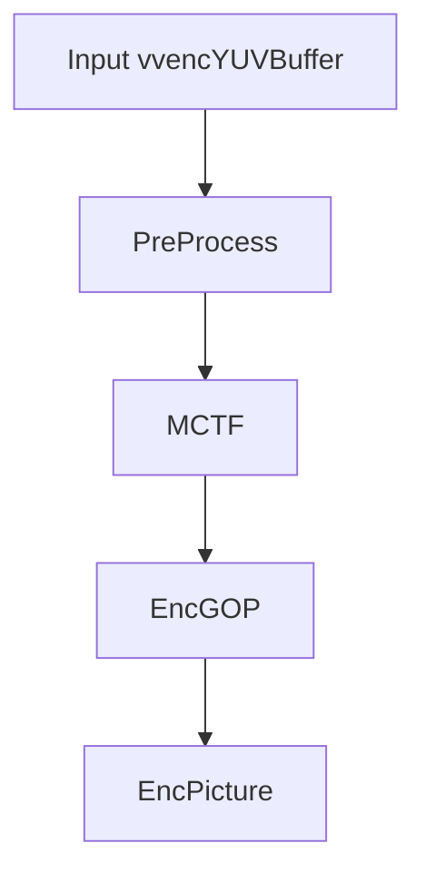
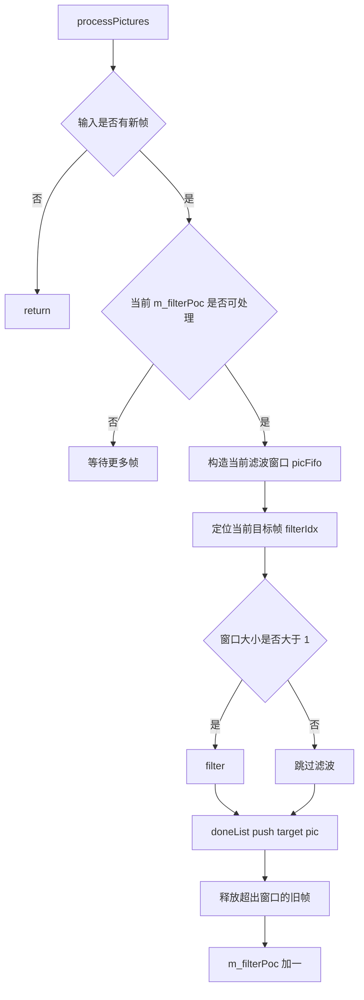
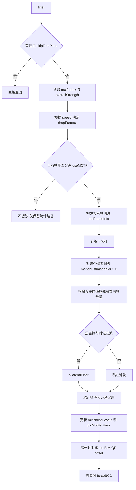

# vvenc `MCTF` 类分析

`MCTF` 是 `vvenc` 编码 pipeline 中位于 `PreProcess` 之后、`EncGOP` 之前的时域滤波 stage。  
它的核心任务不是输出码流，而是：

- 对输入帧做 motion-compensated temporal filtering
- 生成滤波后的原始帧缓冲，供后续编码使用
- 产生与 QPA / BIM / 噪声估计相关的辅助统计
- 在一定条件下辅助判定是否强制使用 SCC 路径

如果把它说得更直接一点：  
`MCTF` 决定后续编码器到底看到“原始帧”，还是“时域降噪后的原始帧”。

## 1. 位置与调用关系

相关文件：

- [vvenc/source/Lib/CommonLib/MCTF.h](/Users/skl/reading/hlpvvc/vvenc/source/Lib/CommonLib/MCTF.h)
- [vvenc/source/Lib/CommonLib/MCTF.cpp](/Users/skl/reading/hlpvvc/vvenc/source/Lib/CommonLib/MCTF.cpp)
- [vvenc/source/Lib/EncoderLib/EncLib.cpp](/Users/skl/reading/hlpvvc/vvenc/source/Lib/EncoderLib/EncLib.cpp)

在 `EncLib` 中，`MCTF` 是可选 stage：

```cpp
if( m_encCfg.m_vvencMCTF.MCTF || m_encCfg.m_usePerceptQPA )
{
  m_MCTF = new MCTF();
  m_MCTF->initStage( ... );
  m_MCTF->init( m_encCfg, m_rateCtrl->rcIsFinalPass, m_threadPool );
  m_encStages.push_back( m_MCTF );
}
```

这说明两点：

- 即使显式 MCTF 滤波关闭，只要启用了 perceptual QPA，也可能仍然启用这个 stage
- `MCTF` 不只是滤波器，它还承担了一部分前分析统计职责

在 pipeline 中的顺序大致为：



## 2. 类职责与主要成员

`MCTF` 定义在 [MCTF.h](/Users/skl/reading/hlpvvc/vvenc/source/Lib/CommonLib/MCTF.h) 中，并继承自 `EncStage`。

### 2.1 作为 stage 的职责

- 接收 `PicList`
- 在足够窗口内对某个目标 POC 执行滤波
- 把滤波完成的帧放入 `doneList`
- 释放超出窗口、不再需要的旧帧

### 2.2 核心成员

- `const VVEncCfg* m_encCfg`
- `NoMallocThreadPool* m_threadPool`
- `bool m_isFinalPass`
- `int m_filterPoc`
- `Area m_area`
- `int m_MCTFSpeedVal`
- `Picture* m_lastPicIn`
- `bool m_lowResFltSearch`
- `bool m_lowResFltApply`
- `int m_searchPttrn`
- `int m_mctfUnitSize`

这些成员可以理解为三类：

- 调度状态
  - `m_filterPoc`
  - `m_lastPicIn`
- 画面尺寸与分块配置
  - `m_area`
  - `m_mctfUnitSize`
- 搜索和滤波策略
  - `m_MCTFSpeedVal`
  - `m_lowResFltSearch`
  - `m_lowResFltApply`
  - `m_searchPttrn`

## 3. 相关辅助结构

## 3.1 `MotionVector`

定义：

```cpp
struct MotionVector
{
  int x, y;
  int error;
  uint16_t rmsme;
  double overlap;
};
```

职责：

- 保存一个 MCTF block 的运动向量和匹配误差

其中：

- `x`, `y` 是运动向量
- `error` 是代价
- `rmsme` 是均方根运动误差
- `overlap` 用于块边界覆盖权重

## 3.2 `Array2D<T>`

职责：

- 一个简单的二维数组容器
- 在 `MCTF` 里常用来存放 block 级 MV 网格

## 3.3 `TemporalFilterSourcePicInfo`

定义：

```cpp
struct TemporalFilterSourcePicInfo
{
  PelStorage            picBuffer;
  Array2D<MotionVector> mvs;
  int                   index;
};
```

职责：

- 描述一张参考帧在当前 MCTF 过程中的全部信息

包含：

- 参考帧像素
- 当前目标帧到该参考帧的 block 级运动向量
- 与目标帧的时域距离索引

可以把它理解为：

- `MCTF` 内部使用的“参考帧工作包”

## 4. 初始化逻辑

关键函数：`MCTF::init()`

简化伪代码：

```cpp
init( encCfg, isFinalPass, threadPool )
{
  m_encCfg      = &encCfg;
  m_threadPool  = threadPool;
  m_isFinalPass = isFinalPass;
  m_filterPoc   = 0;
  m_area        = full padded source area;

  根据 MCTFSpeed 生成速度配置;
  决定是否使用低分辨率滤波搜索;
  决定搜索模式;
  记录 mctf block size;
}
```

几个关键点：

- `m_filterPoc` 表示当前准备滤波的目标 POC
- `m_area` 是整个输入画面区域
- `MCTFSpeed` 会影响：
  - 丢弃多少参考帧
  - 搜索 pattern
  - 是否使用低分辨率滤波核进行运动搜索

## 5. stage 层流程

关键函数：

- `initPicture()`
- `processPictures()`

## 5.1 `initPicture`

职责：

- 对刚进入 `MCTF` stage 的 `Picture` 做最少量的预处理

主要逻辑：

```cpp
pic->getOrigBuf().extendBorderPel( MCTF_PADDING, MCTF_PADDING );
pic->setSccFlags( m_encCfg );
```

作用：

- 扩展原图边界，便于分数像素插值和运动搜索
- 更新当前帧的 SCC 标志

## 5.2 `processPictures`

这是 `MCTF` 作为 stage 的入口。

### 总流程图



### 简化伪代码

```cpp
if( 没有新图 或者 这次还是同一张最后输入图 )
  return;

if( 当前 filterPoc 已经可见 )
{
  根据 filterPoc 和未来参考开关构建 picFifo;
  找到当前待滤波帧在 fifo 中的位置;

  if( fifo 中不止一帧 )
    filter( picFifo, filterIdx );

  doneList.push_back( 当前目标帧 );
}

释放窗口左侧不再需要的图片;
m_filterPoc++;
```

### 关于窗口

窗口范围由下面逻辑决定：

```cpp
const int minPoc = m_filterPoc - VVENC_MCTF_RANGE;
const int maxPoc = m_encCfg->m_vvencMCTF.MCTFFutureReference ? m_filterPoc + VVENC_MCTF_RANGE : m_filterPoc;
```

这意味着：

- 如果允许 future reference，`MCTF` 会用前后双向参考
- 否则只用当前帧之前的历史帧

## 6. `filter()` 主流程

`filter()` 是 `MCTF` 真正的核心。

它负责：

1. 判断当前帧是否应滤波
2. 选择有效参考帧
3. 为每个参考帧做运动估计
4. 执行双边滤波
5. 生成噪声、运动误差、BIM、QPA 相关统计

### 总流程图



## 7. 关键函数拆解

## 7.1 `motionEstimationMCTF`

职责：

- 针对某一张参考帧，生成目标帧到这张参考帧的 block 级运动信息

主要步骤：

1. 把参考帧复制到 `TemporalFilterSourcePicInfo::picBuffer`
2. 创建 `mvs` 二维网格
3. 对参考帧做 2x/4x/8x 下采样
4. 逐级从粗到细做运动估计

简化伪代码：

```cpp
srcFrameInfo.push_back( new source pic info );

srcPic.picBuffer = refPic orig;
srcPic.mvs.allocate(...);
srcPic.index = abs(curPic->poc - m_filterPoc) - 1;

对参考帧做多级下采样;

粗层开始 motionEstimationLuma();
逐层 refine 到 full resolution;

如果需要统计误差
  累积 block error，更新 mvErr 和 minError;
```

这里的设计要点是：

- 运动估计不是直接在全分辨率上暴力做
- 而是先在粗层建立初始估计，再逐层 refine

## 7.2 `subsampleLuma`

职责：

- 对 luma 做简单 2x 下采样

用途：

- 给分层运动估计准备金字塔输入

## 7.3 `motionEstimationLuma`

职责：

- 在某一分辨率层上，生成块级运动向量网格

它内部会调用：

- `estimateLumaLn()`
- `motionErrorLuma()`

并支持：

- 单线程串行
- 基于 `NoMallocThreadPool` 的按行并行

## 7.4 `motionErrorLuma`

职责：

- 计算一个候选运动向量的 block matching 误差

支持三种情况：

- 整像素
- 低分辨率分数像素滤波核
- 高分辨率分数像素滤波核

这也是 `MCTF` 使用自己那套插值核和误差函数的原因。

## 7.5 `estimateLumaLn`

职责：

- 逐块搜索当前行 block 的最佳运动向量

核心思路：

- 先用上一层金字塔结果或零向量做初值
- 做整数像素邻域搜索
- 再做多轮分数像素 refine
- 再利用上方和左方 block 的 MV 做补充比较

输出：

- 每个块一个 `MotionVector`

## 7.6 `bilateralFilter`

职责：

- 根据目标帧和参考帧运动补偿结果，执行双边时域滤波

它会：

1. 计算 luma/chroma 的 `sigmaSq`
2. 按块行并行调用 `xFinalizeBlkLine()`

## 7.7 `xFinalizeBlkLine`

职责：

- 处理一条 block 行的最终滤波应用

对每个块，它会：

1. 根据 MV 从参考帧取对应块
2. 做分数像素插值
3. 必要时做平面校正 `m_applyPlanarCorrection`
4. 调用 `m_applyBlock()` 把多个参考块与当前块融合

简化逻辑：

```cpp
for each component
  for each block in line
    对每个参考帧:
      根据 MV 取出运动补偿块
      分数像素插值
      必要时 planar correction
    applyBlock( 原始块, 参考补偿块集合, 误差, 权重, sigmaSq )
```

可以理解为：

- `motionEstimationMCTF` 负责找“对齐关系”
- `xFinalizeBlkLine` 负责把这些对齐后的参考块真正融合成新的滤波结果

## 8. 什么时候会真的滤波

并不是每一帧都会无条件做时域滤波。

关键判断包括：

### 8.1 首遍 temporal downsampling

```cpp
if( !m_isFinalPass && pic->gopEntry->m_skipFirstPass )
  return;
```

这类帧直接跳过。

### 8.2 `m_mctfIndex` 与 `MCTFStrengths`

每帧会从 `GOPEntry` 取得：

- `m_mctfIndex`
- `overallStrength`

这决定了当前帧理论上应使用多强的滤波。

### 8.3 `useMCTF`

```cpp
if( !pic->useMCTF && !pic->gopEntry->m_isStartOfGop )
  isFilterThisFrame = false;
```

说明：

- 某些帧会被上游逻辑禁用 MCTF
- 但 GOP 起始帧仍可能走统计和重判路径

### 8.4 自适应参考帧裁剪

`MCTF` 会根据运动误差自适应减少参考帧数量，不是固定使用全部窗口参考。

## 9. `MCTF` 输出了什么

`MCTF` 的输出不止一个。

## 9.1 滤波后的原图

当真的执行滤波时，结果写入：

- `pic->getFilteredOrigBuffer()`

后续编码器可以使用这个缓冲作为“滤波后的原图”。

## 9.2 运动误差统计

更新：

- `pic->m_picShared->m_picMotEstError`

这给后续 QPA / RC / 场景分析提供依据。

## 9.3 噪声统计

更新：

- `pic->m_picShared->m_minNoiseLevels[]`

这些统计是按亮度区间组织的最小噪声水平估计。

## 9.4 BIM 的 CTU QP offset

当启用：

- `m_blockImportanceMapping`

且当前帧也启用了 `useMCTF` 时，会生成：

- `pic->m_picShared->m_ctuBimQpOffset`
- `pic->m_picShared->m_picAuxQpOffset`

这会直接影响后续 CTU 级 QP 调整。

## 9.5 强制 SCC 提示

在特定条件下，`MCTF` 还会设置：

- `pic->m_picShared->m_forceSCC`

用于提示后续流程按 screen content 场景处理。

## 10. `MCTF` 与其他模块的关系

## 10.1 与 `PreProcess`

- `PreProcess` 先给帧准备 `GOPEntry`、QPA 相关信息和 SCC 标志
- `MCTF` 再基于这些元信息决定是否滤波、如何统计

## 10.2 与 `Picture` / `PicShared`

- 原图来源：`PicShared::m_origBuf`
- 滤波结果：`PicShared::m_filteredBuf`
- 统计结果也主要回写到 `PicShared`

这说明 `MCTF` 本质上修改的是“共享输入帧表示”，而不是码流结构。

## 10.3 与 `EncGOP`

- `EncGOP` 后续使用 `Picture` 时，会看到 `filtered original buffer`
- 也会消费 `MCTF` 生成的辅助统计数据

## 10.4 与 QPA / BIM

`MCTF` 是这两条链路的重要前置统计源：

- QPA 需要噪声和活动信息
- BIM 需要 block motion / error 统计来推导 CTU 级 QP 偏移

## 11. 阅读建议

如果目标是快速搞懂 `MCTF`，建议按下面顺序读：

1. `init()`
2. `initPicture()`
3. `processPictures()`
4. `filter()`
5. `motionEstimationMCTF()`
6. `motionEstimationLuma()`
7. `estimateLumaLn()`
8. `bilateralFilter()`
9. `xFinalizeBlkLine()`

## 12. 一句话总结

`MCTF` 的本质是编码前的时域滤波与运动统计 stage。它通过多级运动估计把邻近帧对齐，再用双边滤波生成更平滑的输入帧，同时顺便产出噪声、运动误差、BIM 和 SCC 相关统计，供后续编码决策使用。  
