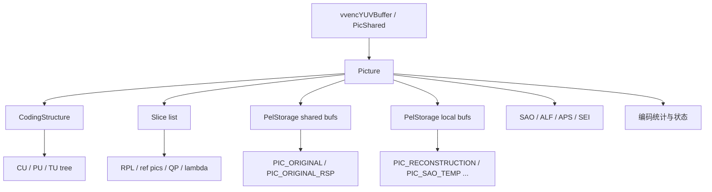
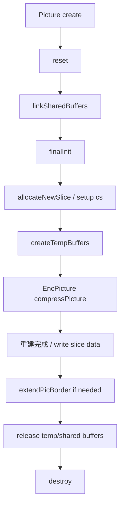
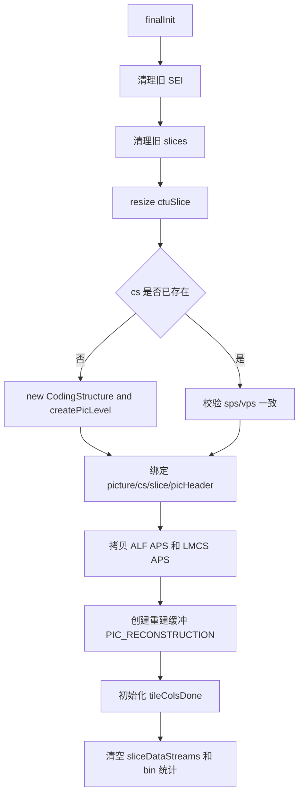
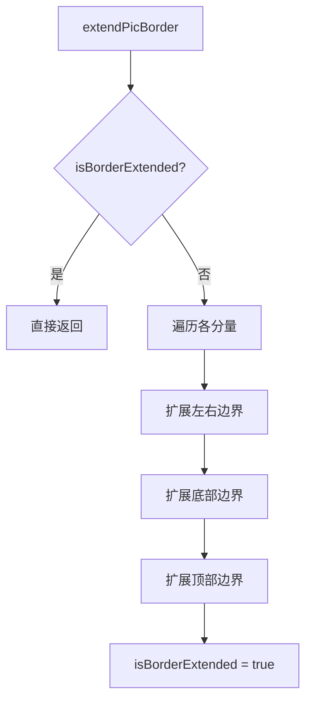
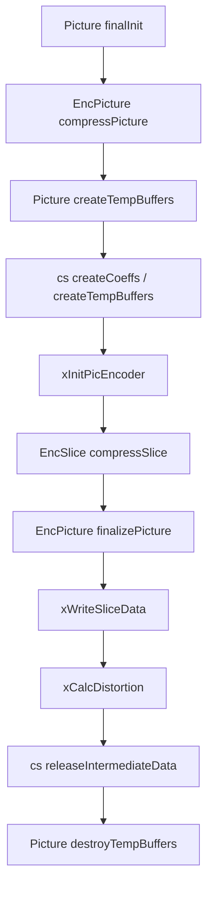

# vvenc `Picture` 类分析

本文聚焦 `vvenc/source/Lib/CommonLib/Picture.h/.cpp` 中的 `Picture` 结构，重点说明：

1. `Picture` 在 vvenc 中到底扮演什么角色
2. 它和 `PicShared`、`CodingStructure`、`Slice`、像素缓冲之间是什么关系
3. 一帧图像从初始化到压缩、写码流、回收的生命周期如何流转

本文重点讲“帧对象设计与数据流”，不展开块级算法细节。

## 1. 类定位

`Picture` 是 vvenc 中“当前一帧”的核心工作对象。

它不是单纯的像素容器，也不是调度器，而是把一帧编码过程中需要的几类东西集中在一起：

- 帧级身份和状态
- 原图 / 重建图 / 临时图像缓冲
- `CodingStructure`
- `Slice`
- SAO / ALF / APS / SEI 等帧级附属数据
- 编码统计、QP 自适应和 SCC 相关开关

可以把它理解成：

- “一帧在编码器内部的总装对象”

如果说：

- `PicShared` 更偏共享输入缓冲和外部数据
- `CodingStructure` 更偏块树和编码结果
- `Slice` 更偏切片语义和参考图关系

那么 `Picture` 就是把这些对象组织成“这一帧”的那个容器。

## 2. 总体关系图

`Picture` 在 vvenc 中的大致位置如下：



这个图反映出一个核心事实：

- `Picture` 不是某一个模块的子对象
- 它是多个模块共同读写的帧级上下文

## 3. 结构定义上的关键信息

`Picture` 的定义是：

```cpp
struct Picture : public UnitArea
```

这说明它首先就是一个“带空间范围的帧对象”：

- 本身携带 `chromaFormat`
- 本身携带整帧 `Area`

这带来一个好处：

- `Picture` 上很多缓冲访问都能直接基于 `UnitArea` / `CompArea` 切片

也就是说，`Picture` 既是帧对象，也是“整帧空间坐标系”的持有者。

## 4. 成员分组与职责

`Picture` 成员很多，但可以分成几组来理解。

### 4.1 核心子对象

```cpp
CodingStructure*          cs;
std::deque<Slice*>        slices;
std::vector<const Slice*> ctuSlice;
```

这是 `Picture` 最核心的一层。

- `cs`
  - 当前整帧的 `CodingStructure`
  - 持有 CU / PU / TU 树和中间编码结果
- `slices`
  - 当前图片的一个或多个 `Slice`
- `ctuSlice`
  - CTU 到 slice 的映射

可以理解为：

- `Picture` 是“帧容器”
- `CodingStructure` 是“帧内部编码树”
- `Slice` 是“帧内部切片语义”

### 4.2 参数集与附属语义

```cpp
const VPS*           vps;
const DCI*           dci;
ParameterSetMap<APS> picApsMap;
SEIMessages          SEIs;
ReshapeData          reshapeData;
```

这些成员负责承载当前帧附带的：

- 参数集引用
- picture 级 APS
- SEI
- LMCS/reshape 数据

说明 `Picture` 不只关心像素，也承载码流层相关附加信息。

### 4.3 像素缓冲

```cpp
PelStorage  m_picBufs[ NUM_PIC_TYPES ];
PelStorage* m_sharedBufs[ NUM_PIC_TYPES ];
PelStorage* m_bufsOrigPrev[ NUM_QPA_PREV_FRAMES ];
```

这里是理解 `Picture` 的关键。

它内部把图像缓冲分成两类：

1. 本地拥有的缓冲 `m_picBufs`
2. 外部共享的缓冲 `m_sharedBufs`

通常可以这样理解：

- `m_sharedBufs`
  - 更偏输入原图 / 共享过滤结果
- `m_picBufs`
  - 更偏当前 `Picture` 自己拥有的工作缓冲，例如重建图、SAO 临时图

`m_bufsOrigPrev` 则用于：

- QPA 等跨帧分析时访问前几帧原图

### 4.4 帧状态标志

```cpp
bool             isInitDone;
std::atomic_bool isReconstructed;
bool             isBorderExtended;
bool             isReferenced;
bool             isNeededForOutput;
bool             isFinished;
bool             isLongTerm;
bool             isFlush;
bool             isInProcessList;
bool             precedingDRAP;
```

这些标志定义了当前帧在编码流程和 DPB 中的状态。

例如：

- 是否已经初始化完成
- 是否已经重建完成
- 是否还能作为参考
- 是否需要输出
- 是否是长期参考

这说明 `Picture` 既是数据对象，也是状态对象。

### 4.5 编码统计与自适应参数

```cpp
std::vector<double> ctuQpaLambda;
std::vector<int>    ctuAdaptedQP;
int                 gopAdaptedQP;
int                 picInitialQP;
double              picInitialLambda;
PicVisAct           picVA;
double              psnr[MAX_NUM_COMP];
double              mse [MAX_NUM_COMP];
```

这部分负责：

- 帧级 / CTU 级 QP 自适应
- 可视活动度统计
- 最终 PSNR / MSE 统计

所以 `Picture` 还承载了一部分“编码分析结果”。

### 4.6 SCC / 工具级开关

```cpp
bool isSccWeak;
bool isSccStrong;
bool useME;
bool useMCTF;
bool useTS;
bool useBDPCM;
bool useIBC;
bool useLMCS;
bool useSAO;
bool useNumRefs;
```

这些成员反映：

- 当前帧的内容特性
- 以及基于此决定的工具开关

这让一些决策可以直接落到 picture 级，而不必每次都重新推导。

## 5. 缓冲设计：为什么有 `shared` 和 `local`

这是 `Picture` 里最值得单独讲的一点。

### 5.1 `m_sharedBufs`

这组缓冲通过 `linkSharedBuffers()` 接进来：

- `PIC_ORIGINAL`
- `PIC_ORIGINAL_RSP`
- 若干 `prev` 原图缓冲

它们本质上是：

- `Picture` 使用，但不一定由 `Picture` 自己分配和拥有

### 5.2 `m_picBufs`

这组缓冲由 `Picture` 自己创建和销毁，常见包括：

- `PIC_RECONSTRUCTION`
- `PIC_SAO_TEMP`
- 某些 decoder/work buffer

### 5.3 设计意义

这种拆分的意义是：

- 原图通常可以来自外部共享对象 `PicShared`
- 重建图和编码临时图必须由当前 picture 自己维护

因此 `Picture` 在缓冲层面是：

- “共享输入 + 本地工作区” 的混合模型

## 6. 生命周期总览

`Picture` 的生命周期大致如下：



注意这里有两个层次：

- 长期对象生命周期：`create()` / `destroy()`
- 单帧编码轮次生命周期：`reset()` / `finalInit()` / 压缩 / 收尾

## 7. 构造、创建与重置

### 7.1 `Picture::Picture()`

构造函数主要做的是默认初始化：

- 指针置空
- 标志位归零
- 共享缓冲指针数组清空

此时只是一个空壳 picture，还没和具体帧绑定。

### 7.2 `create()`

`create()` 的作用是：

- 给 `Picture` 设定整帧 `UnitArea`
- 记录 `margin`
- 某些 decoder 场景下创建 residual / prediction 工作缓冲

这一步更像“搭建容器外壳”。

### 7.3 `reset()`

`reset()` 用于开始复用一个 `Picture` 对象时清理状态。

它会重置：

- 引用与输出状态
- POC / TLayer / GOP 自适应信息
- APS/RC 相关指针
- shared/prev buffer 指针
- tile 完成状态
- 编码计时器

也就是说，`reset()` 是“开始装载一帧新数据前的清场动作”。

## 8. `finalInit()`：真正把一帧绑定起来

`finalInit()` 是 `Picture` 生命周期里最核心的初始化函数。

它做的事情可以概括为：

1. 清空旧的 `SEI`
2. 清空旧的 `Slice`
3. 初始化 `ctuSlice`
4. 创建或复用 `CodingStructure`
5. 绑定 `picHeader`、`APS`、`pcv`
6. 创建重建缓冲
7. 初始化 tile 完成计数
8. 清空 slice data stream 统计

### 8.1 流程图



### 8.2 为什么它重要

因为 `finalInit()` 之后，`Picture` 才从“空壳帧对象”变成：

- 有 `CodingStructure`
- 有 `picHeader`
- 有可写重建图
- 能分配 `Slice`
- 能进入编码阶段

## 9. `Slice` 管理

### 9.1 `allocateNewSlice()`

这个函数会：

- `new Slice`
- 塞进 `slices`
- 把 `pic/pps/sps/vps` 指针挂上去
- 复制 `alfAps`
- 若不是第一片，则拷贝前一片的 slice 信息

这说明 `Picture` 负责 slice 对象的实际持有和生命周期管理。

### 9.2 `swapSliceObject()`

这个函数用于：

- 把外部已有 `Slice` 对象换入当前 picture 的 `slices[i]`
- 同时修正 `pic/sps/pps/vps/alfAps`

这属于一种对象复用接口，避免 slice 对象频繁创建销毁。

## 10. 临时缓冲与编码期资源

### 10.1 `createTempBuffers()`

编码期间，`Picture` 还会为自己创建临时工作缓冲。

当前实现里最重要的是：

- `PIC_SAO_TEMP`

其意义是：

- SAO 在读写时需要额外边界
- 编码期需要临时图像工作区

### 10.2 `destroyTempBuffers()`

编码结束后释放这些临时缓冲，并让 `CodingStructure` 重新绑定 picture 缓冲。

这说明：

- `Picture` 的缓冲不是“一次创建永久持有”
- 而是区分常驻缓冲和编码期临时缓冲

## 11. 边界扩展：`extendPicBorder()`

这是 `Picture` 很关键的一个图像级操作。

其作用是：

- 把重建图边缘向外复制到 margin 区域

这是后续很多操作的基础，例如：

- 插值滤波
- 运动补偿边界访问

### 11.1 流程图



### 11.2 特点

- 按分量分别处理
- 考虑色度缩放
- 只对 `PIC_RECONSTRUCTION` 生效

这体现了 `Picture` 不只是装数据，也承担部分图像级后处理动作。

## 12. 与 `EncPicture` 的交互

`Picture` 自己不负责编码调度，但它是 `EncPicture` 操作的核心对象。

编码期关系可以概括为：



这里 `Picture` 的角色很明确：

- `EncPicture` 是流程执行者
- `Picture` 是被执行流程作用的帧对象

## 13. 数据访问接口设计

`Picture` 提供了大量：

- `getOrigBuf()`
- `getRecoBuf()`
- `getRspOrigBuf()`
- `getOrigBufPrev()`
- `getPicBuf()`
- `getSharedBuf()`

这些接口的特点是：

- 同时支持整帧、`UnitArea`、`CompArea`、`ComponentID`
- 同时支持 const / non-const
- 统一返回 `PelBuf` / `PelUnitBuf`

这使得：

- 上层模块不需要关心底层是 shared 还是 local storage
- 只要按区域取缓冲即可

这是一种非常实用的“视图接口统一”设计。

## 14. SAO / ALF 相关帧级缓存

`Picture` 还持有：

```cpp
std::vector<SAOBlkParam> m_sao[2];
std::vector<uint8_t>     m_alfCtuEnabled[MAX_NUM_COMP];
std::vector<short>       m_alfCtbFilterIndex;
std::vector<uint8_t>     m_alfCtuAlternative[MAX_NUM_COMP];
```

这些成员用于：

- 存放每个 CTU 的 SAO 参数
- 存放每个 CTU 的 ALF 开启状态
- 存放滤波器索引和 alternative 选择

这说明 picture 不只是图像像素容器，也持有一整帧的后处理参数阵列。

## 15. SCC 自适应：`setSccFlags()`

`setSccFlags()` 会根据：

- 编码配置
- 当前帧 SCC 强弱特征

推导 picture 级开关，例如：

- 是否启用 TS
- 是否启用 BDPCM
- 是否启用 IBC
- 是否降低 merge / qtbt 搜索复杂度

这意味着：

- 某些编码策略不是全局固定
- 而是落到每帧 `Picture` 上

## 16. `destroy()`：真正回收

`destroy()` 负责回收 picture 自己拥有的资源：

- `m_picBufs`
- `CodingStructure`
- `Slice`
- `SEI`
- `m_tileColsDone`

注意它不会直接释放那些通过 `linkSharedBuffers()` 挂进来的共享原图缓冲，这也印证了前面提到的所有权分层。

## 17. 设计特点总结

从设计上看，`Picture` 有几个很鲜明的特点。

### 17.1 它是帧级总装对象

`Picture` 不是单一职责类，而是帧级聚合体：

- 像素
- 编码树
- slice
- APS/SEI
- 统计信息
- 状态标志

### 17.2 它把“空间”和“对象”绑在一起

因为继承自 `UnitArea`，`Picture` 本身就带有整帧空间语义。

这使很多缓冲访问天然以区域切片方式组织，减少了接口层的额外包装。

### 17.3 它采用“共享输入 + 本地工作区”模型

这是一种非常适合视频编码器的设计：

- 输入原图可共享
- 重建和临时图必须本地管理

### 17.4 它是编码流程中的中心数据节点

`EncPicture`、`EncSlice`、`InterSearch`、`CABACWriter`、滤波模块都会围绕 `Picture` 工作。

所以更准确地说：

- `Picture` 是整个单帧编码过程的公共工作平面

## 18. 一句话总结

`Picture` 可以概括为：

> vvenc 中承载单帧像素缓冲、编码树、slice 语义、后处理参数和运行状态的核心帧级对象。

如果说：

- `Slice` 定义“这一片怎么解释”
- `CodingStructure` 定义“这一帧内部块怎么组织”
- `EncPicture` 定义“这一帧怎么被推进完成编码”

那么 `Picture` 负责的就是：

- “把这一帧在编码器里真正装起来，并让所有模块都能围绕它工作”
