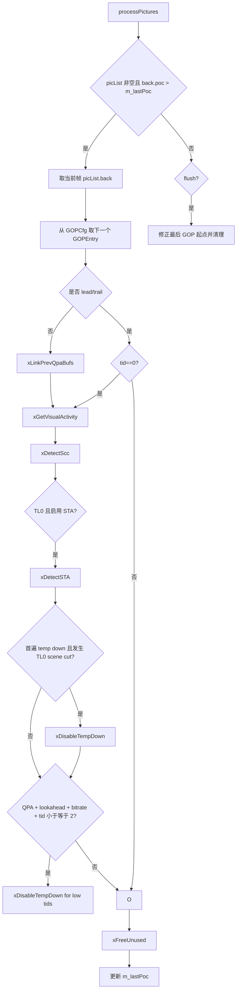

# vvenc `PreProcess` 类分析

`PreProcess` 是 `vvenc` 编码 pipeline 中最靠前的分析型 stage。它不直接做预测、变换或码流写出，而是为后续 `EncGOP` / `RateCtrl` / QPA / 首遍分析提供帧级元数据，包括：

- GOP 条目初始化
- 前序帧链接
- 视觉活动度分析
- scene type adaptation, STA
- 屏幕内容检测, SCC
- 首遍 temporal downsampling 的关闭控制

如果把 `EncLib` 看成总控，`PreProcess` 就是“真正开始编码前的帧级信息准备器”。

## 1. 位置与调用关系

相关文件：

- [vvenc/source/Lib/EncoderLib/PreProcess.h](/Users/skl/reading/hlpvvc/vvenc/source/Lib/EncoderLib/PreProcess.h)
- [vvenc/source/Lib/EncoderLib/PreProcess.cpp](/Users/skl/reading/hlpvvc/vvenc/source/Lib/EncoderLib/PreProcess.cpp)
- [vvenc/source/Lib/EncoderLib/EncLib.cpp](/Users/skl/reading/hlpvvc/vvenc/source/Lib/EncoderLib/EncLib.cpp)

在 `EncLib` 初始化阶段，`PreProcess` 被作为第一个编码 stage 挂入 pipeline：

```cpp
m_preProcess = new PreProcess( msg );
m_preProcess->initStage( m_encCfg, 1, -m_encCfg.m_leadFrames, true, true, false );
m_preProcess->init( m_encCfg, m_rateCtrl->rcIsFinalPass );
m_encStages.push_back( m_preProcess );
```

这里的含义是：

- `minQueueSize = 1`，只要有一帧就可以开始处理
- `startPoc = -leadFrames`，允许带 leading frames 的场景
- `processLeadTrail = true`，允许处理 lead/trail pictures
- `sortByPoc = true`，按 POC 顺序进入队列

`EncGOP` 后续通过 `m_preProcess->getGOPCfg()` 直接复用 `PreProcess` 建好的 GOP 配置对象。

## 2. 类职责

类定义见 [PreProcess.h](/Users/skl/reading/hlpvvc/vvenc/source/Lib/EncoderLib/PreProcess.h)。

`PreProcess` 继承自 `EncStage`，因此本质上是一个队列驱动的图片处理 stage：

```cpp
class PreProcess : public EncStage
{
  const VVEncCfg* m_encCfg;
  GOPCfg          m_gopCfg;
  int             m_lastPoc;
  bool            m_isHighRes;
  bool            m_doSTA;
  bool            m_doTempDown;
  bool            m_doVisAct;
  bool            m_doVisActQpa;
  bool            m_cappedCQF;
};
```

这些成员可以分成三类：

- 配置与状态
  - `m_encCfg`
  - `m_lastPoc`
  - `m_isHighRes`
- GOP 组织
  - `m_gopCfg`
- 各分析分支的开关
  - `m_doSTA`
  - `m_doTempDown`
  - `m_doVisAct`
  - `m_doVisActQpa`
  - `m_cappedCQF`

## 3. 初始化逻辑

关键函数：`PreProcess::init()`

简化逻辑：

```cpp
void PreProcess::init( const VVEncCfg& encCfg, bool isFinalPass )
{
  m_gopCfg.initGopList(...);

  m_encCfg      = &encCfg;
  m_lastPoc     = INT_MIN;
  m_isHighRes   = min(width, height) > 1280;

  m_doSTA       = encCfg.m_sliceTypeAdapt > 0;
  m_cappedCQF   = encCfg.m_RCNumPasses != 2 && encCfg.m_rateCap;
  m_doTempDown  = encCfg.m_FirstPassMode == 2 || encCfg.m_FirstPassMode == 4;
  m_doVisAct    = encCfg.m_usePerceptQPA
               || (encCfg.m_LookAhead && encCfg.m_RCTargetBitrate > 0)
               || (encCfg.m_RCNumPasses > 1 && !isFinalPass);
  m_doVisActQpa = encCfg.m_usePerceptQPA;
}
```

初始化后的含义：

- `m_gopCfg` 决定每帧的 `GOPEntry` 模板
- `m_doSTA` 决定是否做 scene type adaptation
- `m_doTempDown` 决定首遍是否允许某些帧跳过
- `m_doVisAct` 决定是否需要计算视觉活动度
- `m_doVisActQpa` 表示视觉活动度主要服务于 perceptual QPA
- `m_cappedCQF` 则与 rate cap / capped quality 流程有关

## 4. 主处理流程

关键函数：`PreProcess::processPictures()`

这是整个类最重要的函数。它每次只推动当前“最新可处理的一帧”，并在 flush 时做尾部修正。

### 4.1 总体流程图



### 4.2 简化伪代码

```cpp
if( 有新的 POC 到达 )
{
  pic = 当前最新帧;

  m_gopCfg.getNextGopEntry( pic->m_picShared->m_gopEntry );

  if( 不是 lead/trail 帧 )
  {
    链接前序帧缓冲;
    计算 visual activity;
    检测是否是 SCC;

    if( 启用 STA 且当前为 TL0 )
    {
      检测 scene cut，并在需要时把该帧改成 I;

      if( 首遍 temporal downsampling 与 scene cut 冲突 )
        关闭当前 GOP 的 skipFirstPass;
    }

    if( QPA + lookahead + RC 条件成立 )
      对低时域层关闭 temporal downsampling;
  }
  else if( 当前是 TL0 lead/trail )
  {
    仍计算 visual activity;
  }

  清理不再需要的旧帧;
}
else if( flush )
{
  修正最后 GOP 的起点;
  补做起始帧 visual activity;
  清空剩余图片;
}
```

## 5. 关键函数拆解

## 5.1 `xLinkPrevQpaBufs`

职责：

- 为当前帧建立到前几帧原始图像缓冲的引用
- 把这些引用保存在 `PicShared::m_prevShared[]`

简化逻辑：

```cpp
if( m_doVisAct )
{
  prevPics = 获取连续前序帧;
  for each prevPics[i]:
    picShared->m_prevShared[i] = prevPics[i]->m_picShared;
}
```

作用：

- 后续 QPA 或视觉活动分析可以直接访问前几帧原始数据
- 减少重复查找与额外拷贝

相关辅助函数：

- `xGetPrevPics()`
- `xGetPrevTL0Pic()`

其中 `xGetPrevPics()` 只接受“POC 连续”的前序帧；如果第一帧都找不到，会把 `prevPics[0]` 指向当前帧自身，用于兜底。

## 5.2 `xGetVisualActivity`

职责：

- 计算当前帧的空间活动度 `spatAct`
- 计算当前帧相对历史帧的时间活动度
- 得到 `visAct` 与 `visActTL0`
- 将结果写回 `PicShared::m_picVA`

这一函数是 `PreProcess` 最核心的分析函数。

### 计算对象

它会按条件决定是否计算以下量：

- 当前帧空间活动度
- 当前帧相对前序连续帧的视觉活动度
- 当前帧相对前一个 TL0 帧的视觉活动度
- 当前 TL0 参考帧的空间活动度缓存

### 输出位置

最终写入：

- `picShared->m_picVA.spatAct[CH_L]`
- `picShared->m_picVA.spatAct[CH_C]`
- `picShared->m_picVA.visAct`
- `picShared->m_picVA.visActTL0`
- `picShared->m_picVA.prevTL0spatAct[...]`

### 关键分支

```cpp
const bool doChroma           = m_cappedCQF && pic->gopEntry->m_isStartOfGop;
const bool doVisAct           = m_doVisAct && !m_doVisActQpa;
const bool doSpatAct          = pic->gopEntry->m_isStartOfGop && m_encCfg->m_GOPQPA;
const bool doVisActStartOfGOP = pic->gopEntry->m_isStartOfGop && m_cappedCQF;
const bool doVisActTL0        = pic->gopEntry->m_temporalId == 0 && ( m_doSTA || m_cappedCQF || !doVisAct );
```

可以理解为：

- `doSpatAct` 更偏 GOPQPA 的起始帧活动估计
- `doVisAct` 更偏 lookahead / RC / 非 QPA 的活动估计
- `doVisActTL0` 更偏 TL0 层 scene cut 或 capped quality 参考

## 5.3 `xGetSpatialActivity`

职责：

- 计算单帧空间活动度

实现特点：

- luma 直接对 `COMP_Y` 计算
- chroma 在启用时会对各色度分量求平均
- 通过 `calcSpatialVisAct()` 完成实际统计

简化代码：

```cpp
if( doLuma )
  calcSpatialVisAct( Y, bitDepthLuma, m_isHighRes, va[CH_L] );

if( doChroma )
{
  for each chroma component:
    calcSpatialVisAct( Cb/Cr, bitDepthChroma, isUHD, chVA );
  va[CH_C] = 各色度分量平均;
}
```

输出重点：

- `hpSpatAct`
- `spatAct`

其中 `spatAct` 最后会被裁剪并以 12-bit 形式存储到 `PicVisAct`。

## 5.4 `xGetTemporalActivity`

职责：

- 计算当前帧与参考帧之间的时间活动度

输入：

- 当前帧 luma
- 前一参考帧 luma
- 可选第二参考帧 luma

底层调用：

- `calcTemporalVisAct()`

简化代码：

```cpp
origBufs[0] = curPic->Y;
origBufs[1] = refPic1->Y;
origBufs[2] = refPic2 ? refPic2->Y : null;

calcTemporalVisAct(
  cur, ref1, ref2,
  frameRate, bitDepth, m_isHighRes, va
);
```

作用：

- 为 QPA、lookahead 和 STA 提供“运动/变化强度”量化依据

## 5.5 `xDetectSTA`

职责：

- 基于 TL0 帧间 visual activity 变化检测 scene cut
- 必要时把当前 GOP 条目改成 I slice

它只在：

- `m_doSTA == true`
- 当前帧 `temporalId == 0`

时触发。

简化逻辑：

```cpp
prevTL0 = 找前一个 TL0 帧;
if( prevTL0 存在 && prevTL0->visActTL0 > 0 && gopCfg 允许 STA )
{
  根据 SCC 强弱和分辨率计算 scene-cut 阈值;

  if( 当前帧 visActTL0 与前一 TL0 相差足够大 )
  {
    picMemorySTA = 记录变化方向;
    isSta = 与前一帧的 scene-change memory 方向一致;
  }
}

if( isSta )
{
  当前帧标记为 scene cut;
  gopEntry.m_sliceType = 'I';
  gopEntry.m_scType    = SCT_TL0_SCENE_CUT;
  gopCfg.setLastIntraSTA( pic->poc );

  if( sliceTypeAdapt == 2 )
    gopCfg.startIntraPeriod( ... );
}
```

要点：

- 阈值会随 `SCC` 强弱和分辨率变化
- 并不是单次波动就触发，需要结合 `picMemorySTA` 做方向一致性判断
- 一旦触发，会直接改写 `GOPEntry`，从而影响后续 `EncGOP`

## 5.6 `xDisableTempDown`

职责：

- 禁止当前 GOP 某些时域层的 `skipFirstPass`

触发场景主要有两类：

- TL0 scene cut 后，避免首遍 temporal downsampling 跨 scene cut
- 一遍 RC + QPA + lookahead 时，为低时域层保留更稳定的统计

简化逻辑：

```cpp
for( 当前 GOP 内所有已在队列中的帧 )
{
  if( tp->temporalId <= thresh )
    tp->m_picShared->m_gopEntry.m_skipFirstPass = false;
}
```

效果：

- 首遍分析不会再跳过这些帧
- Rate control 和视觉活动建模会更稳定

## 5.7 `xDetectScc`

职责：

- 检测帧是否具有 screen content coding 特征

实现特征：

- 对 luma 图像按固定大小块做统计
- 分析块均值、方差和低电平分布
- 最终得到 `isSccWeak` / `isSccStrong`

简化理解：

```text
遍历图像中的 4x4 / 8x8 局部块
  -> 统计亮度块的均值和方差
  -> 统计平坦块、近零块、重复图形等特征
  -> 判断是否符合 screen content 的纹理分布
  -> 回写到 pic 和 picShared
```

特殊分支：

- 如果 `m_forceScc > 0`，则直接强制指定 `isSccWeak` / `isSccStrong`

作用：

- `SCC` 检测结果会影响 `STA` 阈值
- 也会影响后续编码器对 screen content 相关工具的启用策略

## 5.8 `xFreeUnused`

职责：

- 把当前帧放入 `doneList`
- 保留仍需要的历史帧
- 释放多余旧帧到 `freeList`

保留条件主要有三类：

- 为 visual activity / QPA / cappedCQF 保留最近若干前序帧
- 为 STA 保留前一个 TL0
- 保留“最后一个 GOP 的起始帧”

这是 `PreProcess` 控制内存占用的关键函数。它保证这个 stage 不会无界积累历史图片。

## 6. flush 路径

当没有新 POC，但收到 flush 信号时，`processPictures()` 会进入收尾逻辑：

1. 找到最后一个 GOP 的起始帧
2. 调用 `m_gopCfg.fixStartOfLastGop()` 修正其 GOP 入口
3. 补做该帧的 visual activity
4. 将剩余图片全部送入 `freeList`

这一步的意义是：

- 正常处理中，GOP 信息有时依赖后续帧才能完全确定
- flush 阶段要把“最后一个未完整闭合的 GOP”修正成可编码状态

## 7. `PreProcess` 对后续模块的影响

`PreProcess` 虽然不直接编码，但它会改写很多后续模块依赖的状态。

### 7.1 对 `GOPCfg` / `EncGOP`

- 为每帧写入 `GOPEntry`
- 在 scene cut 时把帧改成 I
- 修正最后一个 GOP 的起始帧

### 7.2 对 `RateCtrl`

- 视觉活动度会影响 lookahead 和码率控制统计
- 关闭 `skipFirstPass` 会改变首遍数据完整性

### 7.3 对 QPA

- 保存前序帧引用
- 生成 `PicVisAct`
- 为后续 CTU 级 QP 自适应提供帧级分析基础

### 7.4 对 SCC

- 检测 screen content 特征
- 提供 `isSccWeak` / `isSccStrong`

## 8. 代码阅读建议

如果只想抓住 `PreProcess` 的核心，建议按下面顺序读：

1. `init()`
2. `processPictures()`
3. `xGetVisualActivity()`
4. `xDetectSTA()`
5. `xDisableTempDown()`
6. `xDetectScc()`
7. `xFreeUnused()`

如果目标是追 QPA 相关链路，再补读：

1. `xLinkPrevQpaBufs()`
2. `xGetPrevPics()`
3. `PicShared::m_prevShared`
4. `EncCu.cpp` 中的 `applyQPAdaptation*`

## 9. 一句话总结

`PreProcess` 的本质不是“图像预处理滤波器”，而是“编码前帧级分析与元数据准备 stage”。它决定了当前帧在进入 `EncGOP` 之前，带着什么样的 GOP 身份、活动度统计、scene cut 标记、SCC 标记和首遍分析策略。  
