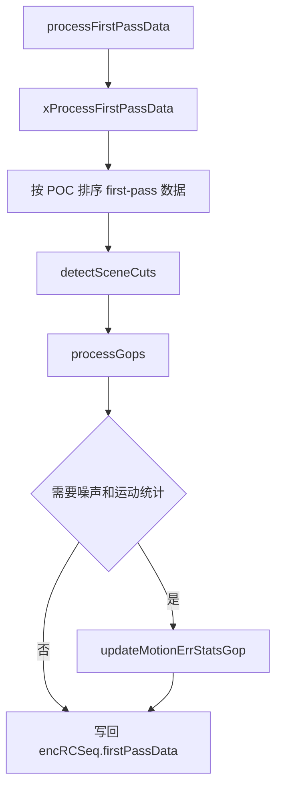
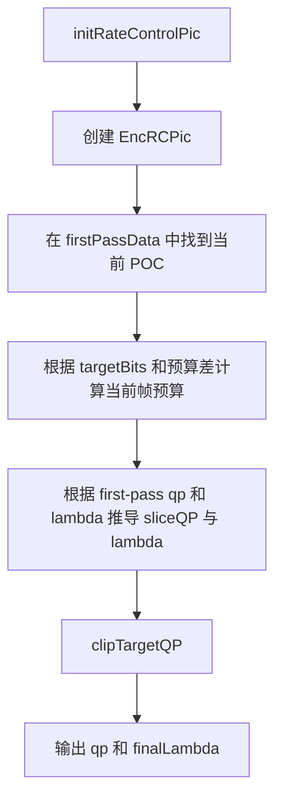

# vvenc `RateCtrl` 类分析

## 1. 类定位

`RateCtrl` 是 vvenc 中负责码率控制的核心管理类。

它的职责不是直接做块级比特分配，而是站在更高层次上，围绕“序列预算、GOP 预算、帧级预算、首通统计、场景变化、QP/lambda 初始化”建立一套闭环。

从编码主流程看，`RateCtrl` 主要介入三个时刻：

- 首通或 look-ahead 阶段，收集和加工统计信息
- 某一帧开始编码前，给出这一帧的 `picInitialQP` 和 `picInitialLambda`
- 某一帧码流输出后，根据实际比特数回写模型

## 2. 在编码链路中的位置

和 `EncGOP` / `EncSlice` 的关系可以概括为：

```text
pre-analysis / first-pass
  -> RateCtrl::addRCPassStats()
  -> RateCtrl::processFirstPassData()

final pass / picture start
  -> EncGOP::xEncodePicture()
  -> RateCtrl::initRateControlPic()
  -> EncSlice::xInitSliceLambdaQP()

picture coded and written
  -> RateCtrl::updateAfterPicEncRC()
```

其中：

- `RateCtrl::initRateControlPic()` 决定帧级初始 QP / lambda
- `EncSlice` 在此基础上继续叠加 GOP 偏移、QPA、自适应 lambda 等
- `RateCtrl::updateAfterPicEncRC()` 则用实际比特数修正后续预算

## 3. 相关核心类

`RateCtrl` 不是孤立工作的，它围绕两个辅助类组织状态。

### 3.1 `TRCPassStats`

这是首通统计记录，保存一帧在 first pass 或 look-ahead 中得到的摘要信息：

```cpp
struct TRCPassStats
{
  int       poc;
  int       qp;
  double    lambda;
  uint16_t  visActY;
  uint32_t  numBits;
  double    psnrY;
  bool      isIntra;
  int       tempLayer;
  bool      isStartOfIntra;
  bool      isStartOfGop;
  int       gopNum;
  SceneType scType;
  int       spVisAct;
  uint16_t  motionEstError;
  uint8_t   minNoiseLevels[QPA_MAX_NOISE_LEVELS];
  bool      isNewScene;
  bool      refreshParameters;
  double    frameInGopRatio;
  int       targetBits;
};
```

这份结构同时承载两类信息：

- 原始观测值
  - 首通 QP/lambda
  - 首通比特数
  - visual activity
  - motion error
- 经 `RateCtrl` 加工后的派生值
  - 是否新场景
  - 是否需要刷新 RC 参数
  - 在 GOP 中的目标比特比例
  - 第二通目标 bits

### 3.2 `EncRCSeq`

`EncRCSeq` 管序列级预算和历史状态。

关键成员包括：

```cpp
class EncRCSeq
{
  bool     twoPass;
  bool     isLookAhead;
  int      targetRate;
  int      maxGopRate;
  double   frameRate;
  int64_t  bitsUsed;
  int64_t  estimatedBitUsage;
  double   qpCorrection[8];
  uint64_t actualBitCnt[8];
  uint64_t targetBitCnt[8];
  int      lastAverageQP;
  int      lastIntraQP;
  double   lastIntraSM;
  std::list<TRCPassStats> firstPassData;
  double   minEstLambda;
  double   maxEstLambda;
};
```

可以把它理解成“整段视频的 RC 总账本”。

它负责记录：

- 整体目标码率和 GOP 约束
- 到目前为止已经花掉多少 bits
- 按 temporal level 分层统计的实际 bits / 目标 bits
- 前面关键帧的 QP 历史
- 第一通统计结果

### 3.3 `EncRCPic`

`EncRCPic` 管单帧的预算状态：

```cpp
class EncRCPic
{
  int      targetBits;
  int      tmpTargetBits;
  int      poc;
  bool     refreshParams;
  uint16_t visActSteady;
  int16_t  picQP;
  uint16_t picBits;
};
```

它代表“当前这帧在 RC 眼里是什么预算、最后实际用了多少 bits”。

## 4. `RateCtrl` 自身的职责分层

`RateCtrl` 本体做的是协调工作，核心职责有四类：

### 4.1 统计数据管理

- `addRCPassStats()`
- `storeStatsData()`
- `processFirstPassData()`
- `readStatsFile()` / `writeStatsHeader()`

### 4.2 首通数据分析

- `detectSceneCuts()`
- `processGops()`
- `adjustStatsDownsample()`
- `updateMotionErrStatsGop()`

### 4.3 单帧初始化

- `getBaseQP()`
- `initRateControlPic()`

### 4.4 编码后回写

- `updateAfterPicEncRC()`

## 5. 初始化与配置

### 5.1 `init()`

`RateCtrl::init()` 会创建一个新的 `EncRCSeq`，把配置里的关键信息装进去：

- 单通还是双通
- 是否 look-ahead
- 目标码率和最大码率
- 帧率
- GOP 大小
- intra period
- bit depth

简化伪代码：

```cpp
init(cfg)
{
  destroy old state;
  save cfg;
  encRCSeq = new EncRCSeq;
  encRCSeq->create(twoPass, lookAhead, targetBitrate, maxBitrate,
                   frameRate, intraPeriod, GOPSize, bitDepth, firstPassStats);
}
```

### 5.2 `setRCPass()`

这个函数负责切换当前 RC pass，并在需要时打开统计文件。

在开启 JSON 支持时：

- 非最终 pass：写 stats 文件
- 最终 pass：读 stats 文件

如果是高等级 `FirstPassMode`，还会调用 `adjustStatsDownsample()` 对统计值做补偿。

## 6. 首通统计数据是怎么进入 `RateCtrl` 的

编码器在 first pass / pre-analysis 中，会把每帧统计信息送进：

```cpp
RateCtrl::addRCPassStats(...)
```

该函数最终转成 `TRCPassStats` 并交给 `storeStatsData()`。

### 6.1 `storeStatsData()`

它做几件事：

- 如果开启 temporal down-sampling，需要复用上一帧同层统计
- 若打开 stats 文件，则把数据写成 JSON 行
- 否则直接缓存到内存链表
- 在 look-ahead 模式下控制缓存窗口大小

这说明 vvenc 的 RC 并不强依赖外部文件。即便不开 JSON 文件，也可以依靠内存中的统计列表继续工作。

## 7. `processFirstPassData()`：把首通统计变成可用预算

`processFirstPassData()` 是 `RateCtrl` 的第一条主线。

它的目标是把原始 first-pass 统计，变成后续真正可用的：

- 场景切换标记
- GOP 级目标 bits
- 帧级目标 bits
- 噪声/运动误差统计

流程图如下：



### 7.1 `detectSceneCuts()`

这个函数不是复杂的镜头分割算法，而是对首通统计做轻量场景变化判断。

主要依据包括：

- `visActY` 是否突变
- TL0/TL1 帧的 `psnrY` 是否明显跳变
- 已有 `SceneType` 标记

检测到新场景后，会在相应 temporal level 上设置：

- `isNewScene = true`
- `refreshParameters = true`

`refreshParameters` 很关键，它告诉后续 RC：场景已经换了，过去的 bits/QP 统计不能完全直接沿用。

### 7.2 `processGops()`

这个函数负责把首通 bits 缩放到当前目标码率下。

本质上分三步：

1. 先算出 second-pass 与 first-pass 的全局比率
2. 再把每帧首通 bits 按比例缩放为 `targetBits`
3. 然后按 GOP 做 rate cap 和再分配

简化伪代码：

```cpp
bp1pf = average bits from first pass;
ratio = targetRate / (frameRate * bp1pf);

for each frame stat:
  stat.targetBits = stat.numBits * ratio;
  accumulate GOP bits;

for each frame stat:
  stat.frameInGopRatio = stat.targetBits / gopBitsOfCurrentGop;

if maxGopRate enabled:
  cap too-heavy GOPs;
  redistribute saved bits to uncapped GOPs;
```

这一步输出的 `targetBits` 和 `frameInGopRatio`，会在 `initRateControlPic()` 中直接使用。

### 7.3 `getAverageBitsFromFirstPass()`

这个函数负责估计“首通平均每帧用了多少 bits”。

它不是简单平均，而是会结合：

- visual activity
- temporal down-sampling 情况
- look-ahead 模式下的 temporal-level 平均 bits

因此它更像一个“用于建模的等效平均值”，而不是普通均值。

### 7.4 `updateMotionErrStatsGop()`

这个函数会提取当前 GOP 内的：

- 最大运动估计误差
- 各级噪声下界 `m_minNoiseLevels`

这些数据后面会被：

- `getLookAheadBoostFac()`
- `updateQPstartModelVal()`

使用，用来调节 GOP 开头的预算和起始 QP。

## 8. `getBaseQP()`：基础 QP 估计

`getBaseQP()` 给出一个接近“全局起始点”的 QP。

它会综合考虑：

- 分辨率相对 4K 的缩放
- 目标码率
- 首通总 bits
- 是否开启 look-ahead
- 是否使用 QPA

简化逻辑：

```cpp
if first-pass data exists:
  estimate first-pass base qp;
  compare target bitrate with first-pass average bits;
  derive a better base qp;
else if look-ahead:
  derive heuristic base qp from resolution and bitrate;
```

这个 QP 不是最终每帧 QP，但它是后面做 clip 和稳定化时的重要参考。

## 9. `initRateControlPic()`：单帧 RC 初始化核心

这是 `RateCtrl` 的第二条主线，也是最关键的函数。

它在某一帧开始编码前被 `EncGOP::xEncodePicture()` 调用，用来输出：

- `qp`
- `finalLambda`

然后写入：

- `pic.picInitialQP`
- `pic.picInitialLambda`

流程图如下：



### 9.1 找到当前帧的首通统计

`initRateControlPic()` 会在 `encRCSeq->firstPassData` 中查找 `poc == slice->poc` 的那条记录。

如果找到，就基于这条记录的：

- first-pass `qp`
- first-pass `lambda`
- `targetBits`
- `frameInGopRatio`
- `refreshParameters`

来推导当前帧的编码起点。

### 9.2 预算补偿

当前帧 target bits 并不是机械地等于 `it->targetBits`，还会叠加“预算超支/节省”的补偿项：

```cpp
d = tmpTargetBits
  + min(maxGopRate, estimatedBitUsage - bitsUsed)
    * tmpVal
    * frameInGopRatio;
```

这里的核心含义是：

- 如果前面花得少，后面可以适度放宽
- 如果前面花得多，后面就要回收预算
- GOP 首帧和关键场景切换位置有自己的放宽策略

同时它还会限制：

- 单帧 budget 不要暴涨
- 单帧 budget 不要暴跌
- GOP 级码率上限不能被突破

### 9.3 `clipTargetQP()`

这是稳定 QP 变化的重要步骤。

`EncRCPic::clipTargetQP()` 会结合：

- 当前 temporal level
- 之前同 temporal level 的 QP
- 更低 temporal level 的 QP
- 历史平均 QP
- 分辨率比例

把当前 QP 限制在合理区间内。

它的目标不是“最优数学解”，而是避免：

- 同层 QP 跳变过大
- 高层帧 QP 反而比低层帧更低
- 在静止场景和刷新场景下出现明显抖动

如果 clipping 改变了 QP，它还会反向调整 `targetBits`，保持模型自洽。

### 9.4 lambda 推导

当前帧 lambda 的来源很直接：

```cpp
lambda = firstPassLambda * 2^((sliceQP - firstPassSliceQP)/3)
```

随后再把它 clip 到：

- `encRCSeq->minEstLambda`
- `encRCSeq->maxEstLambda`

这样可以保证 RC 给到 `EncSlice` 的 lambda 落在稳定区间内。

## 10. `updateAfterPicEncRC()`：编码完成后的闭环更新

这是第三条主线。

某一帧实际编码完成、真实 bits 已知后，`EncGOP` 会调用：

```cpp
RateCtrl::updateAfterPicEncRC(pic)
```

它主要做三件事：

1. 更新当前 `EncRCPic`
2. 把这帧加入历史 picture list
3. 更新序列级累积 bits 和分层统计

简化伪代码：

```cpp
clipBits = max(targetBits, actualBits);

encRCPic->updateAfterPicture(actualOrClippedBits, sliceQp);
encRCPic->addToPictureList(historyList);
encRCSeq->updateAfterPic(actualBits, tmpTargetBits);

if lookAhead and meanQP limited:
  update bitsUsedQPLimDiff;
```

### 10.1 `EncRCPic::updateAfterPicture()`

这个函数会更新：

- `picQP`
- `picBits`
- 当前 temporal level 的 `actualBitCnt`
- 当前 temporal level 的 `targetBitCnt`
- 对应层级的 `qpCorrection`

其中 `qpCorrection` 是后续帧 QP 调整的重要反馈量。

简化理解就是：

- 这一层最近总是超 target，后面 QP 要往上推
- 这一层最近总是低于 target，后面 QP 可以往下放一点

## 11. look-ahead 相关增强

`RateCtrl` 对 look-ahead 模式做了额外增强，主要体现在两点。

### 11.1 `getLookAheadBoostFac()`

它通过 GOP 运动误差环形缓冲，判断当前 GOP 是否值得“boost”。

如果最近一段 GOP 的 motion error 显著升高，就返回大于 `1.0` 的 boost factor。

这个值会在 GOP 开始时提高 `targetBits`，让复杂 GOP 获得更多预算。

### 11.2 `updateQPstartModelVal()`

它根据 `m_minNoiseLevels` 估计一个“噪声等效 QP”。

这个值会被用作 GOP 起始 QP 的辅助参考。  
直观上讲：

- 噪声高的内容，过低 QP 往往效率差
- 噪声低的内容，可以更积极地给更低 QP

## 12. 统计文件格式与双通模式

如果开启 `VVENC_ENABLE_THIRDPARTY_JSON`，`RateCtrl` 会把统计信息写成 JSON 行格式。

文件分两部分：

- 第一行是 header
  - 版本
  - 分辨率
  - CTUSize
  - GOPSize
  - IntraPeriod
  - PQPA
  - QP
  - RCInitialQP
- 后续每一行是一帧的 `TRCPassStats`

这样双通模式下：

1. 首通把统计写到文件
2. 二通读回这些统计
3. 再执行 `detectSceneCuts()`、`processGops()`、`initRateControlPic()`

## 13. 和其它模块的关系

### 13.1 与 `EncGOP`

`EncGOP` 是 `RateCtrl` 的上游调度者。

它负责：

- 在 GOP 起点触发 `processFirstPassData()`
- 在编码某帧前调用 `initRateControlPic()`
- 在该帧输出后调用 `updateAfterPicEncRC()`

### 13.2 与 `EncSlice`

`RateCtrl` 并不直接操作 `EncSlice`，而是通过：

- `pic.picInitialQP`
- `pic.picInitialLambda`

把结果传给后续的 `EncSlice::xInitSliceLambdaQP()`。

`EncSlice` 再在此基础上叠加：

- QPA
- chroma QP 偏移
- slice 级 lambda setup

### 13.3 与 `PreProcess` / `MCTF`

`RateCtrl` 本身不做预处理，但会消费预处理提供的一些统计特征：

- `visActY`
- `spVisAct`
- `motionEstError`
- `minNoiseLevels`

因此它和 `PreProcess` / `MCTF` 的关系是“统计数据消费者”。

## 14. 阅读建议

如果按源码阅读，建议顺序如下：

1. 先看 `TRCPassStats`、`EncRCSeq`、`EncRCPic`
2. 看 `init()`、`setRCPass()`，理解生命周期
3. 看 `addRCPassStats()` 和 `storeStatsData()`，理解统计如何进入 RC
4. 看 `processFirstPassData()`、`detectSceneCuts()`、`processGops()`
5. 重点看 `initRateControlPic()`，这是最终 QP/lambda 的来源
6. 最后看 `updateAfterPicEncRC()` 和 `EncRCPic::updateAfterPicture()`，理解反馈闭环

## 15. 小结

`RateCtrl` 在 vvenc 中的本质可以概括为：

- 用首通或 look-ahead 数据建立复杂度模型
- 把目标码率拆成 GOP 级和帧级预算
- 在每帧编码前给出一个稳定的初始 QP / lambda
- 在每帧编码后根据真实比特数回写并修正模型

它不是简单的“根据实际 bits 加减 QP”，而是一套结合：

- temporal level
- scene cut
- GOP cap
- look-ahead
- motion/noise 统计
- first-pass 历史

的多层预算系统。

如果继续往下读 vvenc 的码率控制路径，最自然的衔接顺序是：

`RateCtrl -> EncGOP::initRateControlPic 调用点 -> EncSlice::xInitSliceLambdaQP -> BitAllocation::applyQPAdaptationSlice`
