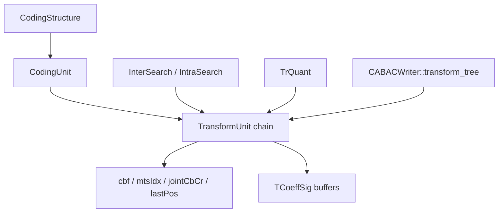
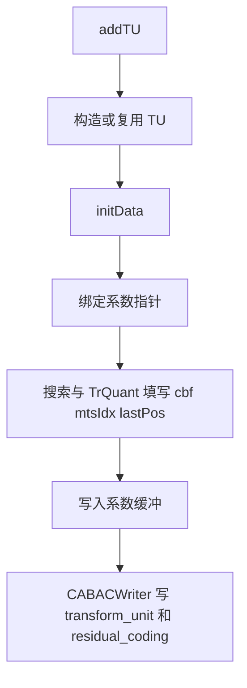
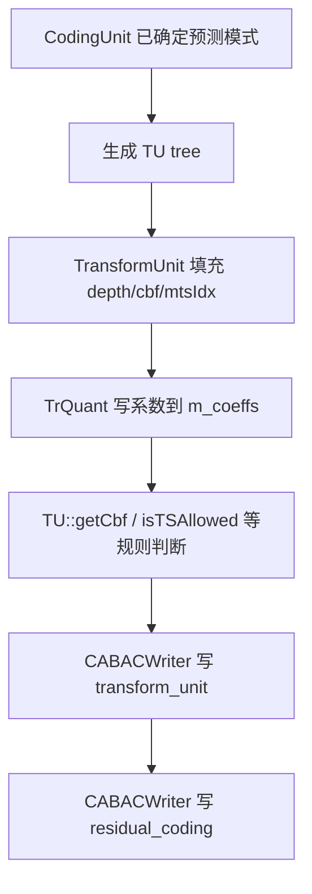
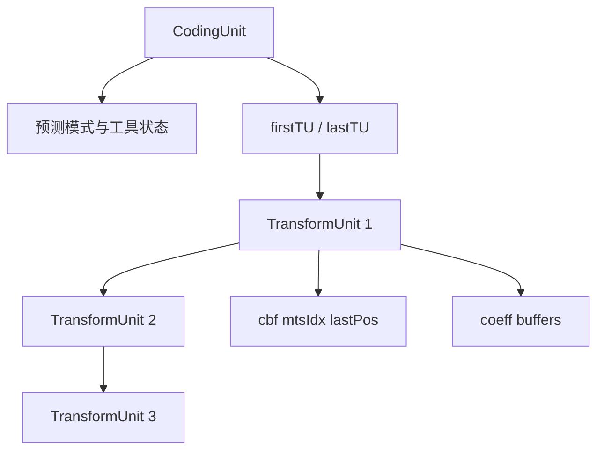

# vvenc `TransformUnit` 类分析

本文聚焦 `vvenc/source/Lib/CommonLib/Unit.h/.cpp` 中的 `TransformUnit`，重点说明：

1. `TransformUnit` 在 vvenc 中是什么
2. 它和 `CodingUnit`、`CodingStructure`、系数缓冲之间是什么关系
3. 为什么 `TransformUnit` 本体不大，但 `TU::` 工具函数承担了很多关键规则

本文重点讲对象设计与数据流，不展开具体变换量化算法细节。

## 1. 类定位

`TransformUnit` 是 vvenc 中负责描述“一个变换残差单元”的核心对象。

它回答的问题不是：

- 这个块是 intra 还是 inter

而是：

- 这个块的残差如何划分成 TU
- 哪些分量有非零系数
- 是否使用 transform skip / MTS / joint CbCr
- 各分量最后一个非零系数位置在哪里
- 系数缓冲在哪里

一句话说：

`TransformUnit` 负责回答“这个块的残差是怎么表达的”。

## 2. 在编码链路中的位置

`TransformUnit` 位于 `CodingUnit` 之下，是块级残差表达的直接承载对象。

关系可以概括为：



这个图反映出：

- `CodingUnit` 决定块级预测语义
- `TransformUnit` 决定块级残差语义

## 3. 和 `CodingUnit` 的区别

### 3.1 `CodingUnit`

`CodingUnit` 关注的是：

- 预测模式
- 分裂历史
- MV / intra mode
- 块级工具状态

### 3.2 `TransformUnit`

`TransformUnit` 关注的是：

- 残差是否存在
- 系数对应的 TU 区域
- 变换工具选择
- 系数缓冲与编码状态

所以可以简单理解为：

- `CodingUnit` = 预测层对象
- `TransformUnit` = 残差层对象

## 4. 结构定义与核心含义

`TransformUnit` 的定义是：

```cpp
struct TransformUnit : public UnitArea
```

这说明它首先也是一个“带空间范围的单元对象”。

但与 `CodingUnit` 不同的是，它没有继承额外的 intra/inter 预测数据，而是专注于变换与残差字段。

## 5. 关键成员分组

### 5.1 基础归属关系

```cpp
CodingUnit*      cu;
CodingStructure* cs;
ChannelType      chType;
```

这组成员定义：

- 这个 TU 属于哪个 `CU`
- 它位于哪个 `CodingStructure`
- 当前 TU 的主通道类型是什么

这说明 `TransformUnit` 从来不是孤立对象，而是依附在 `CU/CS` 上。

### 5.2 变换层状态

```cpp
int      chromaAdj;
uint8_t  depth;
bool     noResidual;
uint8_t  jointCbCr;
uint8_t  mtsIdx[MAX_NUM_TBLOCKS];
uint8_t  cbf   [MAX_NUM_TBLOCKS];
int16_t  lastPos[MAX_NUM_TBLOCKS];
```

这是 TU 最核心的一组字段。

它们分别表示：

- `depth`
  - 当前 TU 深度
- `noResidual`
  - 该 TU 是否被标记为无残差
- `jointCbCr`
  - 色度是否联合编码
- `mtsIdx`
  - 各分量使用哪种变换类型
- `cbf`
  - coded block flag 位图
- `lastPos`
  - 每个分量最后一个非零系数扫描位置

### 5.3 链式组织

```cpp
unsigned       idx;
TransformUnit* next;
TransformUnit* prev;
```

这说明同一个 `CodingUnit` 下多个 TU 是通过双向链表串起来的。

关系可以概括为：

```text
CU
  -> firstTU
     <-> TU1 <-> TU2 <-> TU3
  -> lastTU
```

这种组织很适合：

- ISP
- SBT
- TU split 后的顺序遍历

### 5.4 系数缓冲

```cpp
TCoeffSig* m_coeffs[MAX_NUM_TBLOCKS];
```

这组指针是 TU 最核心的实际数据载体之一。

注意这里不是 owning storage，而是：

- 当前 TU 对应到 `CodingStructure` 系数平面中的视图指针

所以 `TransformUnit` 是：

- 系数语义对象 + 系数区域视图

## 6. 生命周期与初始化

### 6.1 构造函数

构造函数会：

- 初始化 `UnitArea`
- 置空 `cu/cs`
- 把 `m_coeffs[]` 置空
- 调用 `initData()`

### 6.2 `initData()`

这个函数会初始化：

- `cbf = 0`
- `mtsIdx = MTS_DCT2_DCT2`
- `lastPos = 0`
- `depth = 0`
- `noResidual = false`
- `jointCbCr = 0`
- `chromaAdj = 0`

这反映出：

- 一个新 TU 默认表示“没有编码出任何非零残差”
- 默认变换类型是标准 DCT2

### 6.3 `init(TCoeffSig** coeffs)`

这个函数负责把外部系数缓冲挂到当前 TU 上：

- `m_coeffs[i] = coeffs[i]`

这一步很关键，因为它意味着：

- TU 本身不负责分配系数内存
- 它只负责把自己绑定到对应区域的系数平面

## 7. 生命周期流程图



## 8. `TransformUnit` 和系数内存的关系

### 8.1 不是 owning storage

`TransformUnit` 自己并不分配 `m_coeffs`。

实际内存来自：

- `CodingStructure::createCoeffs()`

而 TU 只是通过 `init()` 把自己的 `m_coeffs[i]` 指向对应位置。

### 8.2 `getCoeffs()`

接口：

```cpp
CoeffSigBuf  getCoeffs(ComponentID id);
CCoeffSigBuf getCoeffs(ComponentID id) const;
```

它返回的是：

- “这个 TU 对应分量的系数视图”

所以 TU 不是只保存标志位，也直接暴露了系数访问入口。

## 9. `cbf` 的设计

`TransformUnit` 里的 `cbf` 不是简单一个 bool，而是：

```cpp
uint8_t cbf[MAX_NUM_TBLOCKS];
```

原因是：

- CBF 和深度绑定
- 某些场景要按不同 transform depth 读取/设置

因此相关访问统一通过 `TU::` 工具函数完成，而不是直接用字段。

## 10. `TU::` 工具函数为什么重要

和 `CodingUnit` 类似，`TransformUnit` 本体偏“状态对象”，真正的规则主要在 `namespace TU` 里。

最重要的包括：

- `TU::getCbf()`
- `TU::getCbfAtDepth()`
- `TU::setCbfAtDepth()`
- `TU::isTSAllowed()`
- `TU::getICTMode()`
- `TU::needsSqrt2Scale()`
- `TU::getPrevTU()`
- `TU::getPrevTuCbfAtDepth()`

## 11. `TU::` 几类核心职责

### 11.1 CBF 读写

```cpp
TU::getCbf()
TU::getCbfAtDepth()
TU::setCbfAtDepth()
```

这些函数负责：

- 按 transform depth 解释 `cbf` 位图
- 让上层逻辑不用直接操作位编码

这说明 TU 中的 `cbf` 本质上是“压缩存储”，规则由工具函数解释。

### 11.2 TS 规则判断

```cpp
TU::isTSAllowed()
```

这个函数会综合判断：

- SPS 是否允许 transform skip
- 当前分量是否是 ISP luma
- 是否启用了 BDPCM
- 当前块尺寸是否超过 TS 限制
- 当前 CU 是否用了 SBT

所以 TS 是否可用，并不是 TU 一个字段能直接说明，而要结合：

- `TU`
- `CU`
- `SPS`

一起判断。

### 11.3 Joint CbCr / ICT

```cpp
TU::getICTMode()
```

这个函数根据：

- `tu.jointCbCr`
- `picHeader->jointCbCrSign`

推导当前色度联合变换模式。

这说明 joint chroma 的真正语义解释是通过工具函数完成的。

### 11.4 邻接 TU 关系

```cpp
TU::getPrevTU()
TU::getPrevTuCbfAtDepth()
```

它们负责：

- 找同一 CU 下的前一个 TU
- 读取前一个 TU 在当前 depth 下的 CBF

这对：

- ISP
- 某些 CABAC 上下文建模

都很关键。

### 11.5 变换缩放规则

```cpp
TU::needsSqrt2Scale()
```

这个函数根据：

- TU 尺寸
- 是否是 transform skip

判断是否需要 sqrt(2) 缩放修正。

这属于变换实现细节，但封装在 TU 工具中非常合理。

## 12. `TransformUnit` 在编码流程中的位置

从编码流程看，一个 TU 通常经历：

1. 由 `CodingStructure::addTU()` 创建
2. 绑定到某个 `CodingUnit`
3. `TrQuant` / 搜索模块写入系数、`cbf`、`mtsIdx`
4. `CABACWriter::transform_tree()` / `transform_unit()` / `residual_coding()` 读取并输出

可以概括成：



## 13. `operator=` 与 `copyComponentFrom()`

### 13.1 `operator=`

`TransformUnit::operator=` 会复制：

- `cbf`
- `mtsIdx`
- `lastPos`
- `depth`
- `noResidual`
- `jointCbCr`

必要时还会复制实际系数数据。

但注意：

- 只有在目标和源的系数指针不同
- 且当前分量确实需要复制残差

时才真正 memcpy 系数。

这说明 vvenc 在 TU 复制上也做了明显的性能节制。

### 13.2 `copyComponentFrom()`

这个函数更细粒度，只复制单个分量。

它适合：

- 某些只需要复制 Cb/Cr 或单分量结果的场景

## 14. `noResidual` 与 SBT 的关系

`TransformUnit::checkTuNoResidual()` 用于根据当前 `CU` 的 `sbtInfo` 判断：

- 当前 TU 是否属于 SBT 的无残差半块

这说明在 SBT 模式下：

- 不是所有 TU 都真的承载非零残差
- TU 需要显式记录自己是不是“noResidual TU”

这是 TU 语义里一个很重要的特殊点。

## 15. `getTbAreaAfterCoefZeroOut()`

这个函数用于估计：

- 当前 TU 真正参与有效系数编码的面积

它会考虑：

- MTS
- SBT
- 最大零化阈值

这通常服务于：

- 系数编码约束
- CABAC 剩余 bin 限制

说明 TU 不只是系数容器，还承担一部分与系数编码边界相关的语义。

## 16. 与 `CodingUnit` 的关系图

可以把 CU 和 TU 的关系总结成：



这反映出分工：

- `CU` 管预测层和块级总状态
- `TU` 管残差层和变换表达

## 17. 设计特点总结

从设计上看，`TransformUnit` 有几个很鲜明的特点。

### 17.1 本体非常聚焦

与 `CodingUnit` 相比，`TransformUnit` 明显更纯粹：

- 不关心预测模式
- 只关心残差和变换表达

### 17.2 状态对象和系数视图合一

`TransformUnit` 既有：

- `cbf/mtsIdx/jointCbCr/lastPos`

又有：

- `m_coeffs`

所以它不是纯元数据对象，而是“元数据 + 系数视图”结合体。

### 17.3 规则主要外置在 `TU::`

很多关键语义都不直接体现在字段上，而要通过：

- `TU::getCbfAtDepth`
- `TU::isTSAllowed`
- `TU::getICTMode`

来解释。

这和 `CodingUnit` / `CU::` 的设计风格一致。

### 17.4 它是残差编码链路的核心节点

只要进入：

- `transform_tree`
- `transform_unit`
- `residual_coding`

就几乎一定绕不开 `TransformUnit`。

## 18. 一句话总结

`TransformUnit` 可以概括为：

> vvenc 中承载单个变换残差区域的 CBF、变换类型、联合色度状态、最后非零位置及系数视图的核心残差层对象。

如果说：

- `CodingUnit` 负责“这个块如何预测”
- `TransformUnit` 负责“这个块的残差如何表达”

那么 `TransformUnit` 的作用就是：

- “把变换树里每一个 TU 的残差语义和系数数据完整装起来”
