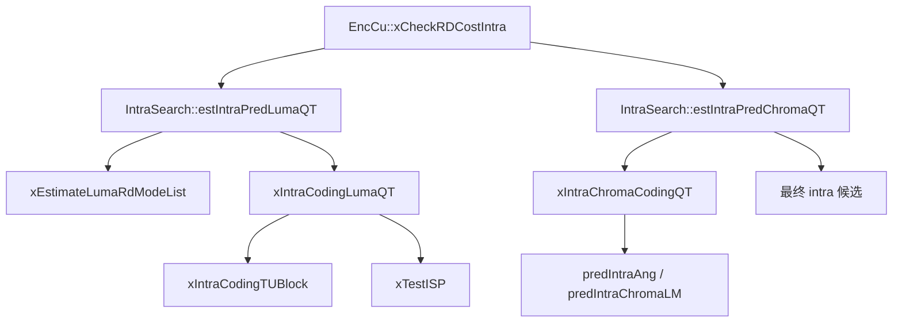
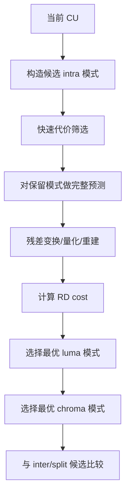
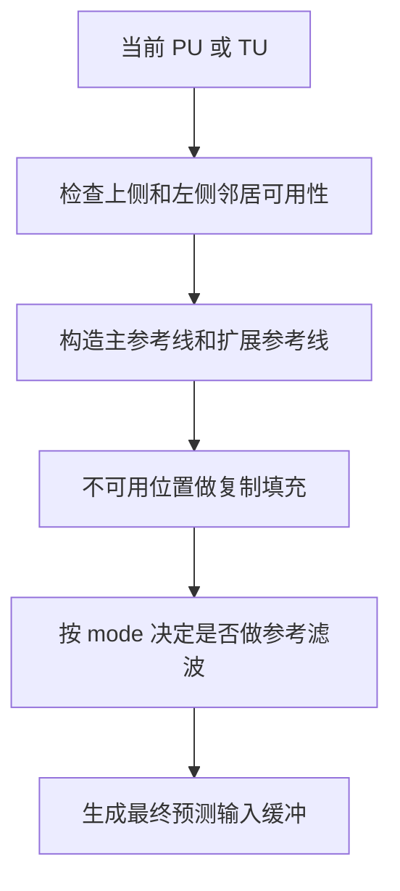
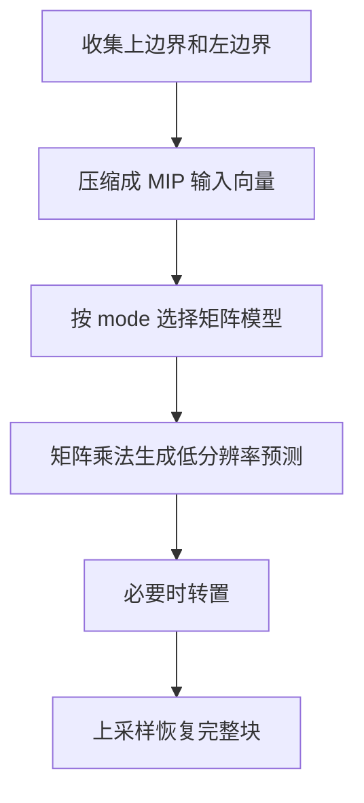
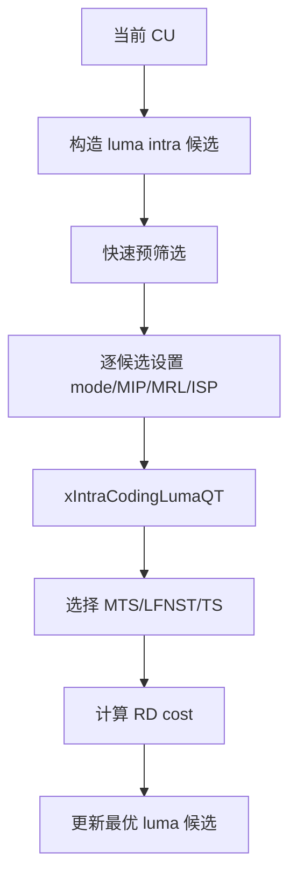
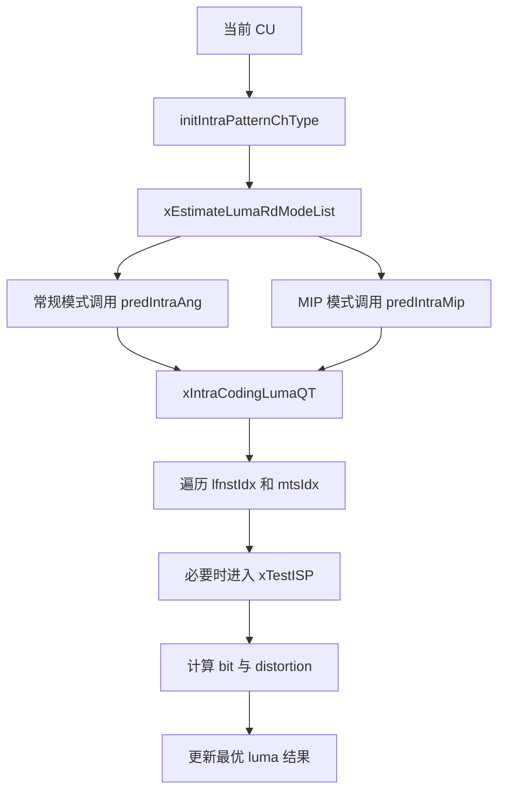
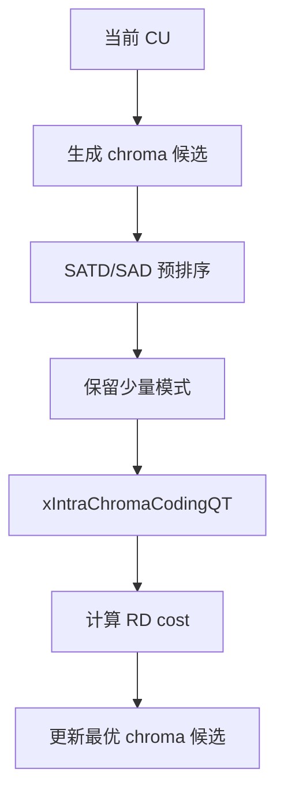
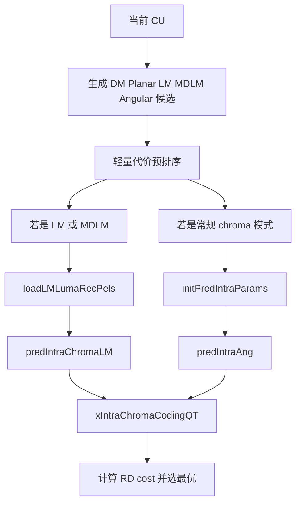

# vvenc 帧内预测分析

本文聚焦 vvenc 的帧内预测（Intra Prediction）实现，说明其算法框架、关键工具以及在源码中的具体落地。内容覆盖：

- 帧内预测的基本思想
- vvenc 中 luma / chroma 帧内预测的调用链
- MPM、角度预测、MIP、MRL、ISP、LFNST、MTS 等关键机制
- 流程图与简化伪代码

## 1. 帧内预测的目标

帧内预测利用当前帧中已重建的空间邻域样本，对当前块构造预测值，从而降低残差能量。

在 vvenc / VVC 中，帧内预测不仅仅是“角度预测”：

1. luma 预测
   - Planar
   - DC
   - Angular modes
   - MIP
   - MRL
   - ISP

2. chroma 预测
   - DM
   - Planar
   - LM / MDLM
   - 角度模式
   - Chroma transform 相关工具

此外，帧内预测与以下工具高度耦合：

- LFNST
- MTS / Transform Skip
- ISP
- BDPCM

因此 vvenc 中的 intra 并不是单阶段过程，而是“模式选择 + 变换选择 + RD 比较”的联合优化过程。

## 2. 在 vvenc 中的模块分工

帧内预测的主调用链如下：



职责划分如下：

1. `EncCu::xCheckRDCostIntra()`
   - 创建 intra CU
   - 驱动 luma/chroma intra 搜索
   - 估算语法比特与完整 RD 代价

2. `IntraSearch::estIntraPredLumaQT()`
   - 选择 luma intra 候选模式
   - 控制 MIP / ISP / MRL / LFNST / MTS 组合
   - 完成 luma 路径的 RDO

3. `IntraSearch::estIntraPredChromaQT()`
   - 选择 chroma intra 模式
   - 处理 DM / LM / MDLM / angular chroma
   - 完成 chroma 路径的 RDO

## 3. 帧内预测的总体算法框架

从编码器角度看，帧内预测可抽象为：



与 inter 路径类似，intra 也不是单独比较预测误差，而是比较完整的 RD 代价。

## 4. `EncCu::xCheckRDCostIntra()`：intra 路径入口

`EncCu::xCheckRDCostIntra()` 可以概括为：

```text
xCheckRDCostIntra():
  创建 intra CU
  调 estIntraPredLumaQT()
  如需要，再调 estIntraPredChromaQT()
  用 CABACEstimator 估算语法比特
  计算 RD cost
  与 bestCS 比较
```

简化代码：

```cpp
cu.predMode = MODE_INTRA;
m_cIntraSearch.estIntraPredLumaQT(cu, partitioner, bestCS->cost);
m_cIntraSearch.estIntraPredChromaQT(cu, partitioner, maxCostAllowedForChroma);

m_CABACEstimator->pred_mode(cu);
m_CABACEstimator->cu_pred_data(cu);
m_CABACEstimator->cu_residual(cu, partitioner, cuCtx);
```

这说明 `EncCu` 自身不负责具体 intra 预测算法，而是负责将 `IntraSearch` 的结果纳入统一的 CU 级 RD 流程。

## 5. luma 帧内预测

### 5.1 `estIntraPredLumaQT()` 的职责

`IntraSearch::estIntraPredLumaQT()` 是 luma intra 搜索主入口。其任务包括：

1. 构造 luma intra 候选模式
2. 做快速预筛选
3. 对候选执行完整 RD
4. 联合考虑：
   - MIP
   - ISP
   - MRL
   - LFNST
   - MTS / TS
   - BDPCM

简化伪代码：

```text
estIntraPredLumaQT():
  计算需要做 full RD 的候选个数
  判断是否允许 MIP / ISP / MRL / LFNST / MTS
  调 xEstimateLumaRdModeList() 做候选预筛选
  对保留候选逐个执行:
    设置 intra mode / MIP / ISP / MRL / BDPCM
    调 xIntraCodingLumaQT()
    比较 RD cost
  保留最优 luma intra 候选
```

### 5.2 模式候选预筛选

`estIntraPredLumaQT()` 在完整 RDO 之前，会调用 `xEstimateLumaRdModeList()` 做候选压缩。其意义是：

- 不对所有 luma intra mode 都做完整 RD
- 先用较轻量的代价筛出少量高价值候选

这是一种标准但非常关键的复杂度控制策略。

## 6. 角度预测、Planar、DC 与参考样本

### 6.1 基本模式

传统 intra 预测的核心仍然是：

1. Planar
2. DC
3. Angular

vvenc 中这类模式的基础调用表现为：

```cpp
initIntraPatternChType(cu, cu.Y(), true);
predIntraAng(COMP_Y, piPred, cu);
```

可抽象为：

```text
准备参考边界样本
根据当前 intra mode 生成预测块
将预测块送入残差编码路径
```

### 6.2 参考样本的重要性

帧内预测依赖空间邻域，因此 `initIntraPatternChType()` 的职责非常关键：

- 收集上、左等邻域已重建样本
- 按当前块形状组织可供预测使用的参考线

在此基础上，`predIntraAng()` 再根据 mode 生成预测。

更细一点看，这一步不是简单“拷贝边界像素”，而是一个参考样本准备流程：



其中有几个实现上的关键点：

- 参考样本不仅包含块正上方和正左方，还会扩展到 above-right、below-left，以支撑角度投影时越界访问。
- 不可用邻居不能留空，编码器会用最近可用样本做延拓填充，否则角度模式无法形成稳定投影。
- `initPredIntraParams()` 会进一步决定是否启用参考滤波、分数插值、PDPC 和 multi-reference line。

### 6.3 `initPredIntraParams()` 在做什么

`IntraPrediction::initPredIntraParams()` 是常规 intra 预测的参数派生核心。它并不直接生成预测块，而是先把“这个 mode 应该怎样预测”算出来。

从实现上，它主要派生出以下信息：

1. 当前模式是更接近 vertical 还是 horizontal
2. 当前模式对应的投影角度 `intraPredAngle`
3. 是否使用多参考线 `multiRefIndex`
4. 是否对参考边界做滤波 `refFilterFlag`
5. 是否启用分数插值 `interpolationFlag`
6. 是否启用 PDPC `applyPDPC`

这一步的核心思想是：角度模式并不是 67 个完全独立的模板，而是“参考边界 + 方向参数 + 插值规则”的统一框架。  
因此 vvenc 先把方向参数和滤波决策算好，后续 `predIntraAng()` 才能走统一实现。

### 6.4 Planar、DC、Angular 的算法差异

`predIntraAng()` 是常规 intra 的统一调度入口。源码里它根据最终模式分派到：

- `xPredIntraPlanar()`
- `xPredIntraDc()`
- `xPredIntraBDPCM()`
- `xPredIntraAng()`

这几类模式在算法含义上差异很大。

#### Planar

Planar 不是简单均值，而是把上边界和左边界共同作为约束，构造一个平滑变化的二维预测平面。  
可以把它理解成“横向渐变 + 纵向渐变”的双线性融合，适合缓慢变化、没有强方向纹理的块。

它的特点是：

- 边界连续性好
- 大块平坦区域通常比 DC 更稳定
- 在边缘不强的自然图像区域很常见

#### DC

DC 模式最直接：先根据参考边界求一个平均值，再把整个块填成这个常数。  
它的优点不是精细，而是鲁棒：

- 参考样本很少时仍然稳定
- 对低纹理块代价较低
- 在快速预筛选阶段经常能留下来

#### Angular

Angular 是 VVC 帧内预测的主体。它的本质不是“挑一个方向后复制整行”，而是：

1. 先把模式号映射成方向角
2. 对块内每个像素沿该方向投影到主参考线
3. 如果投影落在整数位置，直接取样
4. 如果落在两个参考样本之间，做线性插值

这也是 `initPredIntraParams()` 里 `angTable`、`invAngTable`、`interpolationFlag` 这些参数存在的原因。  
它们共同决定“投影步长是多少、是否要做分数位置插值、是否适合额外滤波”。

### 6.5 分数插值、参考滤波与 PDPC

vvenc 对角度预测不是一套死板公式，而是根据块大小、模式角度和参考线状态动态切换几种增强机制。

#### 分数插值

当方向角不是整数斜率时，块内像素投影往往落在参考样本之间。  
这时 `xPredIntraAng()` 会做插值，以减少“台阶状”的方向失真。  
从算法角度看，这一步让角度预测从“离散模板”变成了“连续方向投影”。

#### 参考滤波

当模式远离纯水平或纯垂直时，边界样本上的高频噪声更容易被沿角度传播进块内。  
所以 `initPredIntraParams()` 会根据块尺寸和模式偏离程度决定是否启用参考滤波。

工程上可以把它理解成：

- 方向越斜，越可能做滤波
- 块越大，边界噪声累积影响越明显
- 纯 Planar、BDPCM、MIP、MRL 等路径有各自的限制条件

#### PDPC

PDPC 可以理解为一种位置相关的边界校正。  
对靠近左边界或上边界的预测样本，适度拉回参考边界的真实值，避免预测平面在边缘处漂移。

它的作用不是替代主预测，而是在预测结果生成后做边界一致性补偿。  
在 `predIntraAng()` 里，Planar 和 DC 路径在满足条件时也会再做一次基于边界的滤波修正。

### 6.6 常规 luma 模式的编码器视角

从编码器搜索角度，常规 intra 模式并不是逐个完整尝试，而是先做快速打分，再决定哪些模式值得进入 full RD。

`xEstimateLumaRdModeList()` 的做法可以概括为：

```text
初始化参考边界
生成常规模式集合和 MPM
按抽样步长做第一轮 SATD
围绕较优父模式补充邻近角度模式
对保留模式调用 predIntraAng 或 predIntraMip
形成 full RD 候选列表
```

这一步里 Hadamard SATD 的意义很实际：

- 比完整变换量化便宜很多
- 仍然能较好反映残差能量
- 适合拿来缩小 67 个 luma mode 的搜索范围

因此，源码里真正昂贵的 `xIntraCodingLumaQT()` 只会对少量候选执行，而不会对所有方向模式穷举。

## 7. MIP、MRL、ISP

### 7.1 MIP

MIP（Matrix-based Intra Prediction）是 VVC 的重要增强工具，适合某些纹理结构更复杂的块。

在 vvenc 中，是否测试 MIP 受以下条件控制：

1. SPS 是否启用 `MIP`
2. 块尺寸是否满足约束
3. LFNST 组合是否合法
4. 快速模式筛选是否保留 MIP

在 `estIntraPredLumaQT()` 中可以看到：

- `testMip` 不是无条件开启
- MIP 会被放进候选列表与常规 intra 模式共同竞争

从算法上看，MIP 和角度预测的思路完全不同。  
角度预测是“沿边界方向投影”，MIP 则更像“边界向量经过一个模式相关的矩阵映射，再恢复成块内像素”。

`initIntraMip()` 与 `predIntraMip()` 可以概括成：



它适合的场景通常是：

- 边界模式与块内纹理关系更复杂
- 简单角度投影不足以表达块内结构
- 小到中等块中，边界统计信息足以支撑一个更灵活的预测模型

所以 MIP 本质上不是“又一个角度模式”，而是一条独立的预测家族。

### 7.2 MRL

MRL（Multi-Reference Line）允许 intra 预测使用更远参考线，提高对复杂纹理的适应性。

在 vvenc 中：

- MRL 作为 mode 属性之一进入候选列表
- 与普通 angular/planar/DC 模式共同参与 RD 选择

算法上，MRL 的关键不是改写角度公式，而是把参考线从“紧贴块边界的第 0 行”扩展到更远的参考行。  
这样做的动机是：紧邻当前块的参考样本有时噪声较大、局部纹理扰动明显，反而稍远的边界更平稳、更能代表整体方向。

因此可以把 MRL 理解成：

- 主预测器仍然是 Planar/DC/Angular
- 只是参考输入不再局限于最近一条边界
- 编码器把 `multiRefIdx` 也作为候选维度参与 RDO

这也是为什么 `initPredIntraParams()` 会专门派生 `multiRefIndex`。

### 7.3 ISP

ISP（Intra Sub-Partitions）会把块沿单一方向拆分成多个子分区，对每个子分区分别做 intra 预测，适合细长结构与方向性纹理。

在 vvenc 中，ISP 相关逻辑非常多，主要体现在：

1. `estIntraPredLumaQT()` 判断是否 `testISP`
2. `xSpeedUpISP()` 决定是否继续展开 ISP 路径
3. `xTestISP()` 对 ISP 子分区做逐段 RD

简化伪代码：

```text
if (允许 ISP):
  判断横向/纵向 ISP 是否可用
  对 ISP 方向逐一测试
  每个子分区做预测 + 残差编码
  若累计代价已经劣化，则提前停止
```

这说明 ISP 在 vvenc 中是一个带强 early termination 的高复杂度增强工具。

从算法理解上，ISP 解决的是“整个块共享一个方向模式不够灵活”的问题。  
例如一块纹理整体仍是 intra，但其能量沿竖向或横向分布非常不均匀，这时把块切成多个条带分别编码，往往比整块预测更有效。

`xTestISP()` 的实际代价结构大致是：

1. 按横向或纵向把块拆成多个 sub-partition
2. 每个 sub-partition 复用当前 intra mode 家族做预测
3. 每个 sub-partition 单独做残差编码与 cbf 决策
4. 累计各子块的 bit 和 distortion
5. 若中途已经明显劣于当前 best，则直接 early stop

可以把它看成“块级 intra 模式”与“细粒度残差自适应”之间的折中。

## 8. LFNST、MTS 与 Transform Skip

### 8.1 为什么这些工具属于 intra 路径的重要部分

intra 预测不是“只选预测模式”，还要决定残差如何表示。  
因此在 vvenc 中，intra 搜索会和变换工具联合优化：

1. LFNST
2. MTS
3. Transform Skip
4. BDPCM

### 8.2 `xIntraCodingLumaQT()` 的作用

`xIntraCodingLumaQT()` 可以理解为 luma intra 候选的“残差级 RDO 内核”。其主要工作是：

1. 判断当前候选是否允许 MTS / TS / LFNST
2. 遍历可用变换配置
3. 对每种配置执行残差编码
4. 记录最优变换配置下的 RD 代价

简化伪代码：

```text
xIntraCodingLumaQT():
  判断是否允许 MTS / TS / LFNST
  若是 ISP，则按子分区路径处理
  否则对 TU 执行:
    预测
    变换/量化/反量化/重建
    计算比特与失真
  在多种变换配置中选最优结果
```

从实现可以看到，`EndMTS`、`endLfnstIdx`、`tsAllowed` 等控制变量共同决定 intra 残差的搜索空间。

### 8.3 这些变换工具分别在解决什么问题

#### LFNST

LFNST 是一种在主变换之后追加的小型非分离变换。  
它主要针对 intra 残差中常见的方向相关性，把能量进一步压缩到更少系数上。

可以把它理解成：

- 主变换先做一轮频域解耦
- LFNST 再对低频系数做一次方向自适应重排
- 对某些强方向纹理，码率收益明显

#### MTS

MTS 允许在 DCT2 之外测试更多变换核，例如 DCT8、DST7 等。  
不同残差形状对应不同变换核，编码器通过 RDO 决定哪种更划算。

在 `xIntraCodingLumaQT()` 里，`trModes` 的构造就体现了这件事：  
预测模式确定后，残差仍然要继续选择“用什么变换更匹配”。

#### Transform Skip

TS 的含义最直接：不做常规变换，直接对残差样本量化。  
它适合的通常是：

- 块较小
- 残差很稀疏
- 变换反而会打散原始结构

#### BDPCM

BDPCM 虽然常被单列，但它本质上也是 intra 残差建模的一部分。  
它更适合极强水平或垂直局部结构，此时直接做差分脉冲编码可能比常规角度预测加变换更有效。

### 8.4 为什么预测和变换必须联合搜索

同一个预测模式下，不同变换配置会直接改变：

- 非零系数个数
- 最后显著系数位置
- CABAC 比特数
- 重建失真

所以 intra 路径真正比较的是：

```text
预测模式 + 参考线配置 + ISP/MIP 标志 + 变换配置
```

这也是 `xIntraCodingLumaQT()` 会把 `lfnstIdx`、`mtsIdx`、`tsAllowed` 一起遍历的根本原因。

## 9. chroma 帧内预测

### 9.1 `estIntraPredChromaQT()` 的职责

chroma intra 不简单复制 luma 流程，而是有独立的候选体系。  
`estIntraPredChromaQT()` 的主要工作是：

1. 生成 chroma 候选模式
2. 对候选做 SATD/SAD 预筛选
3. 对保留候选执行完整 chroma 编码
4. 选择最优 chroma mode

简化伪代码：

```text
estIntraPredChromaQT():
  获取 chroma 候选模式
  对候选做 SATD 预排序
  丢弃低价值模式
  对剩余模式执行 xIntraChromaCodingQT()
  选择最优 chroma intra mode
```

### 9.2 chroma 候选类型

从实现上看，chroma 候选包括：

1. DM
2. Planar
3. LM / MDLM
4. 角度模式
5. 必要时的 BDPCM 组合

其中 LM / MDLM 需要额外的 luma 信息支撑，因此在实现中会看到：

```cpp
loadLMLumaRecPels(cu, cu.Cb());
predIntraChromaLM(COMP_Cb, predCb, cu, areaCb, mode);
predIntraChromaLM(COMP_Cr, predCr, cu, areaCr, mode);
```

这说明 chroma 预测在 vvenc 中不是完全独立于 luma，而是部分依赖 luma 重建样本。

### 9.3 LM / MDLM 的算法含义

LM（Linear Model）不是从 chroma 邻域单独外推，而是利用 luma 与 chroma 之间的局部相关性做线性映射：

```text
predChroma = a * recLuma + b
```

其中参数 `a`、`b` 由邻近区域已经重建的 luma/chroma 样本联合估计。  
`loadLMLumaRecPels()` 的职责，就是先把与当前 chroma 块对应的 luma 重建样本收集出来，供后续线性建模使用。

MDLM 可以理解为 LM 的方向化变体：

- `MDLM_T` 更强调上方模板
- `MDLM_L` 更强调左侧模板

这样做的原因是 chroma 与 luma 的相关性常常不是各向同性的。  
如果边界主要在上方稳定，就优先用上模板；如果左侧更可靠，就偏向左模板。

### 9.4 chroma 为什么不完全照搬 luma 搜索

chroma 搜索空间通常更小，原因包括：

- 色度分辨率往往低于亮度
- chroma 纹理通常比 luma 更平滑
- LM / MDLM 这类模式已经能覆盖很多高价值场景

因此 chroma 编码的重点不是“复刻 luma 的大规模角度搜索”，而是：

1. 保留少数高收益模式
2. 利用 luma 信息做跨分量建模
3. 控制额外复杂度

## 10. intra 模式选择的工程化特点

### 10.1 先预筛选，再 full RD

无论 luma 还是 chroma，vvenc 都不会对全部候选做完整 RD，而是先用：

- Hadamard
- SATD/SAD
- 经验阈值

缩小候选集合。

### 10.2 预测模式与变换模式联合优化

在 vvenc 中，一个 intra 候选的优劣不仅由预测模式决定，还受：

- LFNST
- MTS
- TS
- ISP

共同影响。因此 intra 搜索本质上是联合搜索。

### 10.3 大量 early termination

实现里存在很多提前停止机制，例如：

- ISP 早停
- rapid LFNST
- MTS 预筛
- chroma 模式削减

这对控制编码复杂度非常关键。

再具体一点，这些 early termination 分别在不同层面起作用：

- `xEstimateLumaRdModeList()` 用 SATD 先砍掉大量不值得做 full RD 的方向模式
- `xPreCheckMTS()` 先决定某些变换候选是否值得继续
- `xTestISP()` 在累计代价已经劣化时提前截断子分区搜索
- chroma 路径先做轻量排序，再只保留少数模式进入完整残差编码

这也是 vvenc intra 路径能在高工具密度下维持可接受复杂度的关键。

## 11. 一次 luma intra 搜索的简化流程图



如果把算法细节再展开一些，实际更接近下面这条链路：



## 12. 一次 chroma intra 搜索的简化流程图



把 LM 路径也展开后，可理解为：



## 13. 建议的阅读顺序

如果继续深入帧内预测实现，建议按如下顺序阅读：

1. `EncCu::xCheckRDCostIntra()`
2. `IntraSearch::estIntraPredLumaQT()`
3. `IntraSearch::xEstimateLumaRdModeList()`
4. `IntraPrediction::initPredIntraParams()`
5. `IntraPrediction::predIntraAng()`
6. `IntraPrediction::predIntraMip()`
7. `IntraSearch::xIntraCodingLumaQT()`
8. `IntraSearch::xTestISP()`
9. `IntraSearch::estIntraPredChromaQT()`
10. `IntraPrediction::loadLMLumaRecPels()`
11. `IntraPrediction::predIntraChromaLM()`
12. `IntraSearch::xIntraChromaCodingQT()`

这个顺序能先建立整体框架，再深入 luma/chroma 的具体实现差异。
