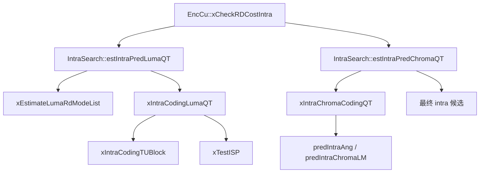
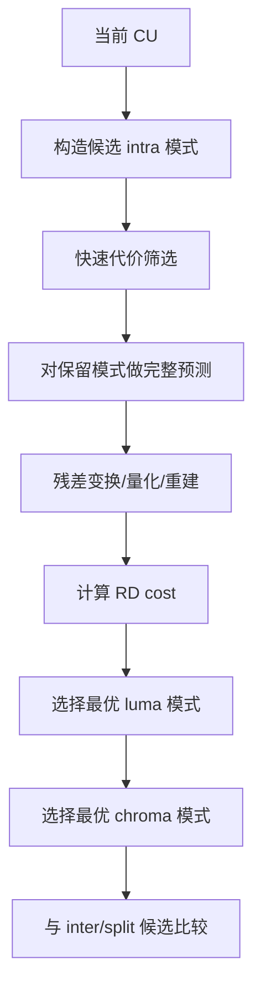
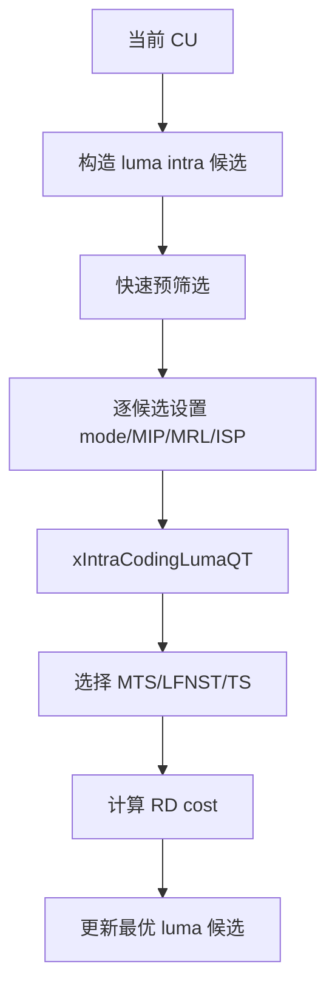
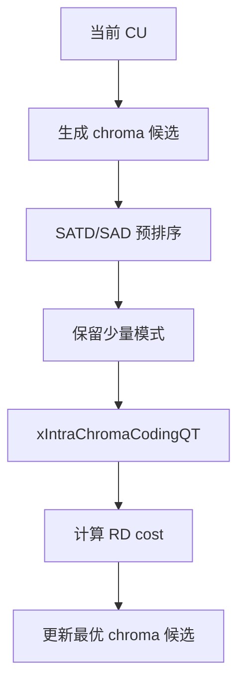

# vvenc 帧内预测分析

本文聚焦 vvenc 的帧内预测（Intra Prediction）实现，说明其算法框架、关键工具以及在源码中的具体落地。内容覆盖：

- 帧内预测的基本思想
- vvenc 中 luma / chroma 帧内预测的调用链
- MPM、角度预测、MIP、MRL、ISP、LFNST、MTS 等关键机制
- 流程图与简化伪代码

## 1. 帧内预测的目标

帧内预测利用当前帧中已重建的空间邻域样本，对当前块构造预测值，从而降低残差能量。

在 vvenc / VVC 中，帧内预测不仅仅是“角度预测”：

1. luma 预测
   - Planar
   - DC
   - Angular modes
   - MIP
   - MRL
   - ISP

2. chroma 预测
   - DM
   - Planar
   - LM / MDLM
   - 角度模式
   - Chroma transform 相关工具

此外，帧内预测与以下工具高度耦合：

- LFNST
- MTS / Transform Skip
- ISP
- BDPCM

因此 vvenc 中的 intra 并不是单阶段过程，而是“模式选择 + 变换选择 + RD 比较”的联合优化过程。

## 2. 在 vvenc 中的模块分工

帧内预测的主调用链如下：



职责划分如下：

1. `EncCu::xCheckRDCostIntra()`
   - 创建 intra CU
   - 驱动 luma/chroma intra 搜索
   - 估算语法比特与完整 RD 代价

2. `IntraSearch::estIntraPredLumaQT()`
   - 选择 luma intra 候选模式
   - 控制 MIP / ISP / MRL / LFNST / MTS 组合
   - 完成 luma 路径的 RDO

3. `IntraSearch::estIntraPredChromaQT()`
   - 选择 chroma intra 模式
   - 处理 DM / LM / MDLM / angular chroma
   - 完成 chroma 路径的 RDO

## 3. 帧内预测的总体算法框架

从编码器角度看，帧内预测可抽象为：



与 inter 路径类似，intra 也不是单独比较预测误差，而是比较完整的 RD 代价。

## 4. `EncCu::xCheckRDCostIntra()`：intra 路径入口

`EncCu::xCheckRDCostIntra()` 可以概括为：

```text
xCheckRDCostIntra():
  创建 intra CU
  调 estIntraPredLumaQT()
  如需要，再调 estIntraPredChromaQT()
  用 CABACEstimator 估算语法比特
  计算 RD cost
  与 bestCS 比较
```

简化代码：

```cpp
cu.predMode = MODE_INTRA;
m_cIntraSearch.estIntraPredLumaQT(cu, partitioner, bestCS->cost);
m_cIntraSearch.estIntraPredChromaQT(cu, partitioner, maxCostAllowedForChroma);

m_CABACEstimator->pred_mode(cu);
m_CABACEstimator->cu_pred_data(cu);
m_CABACEstimator->cu_residual(cu, partitioner, cuCtx);
```

这说明 `EncCu` 自身不负责具体 intra 预测算法，而是负责将 `IntraSearch` 的结果纳入统一的 CU 级 RD 流程。

## 5. luma 帧内预测

### 5.1 `estIntraPredLumaQT()` 的职责

`IntraSearch::estIntraPredLumaQT()` 是 luma intra 搜索主入口。其任务包括：

1. 构造 luma intra 候选模式
2. 做快速预筛选
3. 对候选执行完整 RD
4. 联合考虑：
   - MIP
   - ISP
   - MRL
   - LFNST
   - MTS / TS
   - BDPCM

简化伪代码：

```text
estIntraPredLumaQT():
  计算需要做 full RD 的候选个数
  判断是否允许 MIP / ISP / MRL / LFNST / MTS
  调 xEstimateLumaRdModeList() 做候选预筛选
  对保留候选逐个执行:
    设置 intra mode / MIP / ISP / MRL / BDPCM
    调 xIntraCodingLumaQT()
    比较 RD cost
  保留最优 luma intra 候选
```

### 5.2 模式候选预筛选

`estIntraPredLumaQT()` 在完整 RDO 之前，会调用 `xEstimateLumaRdModeList()` 做候选压缩。其意义是：

- 不对所有 luma intra mode 都做完整 RD
- 先用较轻量的代价筛出少量高价值候选

这是一种标准但非常关键的复杂度控制策略。

## 6. 角度预测、Planar、DC 与参考样本

### 6.1 基本模式

传统 intra 预测的核心仍然是：

1. Planar
2. DC
3. Angular

vvenc 中这类模式的基础调用表现为：

```cpp
initIntraPatternChType(cu, cu.Y(), true);
predIntraAng(COMP_Y, piPred, cu);
```

可抽象为：

```text
准备参考边界样本
根据当前 intra mode 生成预测块
将预测块送入残差编码路径
```

### 6.2 参考样本的重要性

帧内预测依赖空间邻域，因此 `initIntraPatternChType()` 的职责非常关键：

- 收集上、左等邻域已重建样本
- 按当前块形状组织可供预测使用的参考线

在此基础上，`predIntraAng()` 再根据 mode 生成预测。

## 7. MIP、MRL、ISP

### 7.1 MIP

MIP（Matrix-based Intra Prediction）是 VVC 的重要增强工具，适合某些纹理结构更复杂的块。

在 vvenc 中，是否测试 MIP 受以下条件控制：

1. SPS 是否启用 `MIP`
2. 块尺寸是否满足约束
3. LFNST 组合是否合法
4. 快速模式筛选是否保留 MIP

在 `estIntraPredLumaQT()` 中可以看到：

- `testMip` 不是无条件开启
- MIP 会被放进候选列表与常规 intra 模式共同竞争

### 7.2 MRL

MRL（Multi-Reference Line）允许 intra 预测使用更远参考线，提高对复杂纹理的适应性。

在 vvenc 中：

- MRL 作为 mode 属性之一进入候选列表
- 与普通 angular/planar/DC 模式共同参与 RD 选择

### 7.3 ISP

ISP（Intra Sub-Partitions）会把块沿单一方向拆分成多个子分区，对每个子分区分别做 intra 预测，适合细长结构与方向性纹理。

在 vvenc 中，ISP 相关逻辑非常多，主要体现在：

1. `estIntraPredLumaQT()` 判断是否 `testISP`
2. `xSpeedUpISP()` 决定是否继续展开 ISP 路径
3. `xTestISP()` 对 ISP 子分区做逐段 RD

简化伪代码：

```text
if (允许 ISP):
  判断横向/纵向 ISP 是否可用
  对 ISP 方向逐一测试
  每个子分区做预测 + 残差编码
  若累计代价已经劣化，则提前停止
```

这说明 ISP 在 vvenc 中是一个带强 early termination 的高复杂度增强工具。

## 8. LFNST、MTS 与 Transform Skip

### 8.1 为什么这些工具属于 intra 路径的重要部分

intra 预测不是“只选预测模式”，还要决定残差如何表示。  
因此在 vvenc 中，intra 搜索会和变换工具联合优化：

1. LFNST
2. MTS
3. Transform Skip
4. BDPCM

### 8.2 `xIntraCodingLumaQT()` 的作用

`xIntraCodingLumaQT()` 可以理解为 luma intra 候选的“残差级 RDO 内核”。其主要工作是：

1. 判断当前候选是否允许 MTS / TS / LFNST
2. 遍历可用变换配置
3. 对每种配置执行残差编码
4. 记录最优变换配置下的 RD 代价

简化伪代码：

```text
xIntraCodingLumaQT():
  判断是否允许 MTS / TS / LFNST
  若是 ISP，则按子分区路径处理
  否则对 TU 执行:
    预测
    变换/量化/反量化/重建
    计算比特与失真
  在多种变换配置中选最优结果
```

从实现可以看到，`EndMTS`、`endLfnstIdx`、`tsAllowed` 等控制变量共同决定 intra 残差的搜索空间。

## 9. chroma 帧内预测

### 9.1 `estIntraPredChromaQT()` 的职责

chroma intra 不简单复制 luma 流程，而是有独立的候选体系。  
`estIntraPredChromaQT()` 的主要工作是：

1. 生成 chroma 候选模式
2. 对候选做 SATD/SAD 预筛选
3. 对保留候选执行完整 chroma 编码
4. 选择最优 chroma mode

简化伪代码：

```text
estIntraPredChromaQT():
  获取 chroma 候选模式
  对候选做 SATD 预排序
  丢弃低价值模式
  对剩余模式执行 xIntraChromaCodingQT()
  选择最优 chroma intra mode
```

### 9.2 chroma 候选类型

从实现上看，chroma 候选包括：

1. DM
2. Planar
3. LM / MDLM
4. 角度模式
5. 必要时的 BDPCM 组合

其中 LM / MDLM 需要额外的 luma 信息支撑，因此在实现中会看到：

```cpp
loadLMLumaRecPels(cu, cu.Cb());
predIntraChromaLM(COMP_Cb, predCb, cu, areaCb, mode);
predIntraChromaLM(COMP_Cr, predCr, cu, areaCr, mode);
```

这说明 chroma 预测在 vvenc 中不是完全独立于 luma，而是部分依赖 luma 重建样本。

## 10. intra 模式选择的工程化特点

### 10.1 先预筛选，再 full RD

无论 luma 还是 chroma，vvenc 都不会对全部候选做完整 RD，而是先用：

- Hadamard
- SATD/SAD
- 经验阈值

缩小候选集合。

### 10.2 预测模式与变换模式联合优化

在 vvenc 中，一个 intra 候选的优劣不仅由预测模式决定，还受：

- LFNST
- MTS
- TS
- ISP

共同影响。因此 intra 搜索本质上是联合搜索。

### 10.3 大量 early termination

实现里存在很多提前停止机制，例如：

- ISP 早停
- rapid LFNST
- MTS 预筛
- chroma 模式削减

这对控制编码复杂度非常关键。

## 11. 一次 luma intra 搜索的简化流程图



## 12. 一次 chroma intra 搜索的简化流程图



## 13. 建议的阅读顺序

如果继续深入帧内预测实现，建议按如下顺序阅读：

1. `EncCu::xCheckRDCostIntra()`
2. `IntraSearch::estIntraPredLumaQT()`
3. `IntraSearch::xEstimateLumaRdModeList()`
4. `IntraSearch::xIntraCodingLumaQT()`
5. `IntraSearch::xTestISP()`
6. `IntraSearch::estIntraPredChromaQT()`
7. `IntraSearch::xIntraChromaCodingQT()`

这个顺序能先建立整体框架，再深入 luma/chroma 的具体实现差异。

