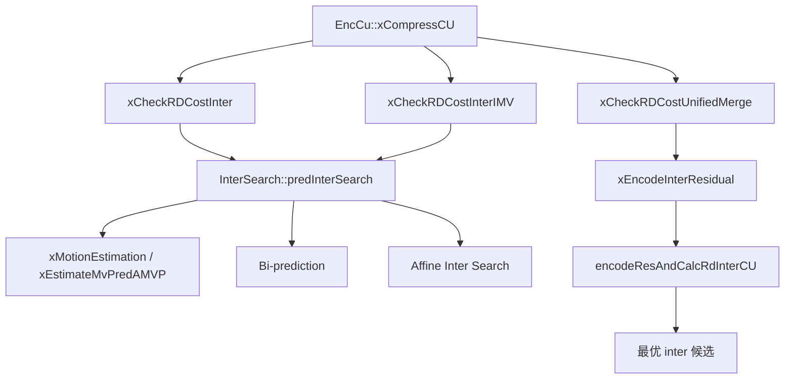
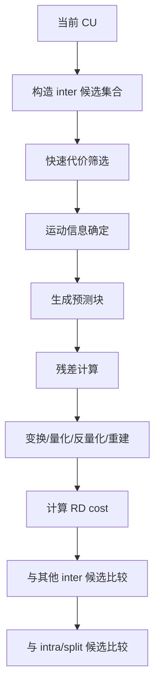

# vvenc 帧间预测分析

本文聚焦 vvenc 的帧间预测（Inter Prediction）实现，说明其在编码器中的职责、主要算法组成，以及在源码中的具体落地方式。内容覆盖：

- 帧间预测的算法框架
- vvenc 中的调用链与模块分工
- merge / AMVP / 双向预测 / affine / MMVD / CIIP / GEO 等关键机制
- 典型执行流程图与简化伪代码

## 1. 帧间预测的目标

帧间预测的目标是利用参考帧中已重建样本，对当前块构造预测值，从而降低残差能量与编码比特数。

在 VVC / vvenc 中，帧间预测不是单一算法，而是一个候选集合，主要包括：

1. 常规运动补偿
   - 单向预测（L0 或 L1）
   - 双向预测（Bi-prediction）

2. merge 类候选
   - regular merge
   - MMVD
   - affine merge
   - CIIP
   - GEO

3. 显式运动搜索类候选
   - AMVP + motion estimation
   - IMV / AMVR
   - affine motion estimation

vvenc 的实现特点是：

- 先用较便宜的代价做候选筛选
- 再对保留候选执行完整 RD 检查
- 在不同 inter 模式之间共享中间结果，减少重复计算

## 2. 在 vvenc 中的模块分工

帧间预测的主调用链如下：



职责划分可以概括为：

1. `EncCu`
   - 决定何时测试 inter 候选
   - 组织 merge / 普通 inter / IMV 的 RD 流程
   - 比较 inter 与 intra / split 候选

2. `InterSearch`
   - 完成运动预测候选构造
   - 完成运动搜索
   - 生成 inter 预测块
   - 为后续残差编码提供运动信息

3. `xEncodeInterResidual()`
   - 对选中的 inter 候选执行残差变换、量化、重建与完整 RD 检查

## 3. 帧间预测的总体算法框架

从编码器视角看，帧间预测可抽象为如下流程：



这里的关键点是：  
vvenc 并不是“先定运动，再无条件编码残差”，而是将运动信息、预测质量、比特代价和残差代价统一纳入 RD 优化。

## 4. merge 类帧间预测

### 4.1 算法意义

merge 类候选的核心思想是：当前块直接复用邻域或派生候选中的运动信息，避免发送完整 MVD，从而节省比特。

vvenc 中的 merge 相关候选包括：

1. regular merge
2. MMVD
3. affine merge
4. CIIP
5. GEO

### 4.2 vvenc 实现路径

对应入口是 `EncCu::xCheckRDCostUnifiedMerge()`，其逻辑可概括为：

```text
xCheckRDCostUnifiedMerge():
  生成 regular merge 候选
  如启用 MMVD，则生成 MMVD 候选
  如启用 affine merge，则生成 affine merge 候选
  如启用 CIIP，则生成 CIIP 候选
  如启用 GEO，则生成 GEO 组合候选
  用 SATD + bit cost 做 pruning
  对保留候选执行完整 RD 检查
```

对应的简化代码形态：

```cpp
CU::getInterMergeCandidates( *cu, mergeCtx, 0 );
if( sps.MMVD )
  CU::getInterMMVDMergeCandidates( *cu, mergeCtx );

addRegularCandsToPruningList( ... );
addCiipCandsToPruningList( ... );
addMmvdCandsToPruningList( ... );
addAffineCandsToPruningList( ... );
addGpmCandsToPruningList( ... );
```

### 4.3 两阶段处理

merge 类候选在 vvenc 中通常走两阶段：

1. 候选裁剪阶段
   - 使用 SATD / 模板代价 / 近似比特代价快速筛掉差候选

2. 完整 RD 检查阶段
   - 对保留候选调用 `xEncodeInterResidual()`
   - 真正计算编码残差后的总代价

这也是 vvenc 在保持压缩效率的同时控制编码复杂度的核心手段。

## 5. 普通 inter 预测：AMVP + 运动搜索

### 5.1 算法概念

普通 inter 预测的典型流程是：

1. 为当前参考帧构造 MVP 候选
2. 选择一个 MVP 作为预测起点
3. 围绕该预测向量执行运动搜索
4. 得到最优 MV / refIdx / mvpIdx
5. 生成预测块并进入残差编码

### 5.2 vvenc 的实现入口

在 `EncCu::xCheckRDCostInter()` 中，普通 inter 候选最终会调用：

```cpp
bool stopTest = m_cInterSearch.predInterSearch(cu, partitioner, bestCostInter);
if( !stopTest )
{
  xEncodeInterResidual(tempCS, bestCS, partitioner, encTestMode, 0, 0, &equBcwCost);
}
```

也就是说：

- `InterSearch::predInterSearch()` 负责运动信息求解与预测块构造
- `xEncodeInterResidual()` 负责残差级 RD 检查

### 5.3 `predInterSearch()` 的内部结构

`InterSearch::predInterSearch()` 可以概括为：

```text
predInterSearch():
  对 L0/L1 参考列表分别遍历参考帧
  对每个参考帧:
    计算 AMVP / MVP
    执行单向运动搜索
    记录单向最佳候选
  若允许双向预测:
    组合 L0/L1 最佳候选
    执行 bi-pred refinement
  若允许 affine:
    执行 affine inter search
  返回最优 inter 运动信息
```

简化代码摘录：

```cpp
for ( int iRefList = 0; iRefList < iNumPredDir; iRefList++ )
{
  for (int iRefIdxTemp = 0; iRefIdxTemp < cs.slice->numRefIdx[ refPicList ]; iRefIdxTemp++)
  {
    xEstimateMvPredAMVP( cu, origBuf, refPicList, iRefIdxTemp, ... );
    xMotionEstimation( cu, origBuf, refPicList, cMvPred[...], iRefIdxTemp, ... );
    xCheckBestMVP( refPicList, cMvTemp[...], cMvPred[...], ... );
  }
}
```

## 6. 单向预测与双向预测

### 6.1 单向预测

单向预测是 inter 搜索的基础路径：

- P slice 只需要 L0
- B slice 通常先分别搜索 L0 与 L1 的最优单向候选

vvenc 在 `predInterSearch()` 中先完成单向候选搜索，再决定是否继续执行双向预测。

### 6.2 双向预测

双向预测用于 B slice，在两个参考列表间组合候选。其好处是：

- 能更好拟合运动遮挡和复杂运动区域
- 通常能显著降低残差能量

但其代价更高，因此实现上会受以下因素约束：

1. 当前 slice 类型
2. 块大小限制
3. LDC / BCW 等约束
4. 当前候选的快速代价

从 `predInterSearch()` 可以看到，单向搜索结束后才进入 bi-pred 路径，这是一种典型的逐步扩展策略。

## 7. AMVP、MVP 与运动搜索

### 7.1 MVP / AMVP

MVP 是运动向量预测；AMVP 是基于邻居构造的候选集合。其目标是：

- 降低运动信息编码比特
- 为运动搜索提供更可靠的初值

vvenc 中的关键步骤包括：

1. `xEstimateMvPredAMVP()`
   - 构造/评估 AMVP 候选

2. `xMotionEstimation()`
   - 以所选 MVP 为中心进行搜索

3. `xCheckBestMVP()`
   - 在 bit cost 维度重新评估最优 MVP

### 7.2 运动搜索

运动搜索的本质是寻找一组 MV/refIdx，使：

`预测失真 + lambda * 运动信息比特`

最小。

vvenc 中的运动搜索不是孤立过程，而是与：

- 参考帧索引选择
- MVP 选择
- IMV / AMVR
- bi-pred
- affine

共同组成 inter 候选空间。

## 8. IMV / AMVR

### 8.1 算法作用

IMV / AMVR 的目标是：

- 在整数、半像素等不同精度层级上控制运动参数表示
- 用更粗的 MV 精度换取更低的比特或更低的搜索复杂度

### 8.2 vvenc 中的实现方式

对应入口是 `EncCu::xCheckRDCostInterIMV()`。其简化逻辑是：

```text
xCheckRDCostInterIMV():
  对不同 IMV 精度模式循环
  在每个精度上执行 inter 搜索
  根据快速门限决定是否继续细化
  对保留候选调用 xEncodeInterResidual()
```

这类路径通常只在满足配置和快速判据时展开，因此它是一种“选择性扩展”的 inter 模式。

## 9. affine 帧间预测

### 9.1 算法意义

普通平移模型只能表达平移运动；affine 模型可以表达：

- 旋转
- 缩放
- 剪切

在非刚性或视角变化明显的区域更有效。

### 9.2 vvenc 实现要点

在 `InterSearch::predInterSearch()` 中，affine 相关逻辑主要表现为：

1. 判断是否值得检查 affine
2. 调用 `xPredAffineInterSearch()`
3. 比较 4 参数 / 6 参数 affine 成本
4. 与普通 translational inter 候选比较

简化伪代码：

```text
if( checkAffine && 块尺寸满足条件 )
{
  执行 4 参数 affine 搜索
  如启用 6 参数 affine，再继续细化
  将 affine 候选与普通 inter 候选比较
}
```

这说明 affine 在 vvenc 中并不是默认强制执行，而是一个受尺寸、时层、快速门限控制的高复杂度增强候选。

## 10. CIIP、GEO 与 MMVD

### 10.1 CIIP

CIIP（Combined Intra Inter Prediction）本质上是把 inter 预测和 intra 预测混合，用于改善仅 inter 预测不足的情况。

在 vvenc 中，CIIP 作为 merge 类候选插入 pruning 列表，随后参与统一 RD 检查。

### 10.2 GEO

GEO（Geometric Partitioning Mode）通过几何分区把块拆成两个预测区域，每个区域可使用不同 merge 候选，适合边界清晰的复杂运动区域。

vvenc 的 GEO 处理流程是：

1. 构造几何组合候选
2. 用 weighted SAD / SATD 做快速排序
3. 对少量优选 GEO 组合做完整 RD

### 10.3 MMVD

MMVD 是在 merge 基础上对运动矢量做离散 refinement。  
它本质上是“低 signalling cost 的细化 merge 方案”。

vvenc 中，MMVD 也是先插入 pruning list，再进入完整 RD 检查。

## 11. inter 残差编码与最终 RD 判定

无论候选来自：

- merge
- 普通 inter
- IMV
- affine

最终都会走向 `xEncodeInterResidual()` 完成真正的 RD 检查。

其职责可概括为：

```text
xEncodeInterResidual():
  根据当前运动信息生成预测块
  形成残差
  进行变换/量化/反量化/重建
  计算失真
  估算语法比特
  计算完整 RD cost
  更新 bestCS
```

这一步非常关键，因为它决定：

- 哪个 inter 候选真正成为当前 CU 的最优模式
- inter 候选能否击败 intra 或 split 候选

## 12. vvenc 帧间预测的工程化特点

### 12.1 候选空间大，但有强 pruning

vvenc 的 inter 候选非常丰富，但并不暴力穷举，而是通过：

- SATD
- 模板代价
- 快速门限
- 时层与块大小约束

控制展开规模。

### 12.2 共享中间结果

实现中存在大量缓存/复用机制，例如：

- uni motion reuse
- affine motion 缓存
- merge pruning list

这能显著减少重复搜索。

### 12.3 将运动搜索与 RD 检查分层

`predInterSearch()` 解决“运动怎么取”，  
`xEncodeInterResidual()` 解决“总代价是否最优”。

这种分层使实现更清晰，也更容易插入快速路径。

## 13. 建议的阅读顺序

如果继续深入帧间预测实现，建议按如下顺序读：

1. `EncCu::xCheckRDCostUnifiedMerge()`
2. `EncCu::xCheckRDCostInter()`
3. `EncCu::xCheckRDCostInterIMV()`
4. `InterSearch::predInterSearch()`
5. `InterSearch` 中的：
   - `xEstimateMvPredAMVP()`
   - `xMotionEstimation()`
   - `xCheckBestMVP()`
   - `xPredAffineInterSearch()`
6. `EncCu::xEncodeInterResidual()`

按这个顺序，可以先建立 inter 决策框架，再深入运动估计和高级候选。

