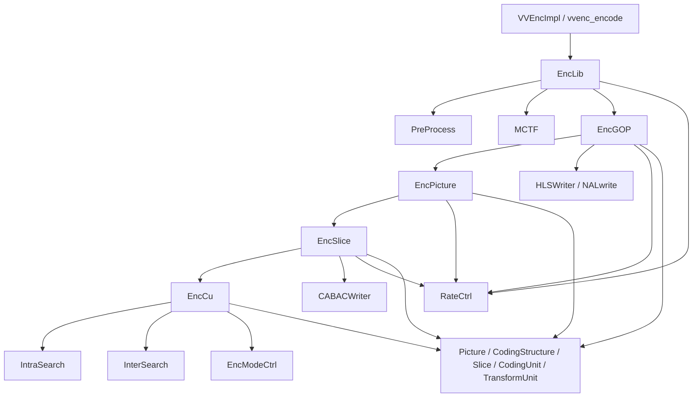

# vvenc 常用类总览

本文不是对全部类做字典式罗列，而是从阅读编码主链路的角度，总结 `vvenc` 中最常用、最值得先掌握的一批类。阅读顺序建议按“顶层入口 -> stage pipeline -> 帧级编码 -> CTU/CU 决策 -> 码流输出 -> 公共数据结构”推进。

## 1. 总体分层



可以把这些类粗分为五层：

- 顶层调度层：`EncLib`、`EncStage`、`PreProcess`、`MCTF`、`EncGOP`
- 帧级编码层：`EncPicture`、`EncSlice`
- 块级决策层：`EncCu`、`IntraSearch`、`InterSearch`、`EncModeCtrl`
- 码流输出层：`CABACWriter`、`BinEncoder`、`HLSWriter`
- 公共数据层：`Picture`、`CodingStructure`、`Slice`、`CodingUnit`、`TransformUnit`

## 2. 顶层调度层

### 2.1 `EncLib`

文件：

- [vvenc/source/Lib/EncoderLib/EncLib.h](/Users/skl/reading/hlpvvc/vvenc/source/Lib/EncoderLib/EncLib.h)
- [vvenc/source/Lib/EncoderLib/EncLib.cpp](/Users/skl/reading/hlpvvc/vvenc/source/Lib/EncoderLib/EncLib.cpp)

职责：

- 编码器内部总控对象。
- 持有整个编码 pipeline 的主要模块实例。
- 接收输入帧、组织 stage 运行、收集 `AccessUnit` 输出。

最关键的成员：

- `RateCtrl* m_rateCtrl`
- `PreProcess* m_preProcess`
- `MCTF* m_MCTF`
- `EncGOP* m_preEncoder`
- `EncGOP* m_gopEncoder`
- `std::vector<EncStage*> m_encStages`
- `std::deque<AccessUnitList> m_AuList`

最关键的接口：

- `initEncoderLib()`
- `initPass()`
- `encodePicture()`
- `getParameterSets()`
- `printSummary()`

理解方式：

- `EncLib` 不直接做块级编码，它更像“装配和调度中心”。
- 如果想看一帧是如何从输入 YUV 进入编码主流程，`EncLib::encodePicture()` 是首选入口。

### 2.2 `EncStage`

文件：

- [vvenc/source/Lib/EncoderLib/EncStage.h](/Users/skl/reading/hlpvvc/vvenc/source/Lib/EncoderLib/EncStage.h)

职责：

- 所有编码 stage 的公共基类。
- 负责 stage 间图片队列、flush、排序和资源回收。

核心抽象：

- `initPicture()`
- `processPictures()`

关键数据：

- `m_procList`
- `m_freeList`
- `m_nextStage`
- `m_minQueueSize`
- `m_sortByPoc`

理解方式：

- `PreProcess`、`MCTF`、`EncGOP` 都是 `EncStage`。
- 这层抽象让 `EncLib` 可以把帧当成“在多个 stage 中流动的对象”来处理。

### 2.3 `PicShared`

文件：

- [vvenc/source/Lib/EncoderLib/EncStage.h](/Users/skl/reading/hlpvvc/vvenc/source/Lib/EncoderLib/EncStage.h)

职责：

- 管理输入原始帧共享数据。
- 封装原始像素、滤波像素、QPA 相关前序帧缓存和可复用的帧级元数据。

为什么重要：

- `Picture` 在编码过程中会大量创建和释放，但原始输入缓冲区不希望反复拷贝。
- `PicShared` 负责把输入帧数据“挂接”到 `Picture` 上，并通过引用计数控制复用。

### 2.4 `PreProcess`

文件：

- [vvenc/source/Lib/EncoderLib/PreProcess.h](/Users/skl/reading/hlpvvc/vvenc/source/Lib/EncoderLib/PreProcess.h)

职责：

- 做编码前分析。
- 计算视觉活动、时空活动、SCC/STA 检测、QPA 相关前处理。
- 构造和更新 `GOPCfg` 所需的一部分信息。

关键成员：

- `GOPCfg m_gopCfg`
- `m_doSTA`
- `m_doTempDown`
- `m_doVisAct`
- `m_doVisActQpa`

关键私有函数：

- `xGetVisualActivity()`
- `xGetSpatialActivity()`
- `xGetTemporalActivity()`
- `xDetectSTA()`
- `xDetectScc()`

理解方式：

- 这一层不产生最终码流，但会显著影响后面 `RateCtrl`、`QPA`、SCC 模式和 GOP 决策。

### 2.5 `MCTF`

文件：

- [vvenc/source/Lib/CommonLib/MCTF.h](/Users/skl/reading/hlpvvc/vvenc/source/Lib/CommonLib/MCTF.h)

职责：

- 做 motion-compensated temporal filtering。
- 在编码前为输入帧提供时域滤波结果，改善编码效率。

特点：

- `MCTF` 也继承自 `EncStage`，因此在 pipeline 里和其他 stage 统一调度。
- 它处理的是“送入主编码器之前的帧准备”。

### 2.6 `EncGOP`

文件：

- [vvenc/source/Lib/EncoderLib/EncGOP.h](/Users/skl/reading/hlpvvc/vvenc/source/Lib/EncoderLib/EncGOP.h)
- [vvenc/source/Lib/EncoderLib/EncGOP.cpp](/Users/skl/reading/hlpvvc/vvenc/source/Lib/EncoderLib/EncGOP.cpp)

职责：

- GOP 级调度中心。
- 决定帧的编码顺序、输出顺序、参考结构、参数集写出和 `AccessUnit` 生成。
- 管理 `EncPicture` 实例池，并驱动单帧编码。

关键成员：

- `RateCtrl* m_pcRateCtrl`
- `EncReshape m_Reshaper`
- `std::list<EncPicture*> m_freePicEncoderList`
- `std::list<Picture*> m_gopEncListInput`
- `std::list<Picture*> m_gopEncListOutput`
- `std::vector<int> m_globalCtuQpVector`
- `HLSWriter m_HLSWriter`
- `SEIWriter m_seiWriter`

关键接口：

- `init()`
- `processPictures()`
- `xEncodePicture()`
- `xWritePicture()`
- `getParameterSets()`

理解方式：

- 如果说 `EncLib` 负责“整条流水线”，那么 `EncGOP` 负责“真正把一组帧编码成访问单元”。
- 读帧级流程时，`EncGOP::xEncodePicture()` 和 `xWritePicture()` 最关键。

## 3. 帧级编码层

### 3.1 `EncPicture`

文件：

- [vvenc/source/Lib/EncoderLib/EncPicture.h](/Users/skl/reading/hlpvvc/vvenc/source/Lib/EncoderLib/EncPicture.h)

职责：

- 单帧编码入口。
- 组织 slice 压缩、环路滤波、ALF、最终码流写出前的帧级处理。

关键成员：

- `EncSlice m_SliceEncoder`
- `LoopFilter m_LoopFilter`
- `EncAdaptiveLoopFilter m_ALF`
- `CABACWriter m_CABACEstimator`
- `RateCtrl* m_pcRateCtrl`

关键接口：

- `compressPicture()`
- `finalizePicture()`

理解方式：

- `EncPicture` 是 `EncGOP` 和 `EncSlice` 之间的桥梁。
- 读单帧编码主线时，可以把它当成“帧级 orchestrator”。

### 3.2 `EncSlice`

文件：

- [vvenc/source/Lib/EncoderLib/EncSlice.h](/Users/skl/reading/hlpvvc/vvenc/source/Lib/EncoderLib/EncSlice.h)

职责：

- 负责 slice/CTU 级编码。
- 完成 CTU 压缩、并行任务推进、SAO/ALF 统计与重建、slice 数据输出。

关键成员：

- `std::vector<PerThreadRsrc*> m_ThreadRsrc`
- `NoMallocThreadPool* m_threadPool`
- `std::vector<ProcessCtuState> m_processStates`
- `BinEncoder m_BinEncoder`
- `CABACWriter m_CABACWriter`
- `LoopFilter* m_pLoopFilter`
- `EncAdaptiveLoopFilter* m_pALF`

关键接口：

- `initPic()`
- `compressSlice()`
- `encodeSliceData()`
- `finishCompressSlice()`

关键枚举：

- `TaskType`
  - `CTU_ENCODE`
  - `RESHAPE_LF_VER`
  - `LF_HOR`
  - `SAO_FILTER`
  - `ALF_GET_STATISTICS`
  - `ALF_DERIVE_FILTER`
  - `ALF_RECONSTRUCT`
  - `FINISH_SLICE`

理解方式：

- `EncSlice` 是 `vvenc` 并行化最明显的一层。
- 它不只是“遍历 CTU”，而是维护 CTU 状态机，把编码、滤波和后处理串成一条任务流水。

## 4. 块级决策层

### 4.1 `EncCu`

文件：

- [vvenc/source/Lib/EncoderLib/EncCu.h](/Users/skl/reading/hlpvvc/vvenc/source/Lib/EncoderLib/EncCu.h)
- [vvenc/source/Lib/EncoderLib/EncCu.cpp](/Users/skl/reading/hlpvvc/vvenc/source/Lib/EncoderLib/EncCu.cpp)

职责：

- CU 级 RDO 核心。
- 负责划分决策、帧内/帧间候选测试、merge/skip/MMVD/GEO/IBC 等模式搜索，以及最优结构选择。

关键依赖：

- `IntraSearch`
- `InterSearch`
- `EncModeCtrl`
- `RateCtrl`

关键数据：

- `m_pTempCS[]` / `m_pBestCS[]`
- `m_CtxBuffer`
- `m_globalCtuQpVector`
- `MergeItem` / `MergeItemList`
- `FastGeoCostList`

理解方式：

- `EncCu` 是最值得花时间读的类之一。
- 绝大多数“编码效率”和“编码复杂度”的折中，都在这里体现。

简化流程：

```text
xCompressCU()
  -> 生成当前 CU 的测试模式列表
  -> 逐个测试 inter / merge / intra / split
  -> 每个候选模式做 RD 代价计算
  -> 保存当前最优 bestCS / bestCU
  -> 如 split 更优，递归进入子 CU
```

### 4.2 `EncModeCtrl`

文件：

- [vvenc/source/Lib/EncoderLib/EncModeCtrl.h](/Users/skl/reading/hlpvvc/vvenc/source/Lib/EncoderLib/EncModeCtrl.h)

职责：

- 控制某个 CU 上“哪些模式要试、哪些模式可提前跳过”。
- 提供模式裁剪、split 次序控制和快速算法判定。

关键类型：

- `EncTestMode`
- `EncTestModeType`
- `ComprCUCtx`

典型模式枚举：

- `ETM_MERGE_SKIP`
- `ETM_INTER_ME`
- `ETM_INTER_IMV`
- `ETM_INTRA`
- `ETM_SPLIT_QT`
- `ETM_SPLIT_BT_H`
- `ETM_SPLIT_BT_V`
- `ETM_SPLIT_TT_H`
- `ETM_SPLIT_TT_V`

理解方式：

- `EncCu` 负责“真正试模式”，`EncModeCtrl` 负责“决定试哪些模式”。
- 想看编码器的复杂度削减策略，`EncModeCtrl` 是关键入口。

### 4.3 `InterSearch`

文件：

- [vvenc/source/Lib/EncoderLib/InterSearch.h](/Users/skl/reading/hlpvvc/vvenc/source/Lib/EncoderLib/InterSearch.h)

职责：

- 帧间预测搜索器。
- 负责运动估计、merge 候选测试、AMVP、MMVD、CIIP、GEO、affine 等工具的代价计算。

典型内部结构：

- `ModeInfo`
- `BlkUniMvInfoBuffer`
- `AffineMVInfo`
- `AffineProfList`

理解方式：

- 这个类的核心不是“生成预测块”本身，而是“在大量 inter 候选中找到 RD 最优者”。
- 其底层预测能力来自 `InterPrediction`，而编码侧的选择逻辑在 `InterSearch`。

### 4.4 `IntraSearch`

文件：

- [vvenc/source/Lib/EncoderLib/IntraSearch.h](/Users/skl/reading/hlpvvc/vvenc/source/Lib/EncoderLib/IntraSearch.h)

职责：

- 帧内预测搜索器。
- 负责 luma/chroma intra 模式评估，覆盖角度预测、MIP、MRL、ISP 等工具。

关键接口：

- `estIntraPredLumaQT()`
- `estIntraPredChromaQT()`

关键辅助逻辑：

- `xEstimateLumaRdModeList()`
- `xIntraCodingLumaQT()`
- `xTestISP()`
- `xReduceHadCandList()`

理解方式：

- `IntraSearch` 通常先做快速候选筛选，再做完整 RD。
- 它是分析帧内预测实现时最直接的入口。

## 5. 码流输出层

### 5.1 `CABACWriter`

文件：

- [vvenc/source/Lib/EncoderLib/CABACWriter.h](/Users/skl/reading/hlpvvc/vvenc/source/Lib/EncoderLib/CABACWriter.h)

职责：

- 负责低层语法元素的 CABAC 编码。
- 将 `CodingStructure` / `CodingUnit` / `TransformUnit` 中的决策结果写成语法比特。

典型接口：

- `coding_tree_unit()`
- `coding_tree()`
- `coding_unit()`
- `prediction_unit()`
- `transform_tree()`
- `transform_unit()`
- `residual_coding()`

理解方式：

- `EncCu` 决定“选什么模式”，`CABACWriter` 负责“如何把这个模式写到码流里”。
- 读码流语法实现时，这个类是核心入口。

### 5.2 `BinEncoder`

文件：

- [vvenc/source/Lib/EncoderLib/BinEncoder.h](/Users/skl/reading/hlpvvc/vvenc/source/Lib/EncoderLib/BinEncoder.h)

职责：

- CABAC 二进制算术编码底层实现。
- 管理上下文状态、bin 计数和实际 bitstream 写入。

理解方式：

- `CABACWriter` 更靠近“语法层”，`BinEncoder` 更靠近“算术编码器实现层”。

### 5.3 `HLSWriter`

文件：

- [vvenc/source/Lib/EncoderLib/VLCWriter.h](/Users/skl/reading/hlpvvc/vvenc/source/Lib/EncoderLib/VLCWriter.h)

职责：

- 负责高层语法写出。
- 例如 VPS/SPS/PPS、slice header、SEI 等 NAL 单元的语法编码。

理解方式：

- `CABACWriter` 处理 slice 数据里的语法元素。
- `HLSWriter` 处理参数集、header 和各类高层信令。

## 6. 公共数据结构层

### 6.1 `Picture`

文件：

- [vvenc/source/Lib/CommonLib/Picture.h](/Users/skl/reading/hlpvvc/vvenc/source/Lib/CommonLib/Picture.h)

职责：

- 编码过程中最核心的帧对象。
- 持有原始帧、重建帧、SAO 临时缓冲、slice 列表、参数集映射和帧级状态。

关键成员：

- `CodingStructure* cs`
- `std::deque<Slice*> slices`
- `ParameterSetMap<APS> picApsMap`
- 原始/重建/滤波缓冲访问接口

理解方式：

- 绝大多数模块处理的“当前帧”都是 `Picture`。
- `Picture` 是跨 stage、跨编码层次流动的主对象。

### 6.2 `CodingStructure`

文件：

- [vvenc/source/Lib/CommonLib/CodingStructure.h](/Users/skl/reading/hlpvvc/vvenc/source/Lib/CommonLib/CodingStructure.h)

职责：

- 描述当前编码区域的树形结构和编码结果。
- 管理 CU/TU/PU、代价、失真、比特数、像素缓存等。

理解方式：

- `Picture` 更像“整帧容器”，`CodingStructure` 更像“当前待编码区域的结构化工作区”。
- 在 `EncCu` 中，`bestCS` 和 `tempCS` 是最重要的数据对象之一。

### 6.3 `Slice`

文件：

- [vvenc/source/Lib/CommonLib/Slice.h](/Users/skl/reading/hlpvvc/vvenc/source/Lib/CommonLib/Slice.h)

职责：

- 封装 slice header、参考列表、QP/lambda、RPL、参数集引用等 slice 级状态。

理解方式：

- 很多编码决策都要读 `Slice`，例如参考帧集合、slice type、QP、lambda、时域层级等。

### 6.4 `CodingUnit`

文件：

- [vvenc/source/Lib/CommonLib/Unit.h](/Users/skl/reading/hlpvvc/vvenc/source/Lib/CommonLib/Unit.h)

职责：

- 表示一个 CU 的预测和划分语义。
- 包含 intra/inter 标志、merge 信息、运动信息、预测模式等。

理解方式：

- 在块级决策中，最终选中的模式大多落在 `CodingUnit` 字段里。

### 6.5 `TransformUnit`

文件：

- [vvenc/source/Lib/CommonLib/Unit.h](/Users/skl/reading/hlpvvc/vvenc/source/Lib/CommonLib/Unit.h)

职责：

- 表示一个 TU 的残差、变换、量化和 CBF 状态。

理解方式：

- `CodingUnit` 解决“如何预测”，`TransformUnit` 解决“残差如何编码”。

## 7. 其他常见辅助类

### 7.1 `RateCtrl`

文件：

- [vvenc/source/Lib/EncoderLib/RateCtrl.h](/Users/skl/reading/hlpvvc/vvenc/source/Lib/EncoderLib/RateCtrl.h)

职责：

- 负责码率控制、两遍统计、目标比特分配、QP/lambda 初始化与更新。

关键接口：

- `initRateControlPic()`
- `updateAfterPicEncRC()`
- `processFirstPassData()`
- `addRCPassStats()`

理解方式：

- `RateCtrl` 横跨多个层次：`EncLib` 初始化，`EncGOP` 做 GOP 级分配，`EncPicture`/`EncSlice` 使用 QP/lambda。

### 7.2 `EncReshape`

文件：

- [vvenc/source/Lib/EncoderLib/EncReshape.h](/Users/skl/reading/hlpvvc/vvenc/source/Lib/EncoderLib/EncReshape.h)

职责：

- 实现 LMCS/reshape 相关的编码侧逻辑。

### 7.3 `LoopFilter` / `EncAdaptiveLoopFilter`

文件：

- [vvenc/source/Lib/CommonLib/LoopFilter.h](/Users/skl/reading/hlpvvc/vvenc/source/Lib/CommonLib/LoopFilter.h)
- [vvenc/source/Lib/EncoderLib/EncAdaptiveLoopFilter.h](/Users/skl/reading/hlpvvc/vvenc/source/Lib/EncoderLib/EncAdaptiveLoopFilter.h)

职责：

- `LoopFilter` 负责 deblocking。
- `EncAdaptiveLoopFilter` 负责 ALF/CCALF 的统计、滤波器推导与重建。

### 7.4 `NoMallocThreadPool`

文件：

- [vvenc/source/Lib/Utilities/NoMallocThreadPool.h](/Users/skl/reading/hlpvvc/vvenc/source/Lib/Utilities/NoMallocThreadPool.h)

职责：

- 编码器内部线程池。
- 为 `EncSlice`、`EncGOP`、`MCTF` 等模块提供并行任务执行环境。

## 8. 建议的源码阅读顺序

如果目标是尽快建立整体心智模型，建议按下面顺序阅读：

1. `EncLib`
2. `EncStage`
3. `PreProcess`
4. `EncGOP`
5. `EncPicture`
6. `EncSlice`
7. `EncCu`
8. `EncModeCtrl`
9. `InterSearch` / `IntraSearch`
10. `CABACWriter`
11. `Picture` / `CodingStructure` / `Slice` / `CodingUnit` / `TransformUnit`

## 9. 一句话记忆

- `EncLib`：编码器总控。
- `EncStage`：流水线 stage 抽象。
- `PreProcess`：编码前分析。
- `EncGOP`：GOP 级调度和 AU 输出。
- `EncPicture`：单帧编码组织者。
- `EncSlice`：CTU/slice 级并行编码器。
- `EncCu`：CU 级 RDO 核心。
- `EncModeCtrl`：模式裁剪和试探策略。
- `InterSearch`：帧间搜索器。
- `IntraSearch`：帧内搜索器。
- `CABACWriter`：低层语法写出。
- `HLSWriter`：高层语法写出。
- `Picture`：整帧对象。
- `CodingStructure`：当前编码区域的结构化工作区。
- `Slice`：slice 级状态。
- `CodingUnit`：预测决策载体。
- `TransformUnit`：残差编码载体。
