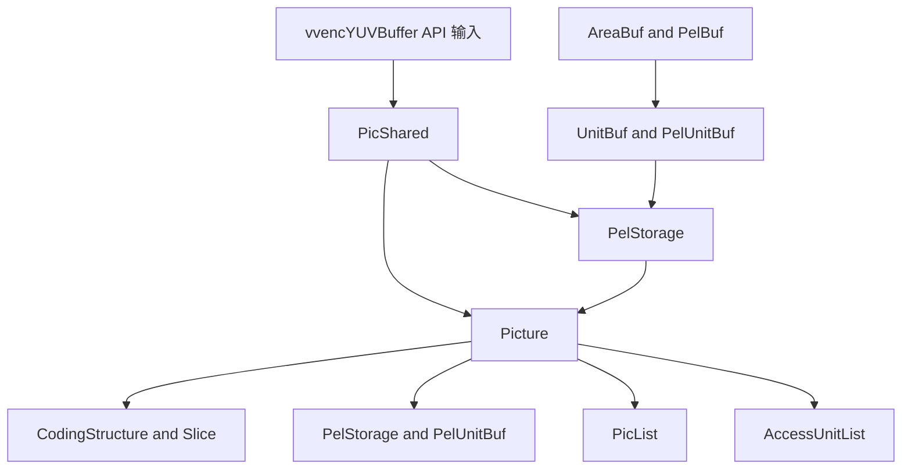
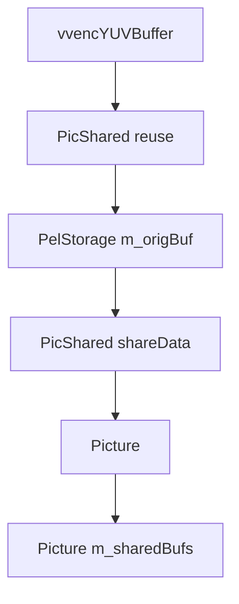
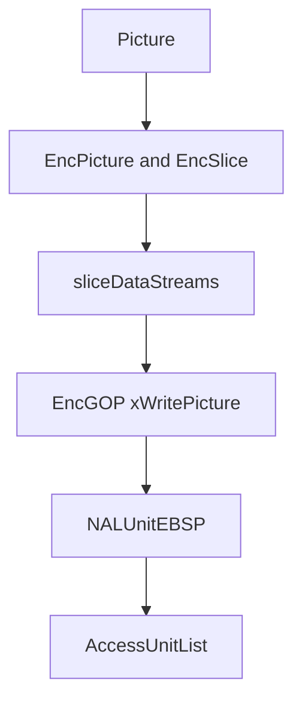

# vvenc 数据结构总览

这份文档专门整理 `vvenc` 里“装数据”的几个核心结构，重点回答三个问题：

1. 输入 YUV 到底用什么结构承载
2. 编码器内部像素和帧数据如何组织
3. `PicList`、`AccessUnitList` 这类容器和 `Picture`、`PicShared` 的关系是什么

本文不展开算法细节，只讲数据结构、职责和相互关系。

## 1. 总体视图



可以把这些结构分成四层：

- API 输入层：`vvencYUVPlane`、`vvencYUVBuffer`
- 像素缓冲层：`AreaBuf`、`PelBuf`、`UnitBuf`、`PelUnitBuf`、`PelStorage`
- 帧对象层：`PicShared`、`Picture`
- 队列与输出层：`PicList`、`AccessUnitList`

## 2. API 输入层

## 2.1 `vvencYUVPlane`

文件：

- [vvenc/include/vvenc/vvenc.h.in](/Users/skl/reading/hlpvvc/vvenc/include/vvenc/vvenc.h.in)

定义：

```cpp
typedef struct vvencYUVPlane
{
  int16_t*  ptr;
  int       width;
  int       height;
  int       stride;
} vvencYUVPlane;
```

职责：

- 表示一个分量平面
- 通常是 Y、Cb、Cr 三个平面之一

特点：

- 这是 API 层结构，不是编码器内部主工作结构
- 它只描述指针和布局，不负责复杂逻辑

## 2.2 `vvencYUVBuffer`

文件：

- [vvenc/include/vvenc/vvenc.h.in](/Users/skl/reading/hlpvvc/vvenc/include/vvenc/vvenc.h.in)

定义：

```cpp
typedef struct vvencYUVBuffer
{
  vvencYUVPlane planes[3];
  uint64_t      sequenceNumber;
  int64_t       cts;
  bool          ctsValid;
  void*         userData;   // unstable api
} vvencYUVBuffer;
```

职责：

- 这是外部调用 `vvenc_encode()` 时传入的一帧原始图像
- 同时带上时间戳和用户附加数据

可以把它理解为：

- “应用程序交给编码器的一帧”

它和内部对象的关系是：

- `vvencYUVBuffer` 是输入格式
- `PicShared` / `Picture` 是内部格式

## 3. 像素缓冲层

这一层最容易混淆，因为它既有“拥有内存的结构”，也有“只是一段二维视图的结构”。

一个简单原则：

- `Buf` 更偏“视图”
- `Storage` 更偏“拥有内存”

## 3.1 `AreaBuf<T>`

文件：

- [vvenc/source/Lib/CommonLib/Buffer.h](/Users/skl/reading/hlpvvc/vvenc/source/Lib/CommonLib/Buffer.h)

定义核心：

```cpp
template<typename T>
struct AreaBuf : public Size
{
  T*  buf;
  int stride;
};
```

职责：

- 描述一块二维内存区域
- 包含宽高、基地址和 stride

常见别名：

- `PelBuf`
- `CPelBuf`
- `CoeffBuf`
- `MotionBuf`

理解方式：

- `AreaBuf` 是“单个二维平面视图”
- 它通常不拥有内存
- 它更像对一块现有内存的切片描述

## 3.2 `PelBuf`

定义：

```cpp
typedef AreaBuf<Pel> PelBuf;
typedef AreaBuf<const Pel> CPelBuf;
```

职责：

- `PelBuf` 是 luma 或 chroma 单平面的像素视图

常见用途：

- 某个 CU 的 luma 区域
- 某个 CTU 的重建块
- 某个分量的原始图像子区域

## 3.3 `UnitBuf<T>`

文件：

- [vvenc/source/Lib/CommonLib/Buffer.h](/Users/skl/reading/hlpvvc/vvenc/source/Lib/CommonLib/Buffer.h)

定义核心：

```cpp
template<typename T>
struct UnitBuf
{
  ChromaFormat chromaFormat;
  UnitBufBuffers bufs;
};
```

职责：

- 把多个 `AreaBuf` 组合成一个“按分量组织的单位缓冲”
- 即把 Y / Cb / Cr 三个平面视图打包在一起

常见别名：

- `PelUnitBuf`
- `CPelUnitBuf`

理解方式：

- `AreaBuf` 是单平面
- `UnitBuf` 是多平面

可以简单理解为：

- `PelBuf` 对应“一个分量”
- `PelUnitBuf` 对应“一块完整 YUV 区域”

## 3.4 `PelUnitBuf`

定义：

```cpp
typedef UnitBuf<Pel> PelUnitBuf;
typedef UnitBuf<const Pel> CPelUnitBuf;
```

职责：

- 表示一块完整的像素区域，可能包含 Y、Cb、Cr

常见用途：

- 整帧原图
- 整帧重建图
- 某个 CU / TU / CTU 的 YUV 块

这个结构在编码器里出现频率非常高，因为很多操作都是“对一个区域的完整 YUV 数据”进行的。

## 3.5 `PelStorage`

文件：

- [vvenc/source/Lib/CommonLib/Buffer.h](/Users/skl/reading/hlpvvc/vvenc/source/Lib/CommonLib/Buffer.h)

定义核心：

```cpp
struct PelStorage : public PelUnitBuf
{
  UnitArea m_maxArea;
  Pel*     m_origin[MAX_NUM_COMP];
};
```

职责：

- `PelStorage` 是“拥有自己内存的 `PelUnitBuf`”
- 它不仅描述 YUV 区域，还真正分配和释放底层像素内存

关键接口：

- `create()`
- `destroy()`
- `getBuf()`
- `getCompactBuf()`

理解方式：

- `PelUnitBuf` 是视图
- `PelStorage` 是带内存所有权的视图

这是 `Picture`、`PicShared` 等对象真正持有像素数据时最常用的结构。

## 3.6 `CompStorage`

文件：

- [vvenc/source/Lib/CommonLib/Buffer.h](/Users/skl/reading/hlpvvc/vvenc/source/Lib/CommonLib/Buffer.h)

职责：

- 单个分量的 owning buffer

它和 `PelStorage` 的关系是：

- `CompStorage` 只管一个平面
- `PelStorage` 管一个完整多分量区域

## 4. 帧对象层

## 4.1 `PicShared`

文件：

- [vvenc/source/Lib/EncoderLib/EncStage.h](/Users/skl/reading/hlpvvc/vvenc/source/Lib/EncoderLib/EncStage.h)

`PicShared` 很关键，因为它位于 API 输入和内部 `Picture` 之间。

### 核心职责

- 持有原始输入帧的共享像素数据
- 记录和该帧关联的前处理结果
- 通过引用计数支持多个 stage / picture 对象共享同一份输入数据

关键成员：

- `PelStorage m_origBuf`
- `PelStorage m_filteredBuf`
- `PicShared* m_prevShared[NUM_QPA_PREV_FRAMES]`
- `GOPEntry m_gopEntry`
- `PicVisAct m_picVA`
- `bool m_isSccWeak`
- `bool m_isSccStrong`
- `int m_picMemorySTA`

理解方式：

- `PicShared` 更偏“输入帧共享壳”
- 它不承担完整编码状态，但承担输入图像和前分析结果的共享

### 为什么需要 `PicShared`

因为编码 pipeline 中，同一帧在不同 stage 会被包装成不同的 `Picture` 对象来流动，但原始输入数据不希望每次都重新拷贝。  
于是：

- `PicShared` 持有共享原图
- `Picture` 只链接过去使用

## 4.2 `Picture`

文件：

- [vvenc/source/Lib/CommonLib/Picture.h](/Users/skl/reading/hlpvvc/vvenc/source/Lib/CommonLib/Picture.h)

`Picture` 是编码器内部最核心的帧对象。

### 核心职责

- 表示“当前编码流程中的一帧”
- 持有该帧的像素缓冲、slice、编码状态、参考状态、码流状态和统计状态

### 重要成员

- `CodingStructure* cs`
- `std::deque<Slice*> slices`
- `PicShared* m_picShared`
- `PelStorage m_picBufs[NUM_PIC_TYPES]`
- `PelStorage* m_sharedBufs[NUM_PIC_TYPES]`
- `PelStorage* m_bufsOrigPrev[NUM_QPA_PREV_FRAMES]`
- `bool isReconstructed`
- `bool isReferenced`
- `bool isNeededForOutput`
- `bool isFinished`
- `const GOPEntry* gopEntry`
- `int poc`
- `uint64_t cts`
- `PicVisAct picVA`

### `Picture` 里的缓冲分成两类

#### 1. 自有缓冲

- `m_picBufs[]`

这类缓冲通常包括：

- 重建图
- SAO 临时图
- 其它帧内临时图

#### 2. 共享缓冲引用

- `m_sharedBufs[]`
- `m_bufsOrigPrev[]`

这些通常来自：

- `PicShared::m_origBuf`
- `PicShared::m_filteredBuf`
- 前序帧 `PicShared`

### 最重要的理解

`Picture` 不是单纯的“图像像素容器”，而是：

- 一帧的像素
- 一帧的语法状态
- 一帧的参考关系
- 一帧的编码结果

全部打包在一起的内部工作对象

## 4.3 `PicVisAct`

文件：

- [vvenc/source/Lib/CommonLib/Picture.h](/Users/skl/reading/hlpvvc/vvenc/source/Lib/CommonLib/Picture.h)

职责：

- 保存帧级视觉活动度分析结果

主要字段：

- `spatAct`
- `prevTL0spatAct`
- `visAct`
- `visActTL0`

关系：

- `PreProcess` 先把它算到 `PicShared::m_picVA`
- `PicShared::shareData()` 再拷给 `Picture::picVA`

## 5. 队列与容器层

## 5.1 `PicList`

文件：

- [vvenc/source/Lib/CommonLib/Picture.h](/Users/skl/reading/hlpvvc/vvenc/source/Lib/CommonLib/Picture.h)

定义：

```cpp
typedef std::list<Picture*> PicList;
```

职责：

- stage 之间流动的图片队列

最常见出现位置：

- `EncStage::m_procList`
- `EncStage::m_freeList`
- `PreProcess::processPictures()`
- `EncGOP::processPictures()`

理解方式：

- `PicList` 不是新类型逻辑，只是一个链表别名
- 关键不在容器本身，而在其中放的是 `Picture*`

### 它为什么重要

因为 `vvenc` 的 pipeline 本质上就是：

- 每个 stage 持有一个 `PicList`
- 处理完后把一部分 `Picture*` 移交给下一个 stage

## 5.2 `AccessUnitList`

文件：

- [vvenc/source/Lib/CommonLib/Nal.h](/Users/skl/reading/hlpvvc/vvenc/source/Lib/CommonLib/Nal.h)

定义：

```cpp
class AccessUnitList : public std::list<NALUnitEBSP*>
{
  int64_t        cts;
  int64_t        dts;
  uint64_t       poc;
  vvencSliceType sliceType;
  int            temporalLayer;
  bool           rap;
  bool           refPic;
  std::string    InfoString;
  void*          userData;
};
```

职责：

- 表示一个访问单元，内部装的是一组 `NALUnitEBSP*`
- 同时附带该 AU 的时间戳、POC、slice type、RAP 标记等元数据

理解方式：

- `PicList` 是内部处理中间队列
- `AccessUnitList` 是输出码流容器

它们处于不同层：

- `PicList` 面向“编码前和编码中”
- `AccessUnitList` 面向“编码后输出”

## 5.3 `NALUnit` / `NALUnitEBSP`

文件：

- [vvenc/source/Lib/CommonLib/Nal.h](/Users/skl/reading/hlpvvc/vvenc/source/Lib/CommonLib/Nal.h)

职责：

- `NALUnit` 表示一个 NAL 头加类型信息
- `NALUnitEBSP` 表示真正已经转成 EBSP 的输出 NAL 数据

关系：

- `EncGOP::xWritePicture()` 里把一帧写成若干 `NALUnitEBSP`
- 再把这些 NAL 放进 `AccessUnitList`

## 6. 这些结构之间的关系

## 6.1 从输入到内部



解释：

1. 外部把一帧装进 `vvencYUVBuffer`
2. `PicShared::reuse()` 把它拷入 `m_origBuf`
3. `PicShared::shareData()` 把这份共享数据挂到 `Picture`
4. 后续 stage 操作的是 `Picture`

## 6.2 从像素视图到 owning buffer

```text
AreaBuf / PelBuf
  -> 单平面视图，不拥有内存

UnitBuf / PelUnitBuf
  -> 多平面视图，不一定拥有内存

PelStorage
  -> 拥有内存的 PelUnitBuf
```

这是阅读源码时最该记住的一层关系。

## 6.3 从内部帧到输出 AU



解释：

- `Picture` 承载一帧编码结果
- `EncGOP` 把该帧的参数集、slice header、slice data、SEI 组织成一组 NAL
- 这些 NAL 放进 `AccessUnitList`

## 7. 怎么快速区分这些结构

可以用一句话区分：

- `vvencYUVBuffer`：API 输入帧
- `PicShared`：共享输入帧壳
- `Picture`：内部完整帧对象
- `PelBuf`：单平面视图
- `PelUnitBuf`：多平面视图
- `PelStorage`：拥有内存的多平面缓冲
- `PicList`：内部帧队列
- `AccessUnitList`：输出 AU 队列

## 8. 代码阅读建议

如果目标是彻底搞清数据流，建议按下面顺序读：

1. [vvenc/include/vvenc/vvenc.h.in](/Users/skl/reading/hlpvvc/vvenc/include/vvenc/vvenc.h.in)
2. [vvenc/source/Lib/CommonLib/Buffer.h](/Users/skl/reading/hlpvvc/vvenc/source/Lib/CommonLib/Buffer.h)
3. [vvenc/source/Lib/EncoderLib/EncStage.h](/Users/skl/reading/hlpvvc/vvenc/source/Lib/EncoderLib/EncStage.h) 里的 `PicShared`
4. [vvenc/source/Lib/CommonLib/Picture.h](/Users/skl/reading/hlpvvc/vvenc/source/Lib/CommonLib/Picture.h)
5. [vvenc/source/Lib/CommonLib/Nal.h](/Users/skl/reading/hlpvvc/vvenc/source/Lib/CommonLib/Nal.h)

## 9. 一句话总结

`vvenc` 的数据组织可以概括成一句话：  
外部用 `vvencYUVBuffer` 送入一帧，内部先落到 `PicShared` 的共享像素存储，再包装成携带完整编码状态的 `Picture` 在 `PicList` 中流动；最终 `EncGOP` 把 `Picture` 的编码结果封装成 `NALUnitEBSP`，并放入 `AccessUnitList` 输出。  
