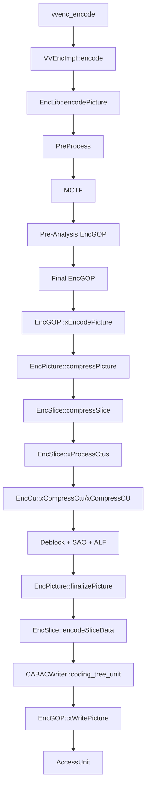
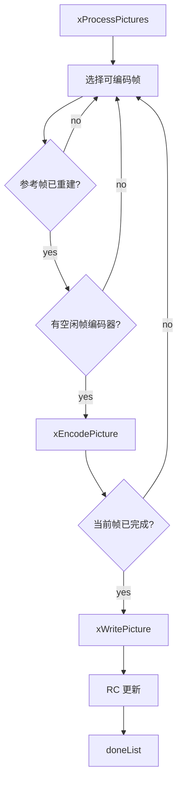
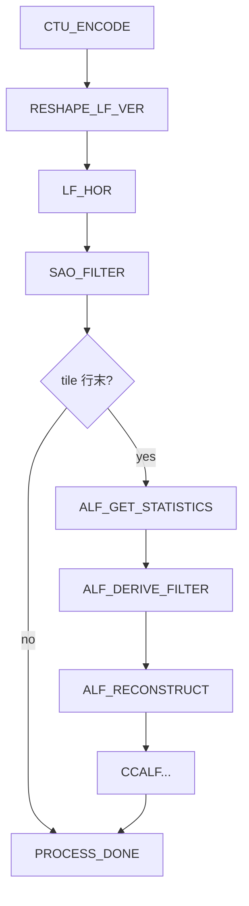
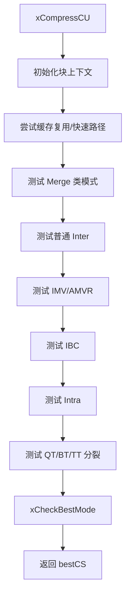
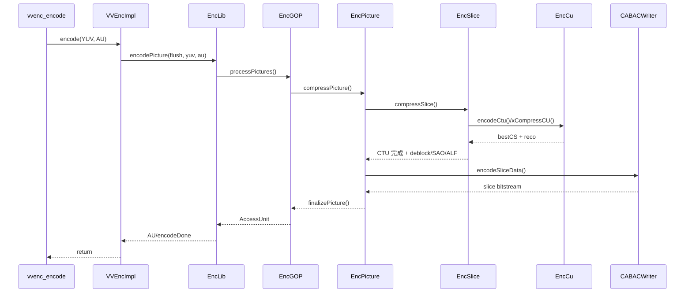

# vvenc 编码过程分析

本文基于仓库内 `vvenc` 源码，梳理一次 `vvenc_encode()` 调用之后，编码器内部从输入 YUV 帧到输出访问单元（AU）/码流的主流程。重点不在于 VVC 语法细节本身，而在于该实现的模块分层、数据流向以及关键调度机制。

## 0. 总览流程图



## 1. 总体分层

vvenc 的编码过程可以按 5 层理解：

1. C 接口层  
   `vvenc_encode()` 只是把外部接口转发到内部实现 `VVEncImpl::encode()`。

2. SDK 内部封装层  
   `VVEncImpl` 负责参数校验、状态机管理、flush 处理、输出 AU 拷贝。

3. 顶层流水线层  
   `EncLib` 负责整个编码流水线，组织预处理、MCTF、预分析编码、正式 GOP 编码等 stage。

4. 帧 / GOP 编码层  
   `EncGOP` 负责帧重排、参考管理、码控联动以及参数集/SEI/切片输出；`EncPicture` 负责单帧编码。

5. Slice / CTU / CU 编码层  
   `EncSlice` 负责一帧内 CTU 级处理和滤波调度；`EncCu` 负责 CU 递归划分与模式决策；`CABACWriter` 负责最终语法比特写出。

## 2. 入口调用链

### 2.1 外部 API 到内部实现

- `vvenc_encode()` 直接转发到 `VVEncImpl::encode()`  
  简化逻辑：外部 C API 不承担编码逻辑，只负责把参数转交给内部实现对象。

代码片段：

```cpp
VVENC_DECL int vvenc_encode( vvencEncoder *enc,
                             vvencYUVBuffer* YUVBuffer,
                             vvencAccessUnit* accessUnit,
                             bool* encodeDone )
{
  auto e = (vvenc::VVEncImpl*)enc;
  return e->encode( YUVBuffer, accessUnit, encodeDone );
}
```

- `VVEncImpl::init()` 中创建 `EncLib` 并调用 `initEncoderLib()`  
  简化逻辑：初始化阶段完成配置归一化、日志回调安装、`EncLib` 创建与内部模块初始化。

- `VVEncImpl::encode()` 做三件事：
  1. 校验输入 YUV 和 AU buffer
  2. 根据 `pcYUVBuffer == nullptr` 判断是否进入 flush
  3. 调用 `m_pEncLib->encodePicture()` 驱动真正编码
  简化逻辑如下：

代码片段：

```cpp
bool bFlush = false;
if( pcYUVBuffer )
{
  // 校验输入并进入 ENCODING 状态
}
else
{
  if( m_eState == INTERNAL_STATE_ENCODING ){ m_eState = INTERNAL_STATE_FLUSHING; }
  bFlush = true;
}

AccessUnitList cAu;
m_pEncLib->encodePicture( bFlush, pcYUVBuffer, cAu, *pbEncodeDone );
```

这里可以看出，`VVEncImpl` 本身不做编码决策，它更像是“安全外壳 + 状态机”。

## 3. EncLib：顶层编码流水线

### 3.1 初始化阶段

`EncLib::initPass()` 会搭建整条流水线。它按配置决定启用哪些 stage：

- `PreProcess`
- `MCTF`
- `EncGOP` 预分析编码器（look-ahead / first pass）
- `EncGOP` 正式编码器（final pass）

简化伪代码：

```text
initPass(pass):
  初始化 RateCtrl
  如需要，重置上一轮内部状态
  创建 ThreadPool
  创建 PreProcess stage
  如启用 MCTF/QPA，创建 MCTF stage
  如启用 LookAhead，创建预分析 EncGOP stage
  创建正式 EncGOP stage
  串联所有 stage
```

流程图：


这里可以看出，vvenc 并不是“收到一帧后立即以单线程路径完成全部编码”的结构，而是一个分阶段的编码流水线：

- 前处理阶段先接收输入帧
- 某些配置下会做时域滤波、预分析
- 最终由 GOP 编码器输出 AU

### 3.2 每次编码调用的工作方式

`EncLib::encodePicture()` 是一次顶层调度循环，核心逻辑：

1. 尝试取空闲 `PicShared`
2. 把输入 YUV 送入第一阶段
3. 依次触发所有 stage 的 `runStage()`
4. 如果某个 stage 产生 AU，就暂存到 `m_AuList`
5. 根据 stage 并行模式，决定是否继续等待 / 返回 AU

简化伪代码：

```text
encodePicture(flush, yuvIn):
  如有输入，尝试申请 PicShared 并送入第一个 stage
  依次驱动所有 stage 运行
  若 stage 产生 AU，则进入输出队列
  若当前阶段需要等待，则继续循环
  若输出队列非空，则返回一个 AU
```

代码片段：

```cpp
if( inputPending )
{
  picShared = xGetFreePicShared();
  if( picShared )
  {
    picShared->reuse( m_picsRcvd, yuvInBuf );
    m_encStages[ 0 ]->addPicSorted( picShared, flush );
    m_picsRcvd += 1;
    inputPending = false;
  }
}

for( auto encStage : m_encStages )
{
  encStage->runStage( flush, au );
  isQueueEmpty &= encStage->isStageDone();
}
```

这个函数反映了 vvenc 的顶层 I/O 行为：

- 编码初期可以只吃输入，不立刻出 AU
- 稳态后通常是一帧输入，对应一帧输出
- flush 时输入为 `nullptr`，持续吐出剩余 AU，直到队列空

## 4. EncGOP：帧编排、码控与输出组织

### 4.1 处理一组帧

`EncGOP::processPictures()` 的顺序很清晰：

1. `xInitPicsInCodingOrder()`  
   将输入帧整理为编码顺序
2. `xProcessPictures()`  
   执行帧级编码调度
3. `xOutputRecYuv()`  
   如有回调，输出重建帧
4. `xReleasePictures()`  
   释放不再需要的帧资源

对应的简化逻辑是：

```text
processPictures(picList):
  将输入帧整理为编码顺序
  推进帧级编码调度
  输出重建帧（如配置了回调）
  回收不再需要的帧资源
```

### 4.2 帧级调度

`xProcessPictures()` 会：

- 从待处理列表中选取当前“可编码”的帧
- 检查参考帧是否已重建
- 检查并行帧编码器是否空闲
- 在 look-ahead / RC 模式下推进码控状态
- 调用 `xEncodePicture()`
- 当当前帧完成编码后，调用 `xWritePicture()` 输出 AU，并更新 RC

简化伪代码：

```text
xProcessPictures():
  选择当前可编码帧
  等待参考帧与空闲帧编码器就绪
  调用 xEncodePicture()
  若已有完成帧，则输出 AU
  若启用 RC，则更新帧级统计
```

流程图：



这层的核心职责是：

- 管理帧顺序
- 管参考依赖
- 管理帧级并行
- 管 RC 与输出时机

### 4.3 单帧入口

`xEncodePicture()` 承担的是单帧编码前后的衔接工作：

- 首 pass 跳帧处理
- ALF APS 同步
- 初始化帧级 QP / lambda（码控）
- 调用 `EncPicture::compressPicture()`
- 编码结束后调用 `finalizePicture()`

简化逻辑：

```text
xEncodePicture(pic):
  处理 first-pass 跳帧
  同步 ALF APS
  初始化帧级码控参数
  调用 EncPicture::compressPicture()
  调用 EncPicture::finalizePicture()
```

代码片段：

```cpp
if( m_pcEncCfg->m_RCTargetBitrate > 0 )
{
  pic->picInitialQP     = -1;
  pic->picInitialLambda = -1.0;
  m_pcRateCtrl->initRateControlPic( *pic, pic->slices[0],
                                    pic->picInitialQP, pic->picInitialLambda );
}

picEncoder->compressPicture( *pic, *this );
picEncoder->finalizePicture( *pic );
```

## 5. EncPicture：单帧编码骨架

### 5.1 帧压缩

`EncPicture::compressPicture()` 的流程：

1. 为当前帧创建临时 buffer、coeff buffer 和临时 CS
2. 如启用 LMCS + ALF，准备亮度权重表
3. `xInitPicEncoder()`
4. 调用 `m_SliceEncoder.compressSlice()`

简化逻辑：

```text
compressPicture(pic):
  创建临时编码缓存
  初始化帧级编码器状态
  调用 EncSlice::compressSlice()
```

代码片段：

```cpp
pic.createTempBuffers( pic.cs->pcv->maxCUSize );
pic.cs->createCoeffs();
pic.cs->createTempBuffers( true );
pic.cs->initStructData( MAX_INT, false, nullptr );

xInitPicEncoder( pic );
m_SliceEncoder.compressSlice( &pic );
```

这里的关键点是：单帧真正的 RDO 压缩从 `EncSlice::compressSlice()` 开始。

### 5.2 帧级收尾

`EncPicture::finalizePicture()` 在帧级搜索完成后做两类事：

1. 生成最终码流数据
   - `xWriteSliceData()`
2. 统计与清理
   - `xCalcDistortion()`
   - 保存 ALF APS
   - 释放临时 buffer

简化逻辑：

```text
finalizePicture(pic):
  写出 slice 数据
  计算失真统计
  保存 APS 等后处理结果
  释放临时缓存
```

代码片段：

```cpp
xWriteSliceData( pic );
xCalcDistortion( pic, *slice->sps );

pic.cs->releaseIntermediateData();
pic.cs->destroyTempBuffers();
pic.cs->destroyCoeffs();
pic.destroyTempBuffers();
```

这说明 vvenc 在实现上将：

- “模式搜索与重建”
- “最终 CABAC 写比特流”

明确拆分为两个阶段。前者发生在 `compressSlice()`，后者发生在 `finalizePicture()`。

## 6. EncSlice：一帧内 CTU 级流水

### 6.1 Slice 初始化

`EncSlice::initPic()` 和 `xInitSliceLambdaQP()` 负责：

- 建立 slice map
- 选择 CABAC 初始化表
- 计算 slice QP 和 lambda
- 初始化每个线程的 `EncCu`

简化伪代码：

```text
initPic(slice):
  建立 slice map
  选择 CABAC 初始化表
  计算 slice QP 与 lambda
  初始化各线程 EncCu 上下文
```

这里尤其重要的是 QP/lambda 的确定：

- 可能来自固定 QP
- 可能叠加 GOP offset
- 可能叠加 perceptual QPA
- 也可能由 RC 传入初值再修正

### 6.2 Slice 压缩入口

`EncSlice::compressSlice()` 会：

- 初始化 `CodingStructure`
- 初始化每线程 `EncCu`
- 初始化每 tile-line 的 CABAC / SAO / ALF 资源
- 最后进入 `xProcessCtus()`

简化逻辑：

```text
compressSlice(pic):
  初始化 CodingStructure
  初始化线程级 CU 编码资源
  初始化 tile-line 级 CABAC/SAO/ALF 资源
  进入 xProcessCtus()
```

### 6.3 CTU 级状态机

`xProcessCtus()` 先构造所有 CTU 任务，然后驱动 `xProcessCtuTask()`。  
简化伪代码：

```text
xProcessCtus():
  为每个 CTU 构造任务参数
  若启用线程池，则提交 CTU 任务
  否则按状态机循环推进所有 CTU
```

流程图：



`xProcessCtuTask()` 体现了 vvenc 的一个关键实现特征：单个 CTU 并不只执行“编码”动作，而是按状态机依次推进多个处理阶段：

1. `CTU_ENCODE`  
   调 `EncCu::encodeCtu()` 做 CTU 内部 CU 划分和模式搜索  
   简化逻辑：完成当前 CTU 的预测、变换、量化、重建和最优结构选择。

2. `RESHAPE_LF_VER`  
   LMCS inverse reshape + 去块垂直边滤波  
   简化逻辑：在重建样本上执行 inverse reshape，并完成垂直边去块滤波。

3. `LF_HOR`  
   去块水平边滤波  
   简化逻辑：完成当前 CTU 的水平边去块滤波。

4. `SAO_FILTER`  
   SAO 统计、参数决策、SAO 重建准备，同时做 ALF 边界扩展、DMVR refined MV 存储  
   简化逻辑：完成 SAO 统计与决策，并为后续 ALF/DMVR 做数据准备。

5. `ALF_GET_STATISTICS`  
   收集 ALF 统计  
   简化逻辑：按 tile 行或同步窗口收集 ALF 统计量。

6. `ALF_DERIVE_FILTER`  
   依据统计推导 / 选择 ALF 滤波器  
   简化逻辑：基于统计结果推导或选择 ALF 滤波器参数。

7. `ALF_RECONSTRUCT`  
   将 ALF 应用于重建帧  
   简化逻辑：将 ALF 滤波作用到当前 CTU 对应的重建样本。

代码片段：

```cpp
case CTU_ENCODE:
  encCu.setCtuEncRsrc( ... );
  encCu.encodeCtu( pic, lineEncRsrc->m_prevQp, ctuPosX, ctuPosY );
  processStates[ ctuRsAddr ] = RESHAPE_LF_VER;
  break;

case LF_HOR:
  encSlice->m_pLoopFilter->xDeblockArea<EDGE_HOR>( cs, ctuArea, MAX_NUM_CH, reco );
  processStates[ ctuRsAddr ] = SAO_FILTER;
  break;
```

从实现角度看，vvenc 将“编码搜索”和“环路滤波”拆分为可并行推进的 CTU 任务状态机，并通过邻域依赖关系约束可执行时机，这也是其多线程效率的重要来源。

## 7. EncCu：CU 划分与模式决策的核心

### 7.1 CTU 入口

`EncCu::xCompressCtu()` 是一个 CTU 的入口。它会：

- 初始化 partitioner
- 拷贝当前 CTU 的原始块数据
- 初始化 `tempCS / bestCS`
- 调用 `xCompressCU()`
- 最终把 bestCS 合并回顶层 CS

简化逻辑：

```text
xCompressCtu():
  初始化 CTU 级 partitioner
  为 tempCS/bestCS 建立局部子结构
  调用 xCompressCU() 做递归搜索
  将 bestCS 回填到顶层 CodingStructure
```

代码片段：

```cpp
partitioner->initCtu( area, CH_L, *cs.slice );
cs.initSubStructure( *tempCS, partitioner->chType, partitioner->currArea(), false, orgBuffer, rspBuffer );
cs.initSubStructure( *bestCS, partitioner->chType, partitioner->currArea(), false, orgBuffer, rspBuffer );

xCompressCU( tempCS, bestCS, *partitioner );
cs.useSubStructure( *bestCS, partitioner->chType, TREE_D, ... );
```

### 7.2 递归搜索主循环

`xCompressCU()` 是整个编码决策过程中最核心的函数，其结构可以概括为：

1. 初始化当前块上下文
2. 根据 QPA / BIM / DQP 调整块级 QP
3. 枚举不分裂模式
   - merge / MMVD / GEO / CIIP / affine merge 等 merge 类模式
   - inter
   - inter + IMV / AMVR
   - IBC / IBC merge
   - intra
4. 枚举分裂模式
   - QT
   - BT-H / BT-V
   - TT-H / TT-V
5. 比较当前最优模式，保留 `bestCS`

简化伪代码：

```text
xCompressCU():
  初始化当前块上下文
  尝试非分裂候选:
    merge / inter / IMV / IBC / intra
  尝试分裂候选:
    QT / BT / TT
  比较候选 RD cost
  保留最优 bestCS
```

流程图：



代码片段：

```cpp
if( !partitioner.isConsInter() && m_modeCtrl.tryMode( encTestMode, cs, partitioner ) )
{
  xCheckRDCostIntra( tempCS, bestCS, partitioner, encTestMode );
}

if( partitioner.canSplit( CU_HORZ_SPLIT, cs ) )
{
  EncTestMode encTestMode( { ETM_SPLIT_BT_H, ETO_STANDARD, qp, false } );
  if( m_modeCtrl.trySplit( encTestMode, cs, partitioner, lastTestMode ) )
  {
    xCheckModeSplit( tempCS, bestCS, partitioner, encTestMode );
  }
}
```

也就是说，vvenc 本质上仍然是标准的 RDO 搜索器，但围绕候选裁剪、缓存复用和快速路径做了大量工程化优化。

### 7.3 Intra 模式检查

`xCheckRDCostIntra()` 会：

- 建立 intra CU
- 调 `estIntraPredLumaQT()` / `estIntraPredChromaQT()`
- 用 `CABACEstimator` 估算当前模式比特数
- 计算 `RD cost = distortion + lambda * bits`
- 调 `xCheckBestMode()` 和当前 best 比较

简化逻辑：

```text
xCheckRDCostIntra():
  生成 intra 候选
  估计 luma/chroma 预测
  用 CABACEstimator 估比特
  计算 RD cost
  与当前 bestCS 比较
```

代码片段：

```cpp
cu.predMode = MODE_INTRA;
m_cIntraSearch.estIntraPredLumaQT( cu, partitioner, bestCS->cost );
m_cIntraSearch.estIntraPredChromaQT( cu, partitioner, maxCostAllowedForChroma );

m_CABACEstimator->pred_mode(cu);
m_CABACEstimator->cu_pred_data(cu);
m_CABACEstimator->cu_residual(cu, partitioner, cuCtx);
```

### 7.4 Merge / Skip / GEO 等 Inter 快速模式

`xCheckRDCostUnifiedMerge()` 负责一大类 merge-based inter 模式：

- regular merge
- MMVD
- affine merge
- CIIP
- GEO

它分两阶段：

1. 用 SATD + 比特代价做 pruning
2. 对保留下来的候选做完整 RD 检查

简化逻辑：

```text
xCheckRDCostUnifiedMerge():
  生成 merge/MMVD/CIIP/GEO/affine merge 候选
  用 SATD 做第一轮 pruning
  对保留候选做完整 RD 检查
```

代码片段：

```cpp
CU::getInterMergeCandidates( *cu, mergeCtx, 0 );
if( sps.MMVD )
  CU::getInterMMVDMergeCandidates( *cu, mergeCtx );

addRegularCandsToPruningList( ... );
addCiipCandsToPruningList( ... );
addMmvdCandsToPruningList( ... );
addAffineCandsToPruningList( ... );
addGpmCandsToPruningList( ... );
```

### 7.5 普通 Inter 与 IMV

- `xCheckRDCostInter()`：普通 inter 预测搜索  
  简化逻辑：执行运动搜索、候选验证以及 inter 残差 RD 检查。

- `xCheckRDCostInterIMV()`：整数 / 半像素等 IMV 模式扩展搜索  
  简化逻辑：在 AMVR/IMV 模式下重复 inter 搜索，并按代价裁剪。

- `xEncodeInterResidual()`：对 inter 候选做残差编码、变换、量化、重建、RD 检查  
  简化逻辑：对当前 inter 候选执行残差编码并完成最终 RD 判断。

代码片段：

```cpp
cu.predMode = MODE_INTER;
bool stopTest = m_cInterSearch.predInterSearch(cu, partitioner, bestCostInter);
if( !stopTest )
{
  xEncodeInterResidual(tempCS, bestCS, partitioner, encTestMode, 0, 0, &equBcwCost);
}
```

### 7.6 “不分裂”与上下文更新

无论 intra 还是 inter，最终候选都会走：

- `xEncodeDontSplit()`  
  把“不再继续 split”这件事编码进估算比特数  
  简化逻辑：在当前候选上显式计入“停止分裂”对应的语法比特。

- `xCheckBestMode()`  
  比较 tempCS 和 bestCS，并保存最优 CABAC 上下文  
  简化逻辑：比较 tempCS 与 bestCS 的总代价，并在更新最优候选时保存对应的 CABAC 上下文。

这点很关键：vvenc 的 RDO 不是只比较失真或运动代价，而是比较“当前模式完整语法编码后的估算总 RD cost”。

## 8. CABACWriter：最终语法输出

前面的 `EncCu` 主要依赖 `CABACEstimator` 做比特估算；真正的码流写出则在 `EncPicture::finalizePicture()` 之后的 `encodeSliceData()` 阶段完成。

### 8.1 Slice 数据写出

`EncSlice::encodeSliceData()` 的逻辑：

- 初始化 CABAC context
- 逐 CTU 遍历
- 处理 tile / WPP 下的上下文同步
- 调 `m_CABACWriter.coding_tree_unit()`
- 在 tile/WPP 结束点做 `end_of_slice()` 和字节对齐

简化伪代码：

```text
encodeSliceData():
  初始化 slice 级 CABAC context
  对 slice 中每个 CTU:
    处理 tile/WPP 上下文同步
    调用 coding_tree_unit()
    在子流结束点写 end_of_slice 与字节对齐
```

### 8.2 CTU 语法写出

`CABACWriter::coding_tree_unit()` 的逻辑：

- 先写 SAO
- 再写 ALF / CCALF 控制信息
- 再调用 `coding_tree()` 写 CTU 内部 coding tree / coding unit 语法
- 更新 luma/chroma QP

简化逻辑：

```text
coding_tree_unit():
  写 SAO 控制信息
  写 ALF/CCALF 控制信息
  写 coding tree / coding unit 语法
  更新 luma/chroma QP
```

代码片段：

```cpp
if( !skipSao ) { sao( *cs.slice, ctuRsAddr ); }

if( !skipAlf )
{
  codeAlfCtuEnabledFlag(...);
  codeAlfCtuFilterIndex(...);
}

coding_tree( cs, *partitioner, cuCtx );
```

这说明最终码流组织顺序与 RDO 搜索阶段并不完全一致：

- 搜索阶段先确定最优结构、预测模式和残差表示
- 输出阶段再按 VVC 语法顺序串行写出

## 9. 一次编码调用的简化时序

一次 `vvenc_encode()` 调用可以抽象为如下执行链路：

1. `vvenc_encode()`
2. `VVEncImpl::encode()`
3. `EncLib::encodePicture()`
4. `PreProcess / MCTF / 预分析 EncGOP / 正式 EncGOP`
5. `EncGOP::xEncodePicture()`
6. `EncPicture::compressPicture()`
7. `EncSlice::compressSlice()`
8. `EncSlice::xProcessCtus()`
9. `EncCu::xCompressCtu()`
10. `EncCu::xCompressCU()` 递归搜索最优划分和模式
11. CTU 级 deblock / SAO / ALF
12. `EncPicture::finalizePicture()`
13. `EncSlice::encodeSliceData()`
14. `CABACWriter::coding_tree_unit()`
15. `EncGOP::xWritePicture()` 组织参数集、SEI、slice NAL，形成 AU
16. `EncLib` 从 AU 队列返回给调用方

时序图：



## 10. 这个实现的几个关键特点

### 10.1 不是单层循环，而是多级流水线

`EncLib` 把编码拆成多个 stage，允许：

- 前处理与正式编码解耦
- look-ahead / first pass / final pass 并存
- stage parallel 与 frame parallel 共存

### 10.2 CTU 内部是递归 RDO，CTU 之间是状态机并行

一个 CTU 内部，`EncCu` 仍然是典型的递归块划分 + 多候选 RDO。  
但 CTU 之间，`EncSlice` 又把流程拆成“编码 / deblock / SAO / ALF”等状态，做细粒度并行。

### 10.3 CABAC 估算与最终写码分离

`EncCu` 在搜索阶段用 `CABACEstimator` 估成本，  
`EncSlice::encodeSliceData()` 再用 `CABACWriter` 正式写比特流。

这能让搜索阶段频繁回退上下文、比较候选，而不污染最终输出流。

### 10.4 码控深度嵌入搜索链路

RC 不只是最终统计比特，而是会影响：

- frame 初始 QP / lambda
- look-ahead chunk 处理
- CTU / sub-CTU QP 调整
- flush 阶段的一/二次 pass 行为

## 11. 建议的阅读顺序

如果要继续深入源码，建议按这个顺序读：

1. `vvenc/source/Lib/vvenc/vvencimpl.cpp`
2. `vvenc/source/Lib/EncoderLib/EncLib.cpp`
3. `vvenc/source/Lib/EncoderLib/EncGOP.cpp`
4. `vvenc/source/Lib/EncoderLib/EncPicture.cpp`
5. `vvenc/source/Lib/EncoderLib/EncSlice.cpp`
6. `vvenc/source/Lib/EncoderLib/EncCu.cpp`
7. `vvenc/source/Lib/EncoderLib/InterSearch.cpp`
8. `vvenc/source/Lib/EncoderLib/IntraSearch.cpp`
9. `vvenc/source/Lib/EncoderLib/CABACWriter.cpp`

这样会先建立“大图”，再进入最复杂的 CU 模式决策细节。
